# SignalHarness

[中文](README.md) | **English**

**Project Environment Intelligence for continuously developed software projects: collect environmental changes, preserve them durably, decide what matters to a project, explain impact, and recommend action.**

SignalHarness watches project-local Git, GitHub, the PyPI package registry, OSV advisories matched to resolved dependency versions, RSS, and configured public-page snapshots, decides whether those changes matter to a project, and turns them into durable, auditable project intelligence instead of another noisy feed. Multi-agent orchestration, single-agent analysis, rules, search, and scoring are implementation techniques rather than the product identity. Real `agent` scans now default to the adaptive two-call Analyzer; the five-Agent path remains a protected evaluation/rollback baseline and is still the default for `mock-agent`.

## At a glance

| Area | What is implemented |
| --- | --- |
| Analyzer default | Real `agent`: deterministic Route/Evidence → merged Impact+Action → Narrative (2 calls), with split escalation only on schema/coverage failure; `mock-agent` retains the five-Agent baseline |
| Tool use | Two-turn evidence tool plan; Python owns allowlist, permission checks, budgets, execution, and observations |
| Reliability | Pydantic structured outputs, schema retry, deterministic fallback, bounded repair, run timeout limits |
| Guarded decisions | LLM contributes semantics; Python owns final scoring and a primary-source high-risk alert floor |
| Change ledger | Project-scoped SQLite EventRevision → Change → ProjectImpact → ScanChange; Top-K no longer controls durable existence |
| Project profile / preference | Versioned ProfileRevision plus Critical / Important / Normal / Low / Ignore preferences that affect ranking and Agent context |
| Sources | Project-local Git commits, GitHub releases/issues/commits/merged PRs, PyPI releases, OSV advisories matched to exact lockfile versions, RSS, and usage-bound official Web changelog/spec sources; equivalent package/version or repo/commit observations aggregate into one Change |
| Memory / state | Existing project-scoped signal/feedback/learning compatibility state remains separated from per-run output/trace |
| Eval | 40-case regression protection + 32-case Capability Golden V1 + 8-case trajectory contracts + 3-case cross-project context + provider contract; Narrative judge remains uncalibrated/disabled |
| Observability | Real TraceRecorder append/update streamed through SSE, including Agent/schema/retry/fallback/tools/latency/tokens/cost plus expandable `structured-reasoning-v1` summaries |
| MCP | Ten structured tools: nine read-only product/context tools plus one persistent fresh-scan starter; CLI remains the primary developer/coding-agent interface |
| Product intelligence | One frozen Scan projection for Overall Report → Top Changes → All Relevant Changes → Change Detail |
| Continuous monitoring | Persistent 12h/24h/local-time schedules + isolated schedule checkpoint + Inbox + Outbox/DeliveryAttempt + optional HMAC-signed Webhook; scheduled runs never consume manual `since_last` |
| Calibration | Real Feedback/Outcome → frozen Episodes → historical/shadow replay → durable promotion gate; minimum labeled evidence, no-gain/regression rejection, and versioned policy rollback |
| CLI | CLI-first developer / coding-Agent surface with stable JSON reads and shared Markdown export |
| Service | FastAPI REST API + replayable SSE streaming runs + Product Intelligence REST + MCP Streamable HTTP |
| Golden Demo | React + TypeScript + Tailwind SPA; Chinese by default with English switch, Runtime/Trace workspace, progressive Project Context, Intelligence results, and Change Drawer over the existing REST/SSE contracts |
| Deployment | Docker image with health check; package/CLI remains usable without a server |
| Learning | Review-only proposals → risk classification → replay gate → explicit human apply |

## Resume Edition evidence

The committed `resume-v1` regression suite contains **40 product-level cases** covering:

- high-risk direct-dependency changes;
- routine dependency releases and negated risk language;
- policy, permission, tool-calling, provider, and structured-output issues;
- expert RSS signals and source-collection noise;
- competitor/web changes;
- explicit irrelevant/giveaway/crypto/gaming noise.

The offline `mock-agent` gate currently passes all labelled expectations:

```text
cases                  40 / 40 assessed
decision accuracy      1.0000
category accuracy      1.0000
priority precision     1.0000
priority recall        1.0000
false-positive rate    0.0000
false-negative rate    0.0000
```

This is intentionally a **project-specific regression/contract suite**, not a claim of general model intelligence. Public CI runs it offline with the real five-Agent architecture and scripted provider. The same fixture can be run manually in real `agent` mode.

## Problem

Small engineering teams are exposed to GitHub releases/issues, RSS feeds, provider/API changes, security advisories, and ecosystem updates. Collection is easy; the hard part is deciding:

1. Is this source trustworthy enough to use?
2. Does the change affect this project rather than the ecosystem in general?
3. Is it an observation, something worth saving, an alert, or an action item?
4. Can the decision be explained after the run?
5. What happens when the model times out, returns invalid JSON, or requests the wrong tool?

SignalHarness treats those questions as an Agent-runtime problem rather than a chatbot problem.

## Architecture

```mermaid
flowchart LR
    Sources[Local Git / GitHub / PyPI / OSV / RSS / Web change / fixture]
    Collect[Collect + Normalize + Deduplicate]
    Funnel[Project-aware Candidate Funnel]
    Noise[Noise Filter]
    Route[Deterministic project-aware Route]
    Evidence[Deterministic source-aware Evidence]
    Tools[Controlled read-only source tools]
    IA[ImpactActionAnalyzerAgent]
    Split[ImpactAnalystAgent → ActionPlannerAgent]
    Guard[Python guarded scoring / permission]
    Narrative[ProjectNarrativeAgent]
    Learning[Explicit Calibration / Learning]
    Output[Assessment / Product / Trace / Digest]
    Interfaces[CLI / REST / SSE Demo / MCP]

    Sources --> Collect --> Funnel --> Noise --> Route --> Evidence --> IA --> Guard --> Narrative --> Output --> Interfaces
    Evidence --> Tools --> Evidence
    IA -. schema / coverage failure only .-> Split --> Guard
    Guard -. feedback / outcomes .-> Learning
    Guard -. schema / permission / budgets / fallback / score .-> IA
    Guard -.-> Split
```



### Protected Five-Agent baseline responsibilities

1. **SignalSupervisorAgent** — classifies each event and decides which downstream stages are required.
2. **ContextEvidenceAgent** — plans bounded read-only tool requests, receives observations, and produces evidence/confidence.
3. **ImpactAnalystAgent** — estimates semantic relevance, affected modules, conflicts, and risk. It cannot emit the authoritative final score.
4. **ActionPlannerAgent** — proposes reversible actions and approval notes; Python re-checks requested high-risk actions.
5. **LearningPolicyAgent** — reads memory and proposes policy/skill/watchlist changes for review only. In real interactive scans its LLM reflection is deferred out of the latency-critical path; explicit calibration/learning flows still invoke the same Agent.

Memory is infrastructure, not a sixth Agent.

### Real SSE Trace and structured model-judgment summaries

The Golden Demo no longer treats a hard-coded Agent animation as execution truth. `TraceRecorder` appends an LLM step with `status=running` before the provider call and updates the same Trace index when the validated result arrives. `StreamRunManager` forwards those real append/update events as SSE `trace.step / trace.step.updated`, and both the Scan control and the full Audit view consume that same Trace.

Model Trace rows use native `<details>` disclosure. The expanded view exposes `structured-reasoning-v1`, derived only from explicit schema-validated output fields such as impact reasons, uncertainty, planning summaries, and `report_zh`, alongside schema/tool/permission/fallback/latency/token audit data. **It is not hidden chain-of-thought and does not expose raw provider responses or prompt text.**

The UI also uses progressive disclosure: detailed project-importance rules are collapsed behind the project profile summary, the real Trace sits next to the Scan control, the legacy Trace table is replaced by a collapsible timeline, and the pipeline is computed from actual Trace stages rather than a fixed historical five-Agent diagram.

### Project Memory V2

Per-run output/trace remains isolated under `service-runs/<run_id>`, while persistent signal, feedback, alert and learning state is stored under `.signal-harness/projects/<project_id>/`. Subsequent runs for the same project reuse that state; different projects are isolated. Shared project-state writes are serialized to prevent concurrent runs from overwriting the same JSON files.

### Project Profile + Preference V1

`signal-harness project-connect <repo>` deterministically inspects allowlisted manifests/lockfiles (`pyproject.toml`, `package.json`, `requirements*.txt`, `Cargo.toml`, `go.mod`, `uv.lock`, `package-lock.json`) plus a bounded directory outline, registers the Project Catalog + Watchlist, and immediately creates the first ProfileRevision. `project-draft` remains as a compatibility preview command instead of a mandatory activation gate.

ProfileRevision records purpose, stack, declared/resolved dependency-version evidence, runtime/protocol/provider, critical modules, evidence, and unknowns. Explicit user preferences use Critical / Important / Normal / Low / Ignore across dependency/provider/runtime/protocol/module/ecosystem/source/category/topic scopes. Auto profile refresh cannot overwrite explicit preferences; structured REST/UI controls and deterministic natural-language updates write the same preference model, and later ranking/Agent context consumes the resulting effective Profile.

The Golden Demo can connect either a pasted GitHub repository root URL or a browser-selected local directory. GitHub onboarding reads repository metadata, an allowlisted manifest/lockfile set, and a bounded path outline without executing repository code; local browser onboarding uploads only allowlisted manifest/lockfile text and relative path names, never source files or `.env`. Valid environment GitHub credentials take precedence; local `serve` onboarding can fall back to the already logged-in GitHub CLI/keyring credential without persisting or exposing it. Repository-root manifests/lockfiles define the primary profile when present, so nested example/demo manifests cannot overwrite the root project identity. A successful import immediately selects the new project. The scan window also accepts a custom 1–3650 day value in addition to the 7/14/30-day presets, and the numeric field is only shown after Custom is selected.

### Product Intelligence V1: CLI-first shared read model

The first P5 vertical slice adds `ProductIntelligenceService`, a shared projection over one frozen Scan + Change Ledger. It exposes Overall Report, Top Changes, All Relevant Changes, and Change Detail from the same business state. Changing Top count does not change `all_count`, and report statistics/themes are computed from the full Scan rather than only the deep-analysis shortlist.

Shell-capable coding Agents can use the CLI directly instead of requiring MCP:

```bash
uv run signal-harness scan --fixture examples/signal_harness/sample_events.json --mode mock-agent --json
uv run signal-harness report --scan <scan_id> --json
uv run signal-harness changes --scan <scan_id> --json --limit 20
uv run signal-harness change <change_id> --scan <scan_id> --json
uv run signal-harness export --scan <scan_id> --mode report --out report.md
```

In JSON mode, requested data stays on stdout; machine-readable errors go to stderr with a non-zero exit code. REST and Golden Demo delegate to the same `ProductIntelligenceService`. All Relevant Changes first groups every frozen Change into a stable project-impact board (project code, dependencies/versions, security, API/protocol/docs, upstream issues/proposals, technology/ecosystem, or other), then supports frozen pagination, search, impact-board/analysis/decision/source/category filters, and rank/impact/newest sorting; Change Detail expands what/why/modules/actions/Before-After/evidence/audit.

After guarded score/decision/evidence/permission state is fixed, a normal Agent scan runs one additional **presentation-only `ProjectNarrativeAgent`** call. It writes the human-facing Chinese environment brief plus what-changed / why-it-matters / recommended-action copy from the same frozen facts, but cannot modify scores or decisions. Priority cards show this copy directly while the full audit remains available separately. This presentation layer adds one LLM call and is not part of the decision-Agent chain.

### Candidate Funnel V2

Live collection can return more than a thousand raw events. SignalHarness now normalizes and deduplicates first, then ranks cheaply by project relevance, focus keywords, source authority, recency and novelty, while reserving source diversity before selecting the bounded Agent candidate set. A 2026-09-06 local live acceptance narrowed 1274 raw events to 12 project-aware candidates; that is runtime evidence, not a fixed benchmark.

### Source Authority V2

Repository authority and claim-author authority are distinct. GitHub releases can be official; a normal user issue in an official repo remains community; OWNER/MEMBER/COLLABORATOR issues are maintainer-level. Explicit OpenAI/GitHub official feeds are marked official, while independent expert feeds remain secondary. Python clamps LLM-reported source quality/confidence so a community issue cannot be promoted to official evidence by model output.

### Change Delta V1

Normalized signals preserve source-native change metadata. GitHub issues distinguish creation from update time, GitHub releases expose `previous_version → current_version`, and RSS preserves publish/update timestamps. The time-window filter now runs after normalization so all source types obey the same observed-change boundary. Golden Demo renders these deltas directly on each change card.

### Real Web Change V1

`web_changes.sources` supports `adapter: http` / `snapshot` for configured public pages. SignalHarness performs a read-only HTTP(S) GET, never executes page JavaScript, normalizes visible text, and stores a project-scoped hash/snapshot. The first observation creates a baseline, unchanged pages emit zero signals, and only a later hash change produces a bounded `Before / After` `web_change` event. A web-only project therefore treats a successful zero-change baseline as a successful scan rather than a collection failure.

The network surface is configuration-driven and closed by default: only public HTTP(S) on ports 80/443 is accepted; credentials, localhost, `.local/.internal`, private/loopback/link-local/metadata-style targets are rejected; every redirect is revalidated; redirects, content type and body size are bounded. Evidence Agent `fetch_snapshot` requests are additionally restricted to URLs already approved in the current project Watchlist, so the tool cannot become a general-purpose web fetcher. Watchlist `official: true` pages receive Python-owned official provenance; other configured pages are secondary.

### Untrusted external-content boundary

GitHub/RSS/Web bodies and ToolObservation content are treated as **untrusted external data**, never Agent instructions. Prompt context explicitly rejects embedded prompt overrides/tool commands/forced classifications, while deterministic semantics strips instruction-like sentences before keyword classification and scoring without deleting the original evidence. Browser source links are restricted to `http/https`, and external event IDs are not interpolated into inline event handlers.

## Python-owned guardrails

The model is deliberately not the authority for external effects or the final business decision.

- Agent JSON is validated against strict Pydantic schemas.
- One schema retry is allowed by default; repeated invalid output falls back deterministically.
- Tool requests are checked against an allowlist, permission policy, run/event budgets, and read-only boundaries.
- Repair is bounded; it cannot become an unbounded recursive Agent handoff loop.
- Final scoring blends deterministic relevance, model semantics, and evidence confidence in Python.
- Category weighting is applied once at the guarded blend boundary.
- Explicit official CVE/vulnerability/supply-chain signals can receive a policy-configured alert floor so model under-scoring cannot silently suppress them.
- Learning proposals never auto-apply; replay and explicit approval remain mandatory.

## Run modes

```bash
# Fully deterministic offline baseline
uv run signal-harness scan \
  --fixture examples/signal_harness/sample_events.json \
  --mode demo

# Offline scripted provider through the real five-Agent architecture
uv run signal-harness scan \
  --fixture examples/signal_harness/sample_events.json \
  --mode mock-agent

# Real OpenAI-compatible provider
LLM_API_KEY=... uv run signal-harness scan \
  --fixture examples/signal_harness/sample_events.json \
  --mode agent
```

`demo` is deterministic fallback logic. `mock-agent` is the CI-safe orchestration path. `agent` uses the same schemas, runner, tool boundary, scoring, and trace with a real provider.

## Agent regression eval

```bash
uv run signal-harness regression-eval \
  --mode mock-agent \
  --enforce
```

Inputs:

- `examples/signal_harness/regression_events.json`
- `examples/signal_harness/regression_expectations.json`

Outputs:

- `outputs/regression-eval/regression_eval_summary.json`
- `outputs/regression-eval/regression_eval_summary.md`

Metrics include exact decision/category accuracy, priority precision/recall, FPR/FNR, TP/FP/TN/FN, decision confusion, missing assessments, and mismatch details. `--enforce` exits non-zero when configured thresholds fail. Unless `--state-dir` is explicitly supplied, each regression invocation uses isolated temporary state so repeated local runs cannot be contaminated by prior duplicate-memory history.

## Cross-project context eval

```bash
uv run signal-harness project-eval --enforce
```

The committed `project-context-v1` gate currently passes 3/3 cases. Each case evaluates the same event under two project profiles and requires a meaningful score gap in the expected direction, proving that project context changes runtime judgment rather than only changing the UI/Watchlist.

## Provider contract eval

`model-eval` answers a different question: **can this provider participate safely in the SignalHarness structured Agent contract?**

```bash
uv run signal-harness model-eval \
  --fixture examples/signal_harness/sample_events.json \
  --mode mock-agent \
  --runs 2
```

It records schema-valid rate, retry/fallback/timeout counts, tool validation/block/budget/runtime errors, repair behavior, decisions, latency, provider-reported token totals, and estimated cost when the selected model profile contains pricing metadata.

Real-provider results are local snapshots, not a universal leaderboard. See `docs/EVALS.md` and `docs/MODEL_EVAL_REPORT.md`.

## MCP

SignalHarness exposes a narrow **thin MCP adapter** over the same Scan/Product services; MCP does not bypass the existing runtime guardrails.

```bash
uv run signal-harness mcp
```

Available tools:

- `signalharness_get_project_context`
- `signalharness_search_signal_history`
- `signalharness_get_latest_assessments`
- `signalharness_get_run_trace`
- `signalharness_get_feedback_memory`
- `signalharness_start_scan`
- `signalharness_get_scan_status`
- `signalharness_get_product`
- `signalharness_list_changes`
- `signalharness_get_change_detail`

Nine retrieval tools are annotated read-only/idempotent/closed-world. `signalharness_start_scan` is explicitly non-read-only and non-idempotent, starts the same persistent `StreamRunManager` used by REST/SSE, and returns a run handle for later status/product/list/detail reads. Product reads delegate to the same `ProductIntelligenceService`; fixture paths remain allowlisted and real-provider readiness uses the existing provider catalog. CLI remains the preferred interface for developers and shell-capable coding agents; MCP exists for clients that benefit from tool discovery and typed schemas.

The `signal-harness serve` FastAPI lifespan also runs the persistent Schedule manager. `/projects/{project_id}/schedules` creates/lists/disables 12h, 24h, or local-time schedules, while `/projects/{project_id}/inbox` exposes project Inbox/read state. When both `SIGNALHARNESS_WEBHOOK_URL` and `SIGNALHARNESS_WEBHOOK_SECRET` are present, high-priority Inbox items enter a durable HMAC-signed Webhook Outbox with an idempotency key; without that runtime configuration SignalHarness keeps Inbox only and does not dispatch externally.
Golden Demo exposes the same continuous-monitoring state directly under Project Profile: create/disable schedules, inspect next-run/checkpoint, and read/mark Inbox items. The page delegates to the project REST/SQLite state rather than implementing a separate browser scheduler.
Change Detail is also the real P8 evidence-entry surface: users can record usefulness/false-positive feedback and observed impact/action/helpfulness/resolution outcomes. These facts never auto-edit policy; fewer than three labeled Episodes, no measured gain, or any guarded regression keeps real-project promotion blocked.

## Golden Demo UI + SSE

Start the same service and open `http://127.0.0.1:8000/demo`:

```bash
uv run signal-harness serve --host 127.0.0.1 --port 8000
```

The Golden Demo is a React + TypeScript + Tailwind SPA compiled by Vite and served as package-owned static assets by FastAPI. It opens in **Chinese by default** and can switch to English in place. A run first selects a **project**, then its data source, analysis path, and optional real-model provider. `configs/projects/*.yaml` is the Project Catalog; each entry binds a project profile to its own Watchlist. The public repo ships `SignalHarness` plus `Example · Agent API Service` to prove project switching without changing runtime code. `mock-agent` remains the default analysis path because it requires no API key while still exercising the real five-Agent orchestration, schemas, tool guard, trace, SSE, and Python scoring.

Clicking **Run Golden Demo** creates and immediately starts a stream run. Queued/running input and status are persisted for bounded restart recovery; the browser may attach to SSE at any time to consume live `TraceRecorder` append/update events. The replay buffer itself remains in-process, reconnects can resume with `Last-Event-ID`, and disconnecting the browser does not cancel the workflow.

An LLM call now emits a real `status=running` Trace before the provider request and updates the same Trace on completion. The scan control can therefore show the current live phase and Agent/model through SSE (collect, route, evidence, impact, action, narrative) instead of waiting for an Agent to finish before reporting progress; the real Trace remains available after the Run completes for continued inspection.

The UI shows the selected project, its Watchlist, source-native change deltas, Agent stages, Python tool guard, schema/fallback/retry state, tool requests/execution/permission checks, final decisions, runtime health, the committed 40-case regression evidence, and the ten-tool MCP surface (nine read-only plus one scan starter). `signal-harness serve` automatically loads an optional project-root `.env` without overriding variables already exported by the caller. Real `agent` mode can select separately configured OpenAI, Qwen, Kimi, or DeepSeek OpenAI-compatible providers per run. The current OpenAI profile uses `gpt-5.6-sol` with medium reasoning effort and is the default real provider in the locally configured environment; the old `gpt-4o-mini` profile remains only for compatibility. Model profiles carry freshness metadata: known retired model aliases resolve to the current profile with a visible warning, while unknown overrides receive conservative capabilities instead of inheriting another model's JSON/context/pricing claims. `/demo/meta` exposes only non-secret project/provider metadata; it never returns API keys, base URLs, or local config paths, and readiness does not claim network connectivity before a run. `.env` is excluded from Git and the Docker build context. The execution metadata is locally recoverable, but the SSE replay buffer is intentionally in-process; SignalHarness does not claim a distributed durable queue or worker system.

## REST API + MCP HTTP

```bash
uv run signal-harness serve --host 127.0.0.1 --port 8000
```

REST endpoints:

```text
GET  /health
POST /runs
GET  /runs/{run_id}
GET  /runs/{run_id}/trace
GET  /runs/{run_id}/assessments
GET  /runs/{run_id}/product
GET  /runs/{run_id}/report
GET  /runs/{run_id}/changes
GET  /runs/{run_id}/changes/{change_id}
GET  /runs/{run_id}/coverage
GET  /signals?run_id=...
POST /feedback
POST /stream-runs
GET  /stream-runs/{run_id}
GET  /stream-runs/{run_id}/events
GET  /demo
GET  /demo/meta
```

MCP Streamable HTTP is mounted at:

```text
/mcp
```

Each API run gets isolated output/trace directories under `service-runs/<run_id>`, while persistent memory is project-scoped under `.signal-harness/projects/<project_id>/`. The original `POST /runs` remains synchronous. Streaming demo runs start when `POST /stream-runs` creates them. Their queued/running request state is persisted and unfinished runs are boundedly recovered after service restart; browser disconnects do not cancel execution. SSE event replay history is still in-process and is not restored after restart. No Redis/Celery/worker tier is claimed.

## Wheel / running outside the repository

The wheel produced by `uv build` now carries the default configs, Project Catalog, model profiles, Watchlists, regression/demo fixtures, and Golden Demo static assets. Runtime resolution remains **workspace first**: a local `configs/` or `examples/signal_harness` wins when present, and only the default missing paths fall back to immutable package-owned resources. Explicit custom paths are never silently redirected.

That makes the built artifact usable outside the source checkout:

```bash
uv build
uv venv /tmp/signalharness-wheel
uv pip install --python /tmp/signalharness-wheel/bin/python dist/signalharness-0.1.0-py3-none-any.whl

cd /tmp
/tmp/signalharness-wheel/bin/signal-harness regression-eval --mode mock-agent --enforce
/tmp/signalharness-wheel/bin/signal-harness project-eval --enforce
```

Golden Demo source lives in `frontend/` (React + TypeScript + Tailwind). Vite compiles it into `src/signal_harness/ui/static/demo.html|css|js`, which `ui/demo.py` and FastAPI serve under `/demo-assets/*`. The compiled files are distribution assets; edit `frontend/src/`, not the generated/minified bundle. Narrative review remains a separate static surface in the same package directory.

## Docker

```bash
docker build -t signalharness:local .
docker run --rm -p 8000:8000 signalharness:local
```

The container runs the same `signal-harness serve` entry point and exposes a `/health` Docker health check.

## Observability

Every LLM trace record can include:

- Agent, model, mode, prompt version, input IDs, output schema;
- schema validity, retry count, fallback reason, timeout state;
- tools requested/executed/blocked, permission checks, budget blocks, tool errors;
- repair status and bounded-repair metadata;
- prompt/static/dynamic context hashes;
- duration;
- provider-reported prompt/completion/total tokens;
- estimated USD cost when profile pricing metadata is configured.

Mock runs deliberately do **not** fabricate token counts.

```bash
uv run signal-harness trace
uv run signal-harness dashboard
```

The static dashboard surfaces runtime health without requiring a hosted observability product. The Golden Demo consumes the same observable trace through SSE, so UI state is derived from runtime evidence instead of a separate simulated Agent state machine.

## Feedback and guarded learning

```bash
uv run signal-harness feedback \
  --signal-id demo-001 \
  --label useful \
  --note "checkpoint signals matter"

uv run signal-harness calibrate --mode mock-agent
uv run signal-harness learning-stage
uv run signal-harness learning-review
uv run signal-harness learning-apply --proposal-id <id> --yes
```

Policy/skill/watchlist proposals remain staged unless replay and risk gates allow an explicit apply. High-risk proposals remain human-reviewed.

## CI

Public GitHub Actions are offline with respect to LLM providers. CI runs:

```text
pytest tests/signal_harness
40-case mock-agent regression gate --enforce
Ruff
mypy --strict
uv build
```

No API key is required and public CI does not call a live model provider. Pytest also verifies the Golden Demo HTML/static-asset wiring and the default packaged-resource fallback from a cwd outside the repository. Full Playwright browser acceptance remains a local release check so public CI stays offline and browser-download-free.

## Key files

```text
src/signal_harness/agent_team/          five Agent roles
src/signal_harness/agent_integration/   prompts, runner, tool loop, trace, scoring bridge
src/signal_harness/runtime/             workflow, permissions, registry, executor
src/signal_harness/signal/              schemas, scoring, taxonomy, text semantics
src/signal_harness/providers/           mock + OpenAI-compatible providers/model profiles
src/signal_harness/resources.py          workspace-first packaged-resource fallback
src/signal_harness/tools/web_snapshot.py safe public snapshot / visible-text diff
frontend/                               React/TypeScript/Tailwind Golden Demo source
src/signal_harness/ui/static/            compiled Golden Demo assets + Narrative review static assets
src/signal_harness/mcp_server.py        thin MCP adapter over shared Scan/Product services
src/signal_harness/service.py           FastAPI REST/SSE + MCP HTTP service
src/signal_harness/service_streaming.py in-process stream-run/SSE replay manager
src/signal_harness/evals.py             model and regression evaluation
src/signal_harness/capability_eval.py   Capability Golden, fair baselines, nDCG, trajectory
src/signal_harness/narrative_calibration.py blind human Narrative calibration gate
src/signal_harness/golden_candidates.py production-failure candidate queue
src/signal_harness/ui/                  Golden Demo + dashboard/digest/trace views
configs/projects/                       project catalog entries
configs/project_profiles/               additional project profiles
configs/watchlists/                      additional project-scoped watchlists
configs/                                default project, policy, model profiles
examples/signal_harness/                demo and regression fixtures
tests/signal_harness/                   unit/integration/regression coverage
```

## Provenance and independence

SignalHarness is maintained as its own project and the current package does not vendor or import OpenHarness runtime code. The repository does retain an `upstream` remote/common Git ancestry with HKUDS/OpenHarness from the project’s earlier exploration stage. The accurate description is therefore: **inspired by modern Agent Harness patterns and substantially reworked around the SignalHarness signal-intelligence use case**, rather than claiming a from-scratch origin with no upstream history.

## Deliberate non-goals

- no LangGraph/CrewAI/AutoGen dependency for orchestration;
- no database, queue, Redis, vector store, or embedding layer without a demonstrated need;
- no provider-native tool execution that can bypass Python controls;
- no autonomous high-risk policy mutation;
## Capability Eval V1

The 40-case suite is now explicitly **regression protection**, not a complete capability benchmark. `capability_golden_v1.json` adds 32 deliberately difficult cases with 0–3 relevance grades, hard negatives, partial/conflicting evidence, acceptable decisions, semantic fact/project/action rubrics, uncertainty/forbidden-claim checks, and optional trajectory contracts.

`capability-eval` compares a one-call shared-evidence Agent against the split Impact → Action → Narrative stack while giving both sides the exact same Event, Project Profile, deterministic Route, and curated Evidence packet. Ranking uses nDCG@5/10 in addition to decision, grounding, project-specificity, action, uncertainty, language, and hard-negative metrics. Mock runs are `plumbing_only` and are intentionally allowed to fail Capability thresholds; they cannot select a production architecture.

A valid Qwen `qwen-plus` run now provides the first repeated real-provider matrix: 32 cases × 3 trials at batch size 4, with all six variant-trial checkpoints coverage-complete, schema-valid, and zero-fallback. The split stack improves factual coverage (0.825 vs 0.799) and project specificity (0.728 vs 0.537), but costs roughly 3× the calls and 2.8× the tokens. This remains review evidence rather than authority to switch the production Harness. The attempted GPT-5.6 Sol run produced no valid Capability evidence because the configured OpenAI API account returned `credit_balance_exhausted`; DeepSeek heavy structured batches showed unacceptable timeout/long-tail behavior.

Real Capability runs now persist per-trial checkpoints and batch progress. Resume accepts only coverage-complete, schema-valid, zero-fallback checkpoints whose experiment signature matches the Eval/Prompt/provider/model-profile/generation contract. Schema-valid outputs that omit event IDs receive one targeted semantic coverage repair for only the missing IDs before deterministic fallback. `capability-regrade` replays deterministic scoring over frozen real semantic checkpoints with zero provider calls. Under `guarded-scoring-v2`, the same Qwen outputs reach decision acceptance 1.000, nDCG@5 1.000, and nDCG@10 0.9202 for both variants while preserving the original Narrative text; the 40-case regression and 15-case real-world Harness corpora remain at 1.000.

The real-agent default, `deterministic-evidence-impact-action`, uses deterministic routing/evidence, one merged Impact+Action LLM call, and one Narrative call. Both the 40-case regression corpus and the 15-case real-world corpus remain at decision/precision/recall 1.000/1.000/1.000, while LLM calls drop from 3 on `deterministic-evidence-resolver` to **2**. The offline Harness recommendation therefore moves to this candidate.

SignalHarness does **not** pre-escalate every high-risk or uncertain event. Shadow routing over the frozen 3×32 Qwen outputs showed no decision/nDCG gain from uncertainty/risk pre-routing while estimated calls rose from 8 to about 15–16 per trial. Adaptive escalation is therefore contract-driven: merged schema or event-coverage failures fall back to the existing split Impact → Action path; provider timeout/error does not trigger extra calls. Trace metadata now records `failure_kind` as `schema_validation`, `coverage_validation`, `provider_timeout`, or `provider_error`. A paid Qwen `qwen-plus` production-style Analyzer smoke has now passed on four representative frozen real-world cases: decision/category match 4/4 and 4/4, two schema-valid calls, zero fallback/escalation, 10,597 provider-reported tokens, and 47.3s summed LLM latency. The local Qwen profile has no authoritative pricing metadata, so `$0.0` in trace is not treated as zero billing cost. This validates the Analyzer path over frozen real-world events, not a new live-source collection run. Real `agent` mode now defaults to this Harness; `mock-agent` retains five-Agent and `--harness-variant five-agent` remains an explicit rollback/comparison path. The smoke also exposed a legacy presentation leak: human-readable Radar/Alerts/Dashboard/Demo fallback surfaces now consume only presentation fields, while raw reason/action/score data remains in JSON/Trace audit outputs. `scan --mode agent` now loads the project `.env` consistently with `serve`; demo/mock modes do not load real credentials.

`trajectory-eval` runs eight representative cases one by one through the full offline mock Harness and checks Agent/tool/schema/fallback behavior. Narrative evaluation is gated behind blind human calibration: `narrative-pair-export` produces anonymous A/B reviewer data plus a separate variant mapping. Mock pairs are never production-calibration eligible. At least 15 blind human labels from a valid real-provider comparison are required before a future judge-calibration experiment can begin, and the LLM judge stays disabled until agreement/bias checks exist and pass.

The local service exposes the blind reviewer at `/eval/narrative`. It shows shared case/evidence context plus anonymous A/B `what changed / why relevant / actions`, while deliberately withholding variant identity, final decision, and impact score. Overall preference plus all seven rubric dimensions are required before atomic persistence. The A/B mapping stays in a separate file and is never returned by the reviewer API.

A first quick human pass produced genuine **pre-fix** evidence: overall preferences for the first five blind pairs were `B/B/B/B/A`; after revealing the separately stored mapping, all five choices favored `split-impact-action-narrative`. The reviewer also identified weaker natural language and leaked runtime permission boilerplate (`Approval required before`, `is not enabled`, `Human approval`) on the other side. This is useful five-case evidence, not sufficient proof for a production architecture switch. Those labels are archived under `outputs/narrative-calibration-pre-presentation-v2/` and are never copied to changed outputs.

`presentation-v2` now provides a deterministic product-copy boundary. Raw guarded `action_items` and Trace keep permission/audit information, while user-visible Chinese actions, Product Intelligence, and Capability review outputs are sanitized: substantive Chinese actions can be extracted from permission wrappers; internal identifiers, runtime boilerplate, and short action-category labels are removed. Prompts were also upgraded to `signal-harness-llm-v3`, but a real five-case Qwen diagnostic showed prompt instructions alone still generated raw permission boilerplate, so the deterministic presentation sanitizer is a required boundary. `capability-grader-v4` now treats these strings as internal leakage and avoids the previous false positive where normal Chinese “迁移影响分析” accidentally matched the debug phrase “影响分”.

The canonical **post-fix** 16-pair review is reset to zero labels. Browser acceptance confirms the new first pair no longer exposes permission boilerplate; pre-fix choices are not reused because the evaluated output changed.

Negative feedback (`not_useful`, `false_positive`, `too_generic`, `missed_signal`) freezes the corresponding Event/Assessment/revision into a project-scoped Golden candidate queue. `golden-review-draft` creates a human annotation worksheet; candidates never auto-promote into the canonical Capability set.

- no claim that the 40-case regression fixture is a general LLM benchmark;
- no claim that static dashboard/API/SSE service equals a horizontally scaled production platform;
- no claim that the in-process SSE replay buffer is a durable job queue.

## Interview material

- `docs/ARCHITECTURE.md`
- `docs/EVALS.md`
- `docs/REPAIR_PASS.md`
- `docs/MODEL_EVAL_RESULTS.md`
- `docs/REAL_SOURCE_SMOKE.md`
- `docs/INTERVIEW_GUIDE.md`
- `docs/INTERVIEW_DEMO_SCRIPT.md`
- `docs/PROJECT_STAR.md`
- `docs/RESUME_GUIDE.md`
