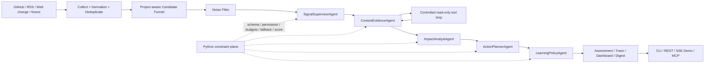

# SignalHarness

[中文](README.md) | **English**

**A production-oriented multi-agent harness for project-level signal intelligence, with controlled tool use, regression evals, observability, MCP, and a thin service layer.**

SignalHarness watches external engineering changes, decides whether they matter to a project, and turns them into auditable assessments instead of another noisy feed. The signal-intelligence use case is the business carrier; the engineering focus is the Agent Harness itself: orchestration, structured contracts, tool guardrails, deterministic fallback, evaluation, traceability, and human-gated learning.

## At a glance

| Area | What is implemented |
| --- | --- |
| Agent orchestration | Fixed five-Agent route: Supervisor → Evidence → Impact → Action → Learning |
| Tool use | Two-turn evidence tool plan; Python owns allowlist, permission checks, budgets, execution, and observations |
| Reliability | Pydantic structured outputs, schema retry, deterministic fallback, bounded repair, run timeout limits |
| Guarded decisions | LLM contributes semantics; Python owns final scoring and a primary-source high-risk alert floor |
| Memory | Project-scoped persistent signal/feedback/learning state, separated from per-run output/trace |
| Eval | 40-case Agent regression + 3-case cross-project context gate + provider contract eval |
| Observability | Local trace for Agent calls, schema/retry/fallback, tools, latency, provider-reported tokens, and estimated cost |
| MCP | Five read-only structured tools for project context, signal history, assessments, trace, and feedback |
| Service | FastAPI REST API + replayable SSE streaming runs + MCP Streamable HTTP |
| Golden Demo | Chinese by default with an in-page English switch; provider readiness is shown without exposing secrets |
| Deployment | Docker image with health check; package/CLI remains usable without a server |
| Learning | Review-only proposals → risk classification → replay gate → explicit human apply |

## Resume Edition evidence

The committed `resume-v1` regression suite contains **40 product-level cases** covering:

- high-risk direct-dependency changes;
- routine dependency releases and negated risk language;
- policy, permission, tool-calling, provider, and structured-output issues;
- expert RSS signals and source-collection noise;
- competitor/web changes;
- explicit irrelevant/giveaway/crypto/gaming noise.

The offline `mock-agent` gate currently passes all labelled expectations:

```text
cases                  40 / 40 assessed
decision accuracy      1.0000
category accuracy      1.0000
priority precision     1.0000
priority recall        1.0000
false-positive rate    0.0000
false-negative rate    0.0000
```

This is intentionally a **project-specific regression/contract suite**, not a claim of general model intelligence. Public CI runs it offline with the real five-Agent architecture and scripted provider. The same fixture can be run manually in real `agent` mode.

## Problem

Small engineering teams are exposed to GitHub releases/issues, RSS feeds, provider/API changes, security advisories, and ecosystem updates. Collection is easy; the hard part is deciding:

1. Is this source trustworthy enough to use?
2. Does the change affect this project rather than the ecosystem in general?
3. Is it an observation, something worth saving, an alert, or an action item?
4. Can the decision be explained after the run?
5. What happens when the model times out, returns invalid JSON, or requests the wrong tool?

SignalHarness treats those questions as an Agent-runtime problem rather than a chatbot problem.

## Architecture



### Five-Agent responsibilities

1. **SignalSupervisorAgent** — classifies each event and decides which downstream stages are required.
2. **ContextEvidenceAgent** — plans bounded read-only tool requests, receives observations, and produces evidence/confidence.
3. **ImpactAnalystAgent** — estimates semantic relevance, affected modules, conflicts, and risk. It cannot emit the authoritative final score.
4. **ActionPlannerAgent** — proposes reversible actions and approval notes; Python re-checks requested high-risk actions.
5. **LearningPolicyAgent** — reads memory and proposes policy/skill/watchlist changes for review only. In real interactive scans its LLM reflection is deferred out of the latency-critical path; explicit calibration/learning flows still invoke the same Agent.

Memory is infrastructure, not a sixth Agent.

### Project Memory V2

Per-run output/trace remains isolated under `service-runs/<run_id>`, while persistent signal, feedback, alert and learning state is stored under `.signal-harness/projects/<project_id>/`. Subsequent runs for the same project reuse that state; different projects are isolated. Shared project-state writes are serialized to prevent concurrent runs from overwriting the same JSON files.

### Candidate Funnel V2

Live collection can return more than a thousand raw events. SignalHarness now normalizes and deduplicates first, then ranks cheaply by project relevance, focus keywords, source authority, recency and novelty, while reserving source diversity before selecting the bounded Agent candidate set. A 2026-09-06 local live acceptance narrowed 1274 raw events to 12 project-aware candidates; that is runtime evidence, not a fixed benchmark.

### Source Authority V2

Repository authority and claim-author authority are distinct. GitHub releases can be official; a normal user issue in an official repo remains community; OWNER/MEMBER/COLLABORATOR issues are maintainer-level. Explicit OpenAI/GitHub official feeds are marked official, while independent expert feeds remain secondary. Python clamps LLM-reported source quality/confidence so a community issue cannot be promoted to official evidence by model output.

### Change Delta V1

Normalized signals preserve source-native change metadata. GitHub issues distinguish creation from update time, GitHub releases expose `previous_version → current_version`, and RSS preserves publish/update timestamps. The time-window filter now runs after normalization so all source types obey the same observed-change boundary. Golden Demo renders these deltas directly on each change card.

### Untrusted external-content boundary

GitHub/RSS/Web bodies and ToolObservation content are treated as **untrusted external data**, never Agent instructions. Prompt context explicitly rejects embedded prompt overrides/tool commands/forced classifications, while deterministic semantics strips instruction-like sentences before keyword classification and scoring without deleting the original evidence. Browser source links are restricted to `http/https`, and external event IDs are not interpolated into inline event handlers.

## Python-owned guardrails

The model is deliberately not the authority for external effects or the final business decision.

- Agent JSON is validated against strict Pydantic schemas.
- One schema retry is allowed by default; repeated invalid output falls back deterministically.
- Tool requests are checked against an allowlist, permission policy, run/event budgets, and read-only boundaries.
- Repair is bounded; it cannot become an unbounded recursive Agent handoff loop.
- Final scoring blends deterministic relevance, model semantics, and evidence confidence in Python.
- Category weighting is applied once at the guarded blend boundary.
- Explicit official CVE/vulnerability/supply-chain signals can receive a policy-configured alert floor so model under-scoring cannot silently suppress them.
- Learning proposals never auto-apply; replay and explicit approval remain mandatory.

## Run modes

```bash
# Fully deterministic offline baseline
uv run signal-harness scan \
  --fixture examples/signal_harness/sample_events.json \
  --mode demo

# Offline scripted provider through the real five-Agent architecture
uv run signal-harness scan \
  --fixture examples/signal_harness/sample_events.json \
  --mode mock-agent

# Real OpenAI-compatible provider
LLM_API_KEY=... uv run signal-harness scan \
  --fixture examples/signal_harness/sample_events.json \
  --mode agent
```

`demo` is deterministic fallback logic. `mock-agent` is the CI-safe orchestration path. `agent` uses the same schemas, runner, tool boundary, scoring, and trace with a real provider.

## Agent regression eval

```bash
uv run signal-harness regression-eval \
  --mode mock-agent \
  --enforce
```

Inputs:

- `examples/signal_harness/regression_events.json`
- `examples/signal_harness/regression_expectations.json`

Outputs:

- `outputs/regression-eval/regression_eval_summary.json`
- `outputs/regression-eval/regression_eval_summary.md`

Metrics include exact decision/category accuracy, priority precision/recall, FPR/FNR, TP/FP/TN/FN, decision confusion, missing assessments, and mismatch details. `--enforce` exits non-zero when configured thresholds fail. Unless `--state-dir` is explicitly supplied, each regression invocation uses isolated temporary state so repeated local runs cannot be contaminated by prior duplicate-memory history.

## Cross-project context eval

```bash
uv run signal-harness project-eval --enforce
```

The committed `project-context-v1` gate currently passes 3/3 cases. Each case evaluates the same event under two project profiles and requires a meaningful score gap in the expected direction, proving that project context changes runtime judgment rather than only changing the UI/Watchlist.

## Provider contract eval

`model-eval` answers a different question: **can this provider participate safely in the SignalHarness structured Agent contract?**

```bash
uv run signal-harness model-eval \
  --fixture examples/signal_harness/sample_events.json \
  --mode mock-agent \
  --runs 2
```

It records schema-valid rate, retry/fallback/timeout counts, tool validation/block/budget/runtime errors, repair behavior, decisions, latency, provider-reported token totals, and estimated cost when the selected model profile contains pricing metadata.

Real-provider results are local snapshots, not a universal leaderboard. See `docs/EVALS.md` and `docs/MODEL_EVAL_REPORT.md`.

## MCP

SignalHarness exposes a narrow **read-only** MCP surface; MCP does not bypass the existing runtime guardrails.

```bash
uv run signal-harness mcp
```

Available tools:

- `signalharness_get_project_context`
- `signalharness_search_signal_history`
- `signalharness_get_latest_assessments`
- `signalharness_get_run_trace`
- `signalharness_get_feedback_memory`

Each tool returns structured content, is annotated read-only/idempotent/closed-world, validates service run IDs, and passes through SignalHarness permission policy.

## Golden Demo UI + SSE

Start the same service and open `http://127.0.0.1:8000/demo`:

```bash
uv run signal-harness serve --host 127.0.0.1 --port 8000
```

The Golden Demo is dependency-free HTML/CSS/JS served by FastAPI. It opens in **Chinese by default** and can switch to English in place. A run first selects a **project**, then its data source, analysis path, and optional real-model provider. `configs/projects/*.yaml` is the Project Catalog; each entry binds a project profile to its own Watchlist. The public repo ships `SignalHarness` plus `Example · Agent API Service` to prove project switching without changing runtime code. `mock-agent` remains the default analysis path because it requires no API key while still exercising the real five-Agent orchestration, schemas, tool guard, trace, SSE, and Python scoring.

Clicking **Run Golden Demo** creates a queued stream run; the workflow starts only after the browser establishes the SSE subscription, so the page consumes live runtime events rather than replaying a finished animation. `TraceRecorder` append/update events feed an in-process replay buffer, and browser reconnects can resume with `Last-Event-ID`. Disconnecting the browser does not cancel the workflow.

The UI shows the selected project, its Watchlist, source-native change deltas, Agent stages, Python tool guard, schema/fallback/retry state, tool requests/execution/permission checks, final decisions, runtime health, the committed 40-case regression evidence, and the five read-only MCP tools. `signal-harness serve` automatically loads an optional project-root `.env` without overriding variables already exported by the caller. Real `agent` mode can select separately configured OpenAI, Qwen, Kimi, or DeepSeek OpenAI-compatible providers per run. Model profiles carry freshness metadata: known retired model aliases resolve to the current profile with a visible warning, while unknown overrides receive conservative capabilities instead of inheriting another model's JSON/context/pricing claims. `/demo/meta` exposes only non-secret project/provider metadata; it never returns API keys, base URLs, or local config paths, and readiness does not claim network connectivity before a run. `.env` is excluded from Git and the Docker build context. The stream is intentionally in-process: it is not a durable queue or distributed worker system.

## REST API + MCP HTTP

```bash
uv run signal-harness serve --host 127.0.0.1 --port 8000
```

REST endpoints:

```text
GET  /health
POST /runs
GET  /runs/{run_id}
GET  /runs/{run_id}/trace
GET  /runs/{run_id}/assessments
GET  /signals?run_id=...
POST /feedback
POST /stream-runs
GET  /stream-runs/{run_id}
GET  /stream-runs/{run_id}/events
GET  /demo
GET  /demo/meta
```

MCP Streamable HTTP is mounted at:

```text
/mcp
```

Each API run gets isolated output/trace directories under `service-runs/<run_id>`, while persistent memory is project-scoped under `.signal-harness/projects/<project_id>/`. The original `POST /runs` remains synchronous. Streaming demo runs are in-process asyncio tasks started by the first SSE subscriber; they continue if the browser disconnects, but live subscription history is not durable across a service restart. No Redis/Celery/worker tier is claimed.

## Wheel / running outside the repository

The wheel produced by `uv build` now carries the default configs, Project Catalog, model profiles, Watchlists, regression/demo fixtures, and Golden Demo static assets. Runtime resolution remains **workspace first**: a local `configs/` or `examples/signal_harness` wins when present, and only the default missing paths fall back to immutable package-owned resources. Explicit custom paths are never silently redirected.

That makes the built artifact usable outside the source checkout:

```bash
uv build
uv venv /tmp/signalharness-wheel
uv pip install --python /tmp/signalharness-wheel/bin/python dist/signalharness-0.1.0-py3-none-any.whl

cd /tmp
/tmp/signalharness-wheel/bin/signal-harness regression-eval --mode mock-agent --enforce
/tmp/signalharness-wheel/bin/signal-harness project-eval --enforce
```

Golden Demo no longer embeds the full HTML/CSS/JS payload in a Python raw string. `ui/demo.py` is now a small loader, while `ui/static/` owns the page, stylesheet, and JavaScript served under `/demo-assets/*`. The UI remains dependency-free while becoming independently testable and maintainable.

## Docker

```bash
docker build -t signalharness:local .
docker run --rm -p 8000:8000 signalharness:local
```

The container runs the same `signal-harness serve` entry point and exposes a `/health` Docker health check.

## Observability

Every LLM trace record can include:

- Agent, model, mode, prompt version, input IDs, output schema;
- schema validity, retry count, fallback reason, timeout state;
- tools requested/executed/blocked, permission checks, budget blocks, tool errors;
- repair status and bounded-repair metadata;
- prompt/static/dynamic context hashes;
- duration;
- provider-reported prompt/completion/total tokens;
- estimated USD cost when profile pricing metadata is configured.

Mock runs deliberately do **not** fabricate token counts.

```bash
uv run signal-harness trace
uv run signal-harness dashboard
```

The static dashboard surfaces runtime health without requiring a hosted observability product. The Golden Demo consumes the same observable trace through SSE, so UI state is derived from runtime evidence instead of a separate simulated Agent state machine.

## Feedback and guarded learning

```bash
uv run signal-harness feedback \
  --signal-id demo-001 \
  --label useful \
  --note "checkpoint signals matter"

uv run signal-harness calibrate --mode mock-agent
uv run signal-harness learning-stage
uv run signal-harness learning-review
uv run signal-harness learning-apply --proposal-id <id> --yes
```

Policy/skill/watchlist proposals remain staged unless replay and risk gates allow an explicit apply. High-risk proposals remain human-reviewed.

## CI

Public GitHub Actions are offline with respect to LLM providers. CI runs:

```text
pytest tests/signal_harness
40-case mock-agent regression gate --enforce
Ruff
mypy --strict
uv build
```

No API key is required and public CI does not call a live model provider. Pytest also verifies the Golden Demo HTML/static-asset wiring and the default packaged-resource fallback from a cwd outside the repository. Full Playwright browser acceptance remains a local release check so public CI stays offline and browser-download-free.

## Key files

```text
src/signal_harness/agent_team/          five Agent roles
src/signal_harness/agent_integration/   prompts, runner, tool loop, trace, scoring bridge
src/signal_harness/runtime/             workflow, permissions, registry, executor
src/signal_harness/signal/              schemas, scoring, taxonomy, text semantics
src/signal_harness/providers/           mock + OpenAI-compatible providers/model profiles
src/signal_harness/resources.py          workspace-first packaged-resource fallback
src/signal_harness/ui/static/            Golden Demo HTML / CSS / JS
src/signal_harness/mcp_server.py        read-only MCP interface
src/signal_harness/service.py           FastAPI REST/SSE + MCP HTTP service
src/signal_harness/service_streaming.py in-process stream-run/SSE replay manager
src/signal_harness/evals.py             model and regression evaluation
src/signal_harness/ui/                  Golden Demo + dashboard/digest/trace views
configs/projects/                       project catalog entries
configs/project_profiles/               additional project profiles
configs/watchlists/                      additional project-scoped watchlists
configs/                                default project, policy, model profiles
examples/signal_harness/                demo and regression fixtures
tests/signal_harness/                   unit/integration/regression coverage
```

## Provenance and independence

SignalHarness is maintained as its own project and the current package does not vendor or import OpenHarness runtime code. The repository does retain an `upstream` remote/common Git ancestry with HKUDS/OpenHarness from the project’s earlier exploration stage. The accurate description is therefore: **inspired by modern Agent Harness patterns and substantially reworked around the SignalHarness signal-intelligence use case**, rather than claiming a from-scratch origin with no upstream history.

## Deliberate non-goals

- no LangGraph/CrewAI/AutoGen dependency for orchestration;
- no database, queue, Redis, vector store, or embedding layer without a demonstrated need;
- no provider-native tool execution that can bypass Python controls;
- no autonomous high-risk policy mutation;
- no claim that the 40-case regression fixture is a general LLM benchmark;
- no claim that static dashboard/API/SSE service equals a horizontally scaled production platform;
- no claim that the in-process SSE replay buffer is a durable job queue.

## Interview material

- `docs/ARCHITECTURE.md`
- `docs/EVALS.md`
- `docs/REPAIR_PASS.md`
- `docs/MODEL_EVAL_RESULTS.md`
- `docs/REAL_SOURCE_SMOKE.md`
- `docs/INTERVIEW_GUIDE.md`
- `docs/INTERVIEW_DEMO_SCRIPT.md`
- `docs/PROJECT_STAR.md`
- `docs/RESUME_GUIDE.md`
