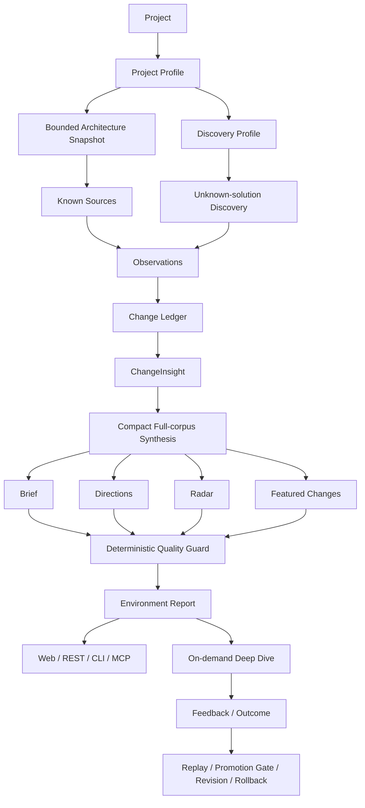

<div align="center">

# SignalHarness

**Project Environment Intelligence for software engineering changes**

Understand the project first, then continuously observe dependencies, protocols, tooling and adjacent solutions — turning “what changed outside” into “what this means for this project.”

[中文](README.md) · [Architecture](docs/ARCHITECTURE.md) · [Data Flow](docs/DATA_FLOW.md) · [Interview Demo](docs/INTERVIEW_DEMO_SCRIPT.md)

[](https://github.com/pocketvin/SignalHarness/actions/workflows/ci.yml)


</div>

---

## What problem does it solve?

Dependency bots, RSS feeds and GitHub watchlists can tell you that something changed. A real software project needs more:

- Does this change actually matter to **my project**?
- Do several independent changes form a meaningful **direction**?
- Are there previously unknown **solutions** appearing around the same problem space?
- If a change is relevant, where does it connect to actual dependencies or code structure?
- When users say an item was “too generic” or “irrelevant”, how can the system improve without silently rewriting itself?

SignalHarness keeps those questions in one auditable chain:

> **Project → Observation → Change → ChangeInsight → Direction / Radar → Deep Dive → Feedback / Calibration**

The current product is not a free-form multi-agent discussion system. Its hot path is **deterministic workflow + bounded model stages**: Python owns facts, identity, evidence boundaries and quality gates; models are used only where semantic judgment is needed.

---

## Current product path



### 1. Understand the project first

Connecting a project produces a versioned Project Profile and derives:

- stack, runtimes, protocols, providers and dependencies;
- problem spaces / solution categories;
- a bounded `Architecture Snapshot`;
- a `Discovery Profile` that determines what adjacent solutions should be searched for.

Project Understanding V2 reads a bounded set of real production source files and extracts:

- major subsystems;
- entrypoint hints;
- dependency usage;
- static import edges;
- path / line evidence.

It deliberately does **not** claim that a bounded sample is a complete runtime call graph. Static imports are structural evidence, not runtime reachability.

### 2. Observe the environment

Known sources and active discovery enter a shared Observation layer:

- GitHub releases / issues / PRs / commits;
- package registries;
- OSV;
- RSS / official web changes;
- local git;
- project-conditioned GitHub repository discovery.

Observations are frozen into a time window, normalized, identity-resolved and deduplicated before entering the `Change Ledger`. Project-owned activity is separated from external environment changes, so **a project’s own commits or PRs cannot prove an external trend**.

### 3. ChangeInsight: keep project relation cheap

Every Change receives a persisted ChangeInsight, but it may come from:

- validated cache;
- deterministic FactCapsule / project relation logic;
- bounded weak-model semantic batches.

Routine community GitHub issues can use a conservative deterministic projection when project relation is already known and no high-risk signal is present. The system says “the community reported / proposed X”; it does not silently upgrade discussion into a confirmed defect.

### 4. One global synthesis, not one Deep Dive per item

The strong model sees a **compact representation of the full external Change corpus**, not Featured items or a Top-K subset.

The synthesis produces four first-class outputs:

| Object | Question it answers |
| --- | --- |
| **Brief** | What happened overall? |
| **Direction** | What do several independent changes collectively suggest? |
| **Radar** | What previously untracked solutions appeared in the same problem space? |
| **Featured** | Which concrete changes deserve attention first? |

Direction and Radar then pass deterministic quality gates for evidence ownership, source independence, temporal claims, project-activity contamination, adoption overclaims, trend velocity and product copy quality.

### 5. Repair is bounded

Invalid model output is not shown directly and the system does not loop indefinitely.

- Local prose / temporal issues → localized repair with only the invalid result and referenced Changes;
- global evidence / citation structure issues → bounded full-context retry;
- repair still fails → explicit degraded / unavailable state, never fabricated success.

This keeps broad scans predictable rather than turning them into an autonomous agent loop.

### 6. Deep Dive is explicit

Normal scans do not automatically run evidence-heavy Deep Dives. A user explicitly opens an external Change before SignalHarness combines:

- source Evidence;
- current Project Profile;
- Architecture Snapshot;
- dependency usage / saved code references;
- additional external verification when needed.

Cost is concentrated on the few questions that actually require deeper investigation.

### 7. Review-first self-improvement

Users can label a frozen Change as useful, not useful, false positive / unrelated, or too generic, and can record a real outcome.

Those signals do **not** immediately rewrite a report or Prompt. They enter:

```text
Feedback / Outcome
        ↓
Frozen Episodes
        ↓
Replay
        ↓
Candidate Policy
        ↓
Promotion Gate
        ↓
Human Review
        ↓
Apply → Revision → Rollback
```

The Web “Learning & Calibration” view renders the actual durable state. If evidence is insufficient, it says so instead of pretending the system has learned.

---

## Web product

Run the local service:

```bash
uv run signal-harness serve --host 127.0.0.1 --port 8001
```

Open:

```text
http://127.0.0.1:8001/demo
```

The current Web surface includes:

- Environment Overview: Brief / Direction / Radar / Featured;
- All Changes: frozen Changes from the selected report;
- Project Activity: project-owned activity shown separately;
- Project & Watchlist: Project Profile / Watchlist / Architecture Snapshot;
- Learning & Calibration: Feedback / Outcome / Replay / Candidate / Revision;
- Real execution Trace: model, tokens, latency, cache, fallback and repair state.

The product Trace API exposes only safe product fields. Raw prompts, internal source-task payloads and error bodies are not exposed.

---

## REST / CLI / MCP share one product truth

The current Direction-first product delegates shared semantics to `EnvironmentApplication`:

```text
                     REST / React
                    ↗
EnvironmentApplication → CLI
                    ↘
                      MCP
```

This prevents each adapter from inventing its own definition of “latest report”, “current profile” or Change ownership.

### CLI

```bash
# Run the current Project Environment Intelligence pipeline
uv run signal-harness environment --project signalharness --window since_last

# Read-only commands — no model call
uv run signal-harness environment-context --project signalharness
uv run signal-harness environment-architecture --project signalharness
uv run signal-harness environment-report --project signalharness
uv run signal-harness environment-changes --project signalharness
uv run signal-harness environment-calibration --project signalharness
```

The old `scan / report / changes / change` commands remain as a legacy compatibility surface; they are not the current Web product’s source of truth.

### MCP

```bash
# stdio MCP
uv run signal-harness mcp

# REST + SSE + Streamable HTTP MCP (/mcp)
uv run signal-harness serve --host 127.0.0.1 --port 8001
```

The MCP surface exposes **19 tools: 15 read-only + 4 write actions**. It includes current-product tools plus a small compatibility surface. The four write actions only start scans or record feedback / outcomes and keep explicit permission boundaries; MCP is not falsely described as entirely read-only.

---

## Quick start

### 1. Install

```bash
git clone https://github.com/pocketvin/SignalHarness.git
cd SignalHarness

uv sync --extra dev --locked
npm --prefix frontend ci --ignore-scripts
npm --prefix frontend run build
```

Requirements:

- Python 3.10+
- Node.js / npm for frontend development and build
- `uv`

### 2. Configure live providers (optional)

```bash
cp .env.example .env
```

`.env.example` follows the actual Provider Catalog contract:

```text
QWEN_API_KEY / QWEN_BASE_URL
KIMI_API_KEY / KIMI_BASE_URL
DEEPSEEK_API_KEY / DEEPSEEK_BASE_URL
OPENAI_API_KEY / OPENAI_BASE_URL
```

Model names default to `configs/model_profiles/*.yaml`. Set `*_MODEL` / `*_MODEL_PROFILE` only when you explicitly need an override.

Never commit `.env`, API keys, runtime outputs or local state.

### 3. Run

```bash
uv run signal-harness serve --host 127.0.0.1 --port 8001
```

### 4. Offline quality gate

```bash
npm --prefix frontend run typecheck
npm --prefix frontend run build
uv run --extra dev python -m pytest tests/signal_harness -q
uv run --extra dev ruff check src/signal_harness tests/signal_harness
uv run --extra dev mypy src/signal_harness
uv build
```

Public CI runs only deterministic offline quality gates. It does not require live provider credentials or incur provider cost.

---

## Repository map

```text
src/signal_harness/
├── environment_application.py   # current product application truth
├── intelligence/                # ChangeInsight / synthesis / guard / deep dive
├── projects/                    # onboarding / discovery / architecture snapshot
├── persistence/                 # Change Ledger / intelligence revisions
├── providers/                   # model profiles / provider routing
├── runtime/                     # workflow / streaming / permissions / trace
├── service*.py                  # REST / SSE adapters
├── mcp_server.py                # MCP adapter
├── agent_team/                  # legacy five-Agent compatibility baseline
└── agent_integration/           # legacy/eval model integration infrastructure

frontend/src/environment/        # current React + TypeScript product UI
configs/                         # policies / built-in project config / watchlist
tests/signal_harness/            # offline regression and product contracts
docs/                            # architecture / data flow / decision records
```

---

## Design principles

1. **Project-first, not news-first.** Understand the project before ranking external changes.
2. **Full evidence ledger, compact model wire.** Save tokens without deleting facts via Top-K truncation.
3. **Python owns deterministic boundaries.** Identity, ownership, time, independence, permission and guards are code-owned.
4. **Cheap broad scan, deep analysis on demand.** The hot path does not run an autonomous agent loop.
5. **Frozen history.** A new Profile or Policy never rewrites an old Report.
6. **Learning is replayable, approvable and rollbackable.** No scan-time self-modification.
7. **Legacy remains compatible, but never becomes a second current-product truth.**

---

## Current boundary

SignalHarness today is:

> **Project Environment Intelligence + bounded static codebase understanding**

It deliberately does not claim:

- complete understanding of the entire repository;
- a complete symbol graph / call graph;
- static import equals runtime reachability;
- GitHub search proves market adoption;
- one new repository proves an industry trend;
- unguarded model output is factual truth.

A future Repository Index / symbol graph / impact-propagation phase would be a separate, heavier stage rather than an excuse to overstate the current Architecture Snapshot.

---

## Legacy Harness / Eval baseline

The repository still contains the earlier deterministic / mock-agent / five-Agent Harness, regression eval, capability eval and related CLI commands for:

- regression;
- architecture experiments;
- compatibility;
- historical comparison.

They are **not** the current Direction-first Web product path. New REST / CLI / MCP product semantics should go through `EnvironmentApplication`, not extend `ProductIntelligenceService` or the old assessment / impact-score model.

---

## Further reading

### Current product

- [Architecture](docs/ARCHITECTURE.md)
- [Data Flow](docs/DATA_FLOW.md)
- [Environment Intelligence V1](docs/ENVIRONMENT_INTELLIGENCE_V1.md)
- [Target State](docs/SIGNALHARNESS_TARGET_STATE.md)
- [Working Plan](docs/SIGNALHARNESS_WORKING_PLAN.md)
- [Interview Demo Script](docs/INTERVIEW_DEMO_SCRIPT.md)

### Historical validation / engineering notes

- [Repair Pass](docs/REPAIR_PASS.md)
- [Model Eval Results](docs/MODEL_EVAL_RESULTS.md)
- [Real Source Smoke](docs/REAL_SOURCE_SMOKE.md)
- [Notices](NOTICE.md)

---

## Status

The current branch is protected by the offline Python test suite, Ruff, mypy, TypeScript typecheck, Vite production build and Python package build. Live-provider smoke tests and live-source scans are explicit, potentially billable manual validation and are not executed automatically in Public CI.

The most accurate one-line architecture summary is:

> **Use deterministic analysis to understand the project and evidence, weak models to interpret local changes, one strong-model pass for global synthesis, Deep Dive only on explicit demand, and a replayable / approvable / rollbackable feedback loop for continuous calibration.**
