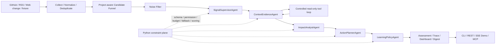

# SignalHarness

**中文** | [English](README.en.md)

> 一个面向真实工程场景的 Multi-Agent Harness：用外部技术变化作为业务载体，重点展示五 Agent 编排、受控工具调用、Python Guardrails、Agent Eval、Trace/Observability、MCP、SSE、FastAPI 与 Docker。

SignalHarness 会实时监听 GitHub / RSS 等外部工程信号，并保留可扩展的 Web Change 适配入口；它判断这些变化是否真正影响当前选择的项目，并把结果转成**可解释、可审计、可回归验证**的决策，而不是再做一个信息聚合器或聊天机器人。

## 30 秒看懂这个项目

普通爬虫擅长“收集”，普通 Dashboard 擅长“展示”，普通 LLM 擅长“推理”，但真实 Agent 系统还需要回答：

- 模型什么时候可以调用什么工具？
- 工具调用被拒绝或失败怎么办？
- 模型输出 JSON 不合法怎么办？
- 模型能不能直接决定最终业务分数？
- 一次判断为什么发生，之后能不能复盘？
- 修改 Prompt / Router / Scoring 后，如何防止旧能力被改坏？

SignalHarness 的核心答案是：**LLM 负责推理，Python runtime 负责约束、执行、评分、Fallback 和审计。**

## 当前已实现能力

| 能力 | 当前实现 |
| --- | --- |
| Agent 编排 | 固定五 Agent：Supervisor → Evidence → Impact → Action → Learning |
| Tool Calling | Evidence 两阶段工具计划；Python 负责 allowlist、permission、budget、execution、observation |
| 结构化输出 | Pydantic Schema、一次 schema retry、确定性 fallback |
| Guarded Scoring | LLM 提供语义判断；Python 持有 authoritative final score |
| Memory | Project-scoped persistent Signal / Feedback / Learning Memory；Run 输出与项目长期状态分离 |
| Agent Eval | 40 条项目级 Regression Suite + 3 条 Cross-project Context Gate + Provider Contract Eval |
| Observability | Agent、Schema、Retry、Fallback、Tools、Latency、Tokens、Estimated Cost Trace |
| MCP | 5 个只读 structured tools |
| Service | FastAPI REST + SSE Streaming Run + MCP Streamable HTTP |
| Golden Demo | 默认中文，可切换 English，实时消费同一份 Trace |
| Deployment | Docker + `/health` healthcheck |
| Learning | Review-only proposal → replay/risk gate → 显式人工 apply |

## 总体架构



核心边界：**Agent 负责语义推理；Python constraint plane 负责可验证规则和外部副作用。**

## Golden Demo：实时运行入口

启动服务：

```bash
uv run signal-harness serve \
  --host 127.0.0.1 \
  --port 8001
```

打开：

```text
http://127.0.0.1:8001/demo
```

页面默认是**中文**，右上角可切换 `EN`。运行前先选择**关联项目**，再选择数据来源、分析方式和真实模型。项目不是写死在 UI 中：`configs/projects/*.yaml` 是 Project Catalog，每个项目分别绑定自己的 Project Profile 与 Watchlist。公开仓库默认提供 `SignalHarness` 与 `Example · Agent API Service` 两个 profile，用来证明同一套 Workflow 可以按项目切换判断上下文。

默认组合是：

```text
SignalHarness + 实时 Watchlist + 离线五 Agent / mock-agent
```

它不需要 API Key，但仍然走真实五 Agent orchestration、Schema、Tool Guard、Trace、SSE 和 Python scoring，因此适合稳定展示真实 Harness 行为。

页面会实时展示：

```text
采集 + 标准化
      ↓
SignalSupervisorAgent
      ↓
ContextEvidenceAgent
      ↓
Python 工具守卫
      ↓
ImpactAnalystAgent
      ↓
ActionPlannerAgent
      ↓
LearningPolicyAgent
      ↓
受控决策
```

点击任一阶段可以查看：

- Schema 是否有效
- Retry / Fallback
- Tools requested / executed / blocked
- Permission checks
- Duration
- 最终 decision / score
- Live Trace
- Runtime health

### SSE 不是前端假动画

Golden Demo 的实时链路是：

```text
POST /stream-runs
        ↓
queued
        ↓
浏览器建立 EventSource
        ↓
启动 SignalHarnessWorkflow
        ↓
TraceRecorder append / update
        ↓
SSE
        ↓
浏览器实时更新
```

首个 SSE subscriber 建立后才真正启动 queued run；浏览器断开不会取消任务；重连可通过 `Last-Event-ID` 补发内存中的历史事件。

这里明确是 **in-process streaming**，不是 Redis/Celery/Kafka，也不声称拥有持久化分布式任务系统。

### Project Memory V2：Run 状态与项目长期状态分离

服务端每次 Run 仍保留独立 output / trace，但项目长期记忆按 `project_id` 持久化：

```text
.signal-harness/
├── projects/<project_id>/
│   ├── signal_memory.json
│   ├── feedback_memory.json
│   ├── alert_state.json
│   └── learning artifacts
└── service-runs/<run_id>/
```

同一项目的后续扫描会读取之前的 seen signals 与 feedback；不同项目彼此隔离。同项目并发 Run 在共享状态写入处串行化，避免覆盖同一个 JSON state。

### Candidate Funnel V2：先判断相关性，再做 Top-K

实时 Watchlist 可能一次产生上千条原始事件。SignalHarness 不再先按时间把它们直接砍成 12 条，而是先完成 Normalize / Deduplicate，再用低成本的 Project Relevance、Focus Keyword、Source Authority、Recency 与 Novelty 做候选排序，并保留来源多样性后才进入五 Agent。

一次 2026-09-06 本地 live acceptance 中，Watchlist 从 1274 条 raw events 形成 12 条 project-aware candidates；这是运行证据，不是固定 benchmark。

### Source Authority V2

来源位置与“谁在说话”分开建模：GitHub Release 可视为 official；官方仓库里的普通用户 Issue 仍是 community；OWNER / MEMBER / COLLABORATOR Issue 作为 maintainer；Watchlist 中明确标记的 OpenAI/GitHub 官方 RSS 才是 official，独立专家 Feed 保持 secondary。Python 会 clamp LLM 报告的 source quality / confidence，模型不能把 community Issue 自行升级成 official。

## 三种运行模式

### 1. `mock-agent`：离线五 Agent 演示

```bash
uv run signal-harness scan \
  --fixture examples/signal_harness/sample_events.json \
  --mode mock-agent
```

使用 scripted offline provider，但走真实五 Agent 架构。公开 CI 和 Golden Demo 默认使用它。

### 2. `demo`：确定性基线

```bash
uv run signal-harness scan \
  --fixture examples/signal_harness/sample_events.json \
  --mode demo
```

这是 deterministic fallback，不应描述成真实多 Agent 执行。

### 3. `agent`：真实模型

```bash
LLM_API_KEY=... uv run signal-harness scan \
  --fixture examples/signal_harness/sample_events.json \
  --mode agent
```

`signal-harness serve` 启动时会自动读取项目根目录的 `.env`，但不会覆盖已经显式 export 的环境变量。Golden Demo 当前可识别并按 run 切换 OpenAI、Qwen、Kimi、DeepSeek 四套 OpenAI-compatible 配置；未配置的 provider 会保持不可选。

页面不会暴露 API Key、Base URL 或本地配置路径；“已配置”也只表示本地配置完整，真实网络连接仍在 Run 时验证。`.env` 已被 Git 和 Docker build context 排除。

## 五个 Agent 分别做什么

1. **SignalSupervisorAgent**
   对 Signal 分类并决定哪些下游阶段需要执行。

2. **ContextEvidenceAgent**
   先提出 bounded read-only tool requests；Python 校验并执行后，再根据 ToolObservation 合成证据和 confidence。

3. **ImpactAnalystAgent**
   结合 Project Profile 判断 semantic relevance、affected modules、conflicts 和 risk，但不能输出 authoritative final score。

4. **ActionPlannerAgent**
   生成 bounded、可逆、可审核的行动建议；高风险动作仍会被 Python 再次检查。

5. **LearningPolicyAgent**
   基于 Memory 提出 policy / watchlist / skill 的 review-only proposal，不自动修改配置。

## 为什么最终分数不交给 LLM

SignalHarness 故意把最终业务判断留在 Python：

```text
Deterministic relevance
        +
LLM semantic relevance
        +
Evidence confidence
        +
Policy/category weights
        ↓
Python guarded score
        ↓
ignore / save / alert / action_required
```

这样做的目的不是“不相信模型”，而是把**可验证规则和不可完全验证的语义推理拆开**。

另外，官方来源中的 CVE / vulnerability / supply-chain 等高风险 Signal 可以触发 Python-owned priority floor，避免模型低估后静默漏报。

## Controlled Tool Calling

SignalHarness 不是让 Provider 原生自由调用工具，而是：

```text
LLM
 ↓
EvidenceToolPlan
 ↓
Python allowlist / permission / budget
 ↓
Tool execution
 ↓
ToolObservation
 ↓
LLM evidence synthesis
```

这意味着：

- 模型只能“提出工具请求”
- Python 决定是否执行
- Tool error / blocked / budget exceeded 都进入 Trace
- 工具失败不会被隐藏
- broad live search 默认没有开放

## 40 条 Agent Regression Eval

运行：

```bash
uv run signal-harness regression-eval \
  --mode mock-agent \
  --enforce
```

当前 committed `resume-v1` corpus：

```text
cases                  40 / 40 assessed
decision accuracy      1.0000
category accuracy      1.0000
priority precision     1.0000
priority recall        1.0000
false-positive rate    0.0000
false-negative rate    0.0000
```

覆盖包括：

- 高风险直接依赖变化
- 普通 release
- policy / permission / tool calling
- provider / structured-output 问题
- RSS expert signal 与采集噪声
- competitor / web change
- giveaway / crypto / gaming 等显式噪声
- `no breaking change` 一类否定语义

第一版 Regression baseline 曾出现：

```text
decision accuracy  75%
priority recall     28.57%
```

它真实暴露并推动修复了：

- category multiplier 重复计算
- mock provider 没拿到 stable project context
- 否定语义误判
- routing contract 回归

> **重要：这里的 100% 只代表 SignalHarness 项目级 Regression Contract，不代表通用 LLM 准确率 100%。**

## Cross-project Context Eval

多项目之后还要证明“Project Context 真的会改变判断”，而不是只换 Watchlist。CI 额外运行：

```bash
uv run signal-harness project-eval --enforce
```

当前 `project-context-v1` 为 3/3 PASS。同一事件分别在 `SignalHarness` 与 `Example Agent API Service` 下评分，要求目标项目的相关性得分有明确 gap；例如 MCP permission change 在 SignalHarness 中为 `SAVE`，在 Example Agent API Service 中为 `IGNORE`。

## Provider Contract Eval

Regression Eval 关注“产品行为有没有回归”；`model-eval` 关注“某个真实 Provider 能否稳定遵守 Harness contract”。

```bash
uv run signal-harness model-eval \
  --fixture examples/signal_harness/sample_events.json \
  --mode mock-agent \
  --runs 2
```

记录：

- schema-valid rate
- retry / fallback / timeout
- tool validation / blocked / runtime error
- bounded repair
- latency
- provider-reported tokens
- estimated cost（配置 pricing metadata 时）

历史真实 Provider 结果只作为 dated snapshot，不作为长期通用排行榜。详见 `docs/EVALS.md` 和 `docs/MODEL_EVAL_REPORT.md`。

## MCP

SignalHarness 暴露 5 个只读 Structured MCP Tools：

```text
signalharness_get_project_context
signalharness_search_signal_history
signalharness_get_latest_assessments
signalharness_get_run_trace
signalharness_get_feedback_memory
```

特点：

- read-only
- idempotent
- closed-world
- service run ID 校验
- 仍经过 SignalHarness permission policy

MCP 是第二个读取入口，不是绕过 Harness Guardrail 的后门。

## REST + SSE + MCP HTTP

启动：

```bash
uv run signal-harness serve --host 127.0.0.1 --port 8001
```

主要 endpoints：

```text
GET  /health
GET  /demo
GET  /demo/meta
POST /runs
GET  /runs/{run_id}
GET  /runs/{run_id}/trace
GET  /runs/{run_id}/assessments
GET  /signals?run_id=...
POST /feedback
POST /stream-runs
GET  /stream-runs/{run_id}
GET  /stream-runs/{run_id}/events
```

MCP Streamable HTTP：

```text
/mcp
```

原 `POST /runs` 仍是同步 Run；Golden Demo 使用新增的 in-process stream-run，两者复用同一个 `SignalHarnessWorkflow`。

## Observability

Trace 可以记录：

- Agent / model / mode / prompt version
- Schema validity
- Retry / Fallback / Timeout
- Tools requested / executed / blocked
- Permission checks
- Budget blocks / Tool errors
- Repair metadata
- Context hashes
- Duration
- Provider reported tokens
- Estimated USD cost

`mock-agent` 不伪造 token 数量。

CLI 查看：

```bash
uv run signal-harness trace
uv run signal-harness dashboard
```

Golden Demo 通过 SSE 消费**同一个 observable TraceRecorder**，不是维护另一套“看起来像 Agent 在跑”的前端状态机。

## Feedback 与 Guarded Learning

```bash
uv run signal-harness feedback \
  --signal-id demo-001 \
  --label useful \
  --note "checkpoint signals matter"

uv run signal-harness calibrate --mode mock-agent
uv run signal-harness learning-stage
uv run signal-harness learning-review
uv run signal-harness learning-apply --proposal-id <id> --yes
```

Learning proposal 不自动应用。高风险 proposal 或 replay gate failed proposal 保持 staged，需要显式 review / approval。

## Docker

```bash
docker build -t signalharness:local .
docker run --rm -p 8001:8000 signalharness:local
```

浏览器打开：

```text
http://127.0.0.1:8001/demo
```

容器运行的是同一个 FastAPI + MCP + SSE service entry point，并提供 `/health` healthcheck。

## CI 与工程验证

公开 GitHub Actions 不依赖真实 LLM API：

```text
pytest tests/signal_harness
40-case mock-agent regression gate --enforce
3-case cross-project context gate --enforce
Ruff
mypy --strict
uv build
```

真实 Provider smoke 由本地显式环境变量触发，不把 API Key 放进 Public CI。

## 核心文件

```text
src/signal_harness/agent_team/          五 Agent roles
src/signal_harness/agent_integration/   prompts / runner / schemas / tool loop / trace
src/signal_harness/runtime/             workflow / permissions / registry / executor
src/signal_harness/signal/              scoring / candidate funnel / source authority / semantics
src/signal_harness/projects/            Project Catalog + persistent project state
src/signal_harness/providers/           mock + OpenAI-compatible provider
src/signal_harness/mcp_server.py        只读 MCP interface
src/signal_harness/service.py           FastAPI REST/SSE + MCP HTTP
src/signal_harness/service_streaming.py stream-run / SSE replay manager
src/signal_harness/ui/demo.py           中英双语 Golden Demo
src/signal_harness/evals.py             Regression + Provider Contract Eval
configs/projects/                       Project Catalog entries
configs/project_profiles/               Additional project profiles
configs/watchlists/                      Additional project-scoped Watchlists
configs/                                Default project / Policy / Model profiles
examples/signal_harness/                Demo / Regression fixtures
tests/signal_harness/                   Unit / Integration / Regression tests
```

## 项目边界

SignalHarness 当前**明确没有**：

- LangGraph / CrewAI / AutoGen orchestration dependency
- Redis / Celery / Kafka durable queue
- PostgreSQL / multi-tenant state
- VectorDB / Embedding / 通用 RAG
- Provider-native unrestricted tool calling
- 自动应用高风险 Learning proposal
- Production auth / horizontal scaling

这些不是通过 README 隐藏掉的“未来能力”，而是当前有意保持的 MVP 边界。

## 项目来源说明

SignalHarness 当前 package 不 vendor、也不 import OpenHarness runtime code；但仓库保留了早期探索阶段与 `HKUDS/OpenHarness` 的 upstream remote / common Git ancestry。

准确表述是：**借鉴现代 Agent Harness 模式，并围绕 Signal Intelligence 场景进行了实质性重构和独立实现。** 不声称项目从历史上完全没有 upstream 来源。

## 技术与项目文档

- `docs/ARCHITECTURE.md`
- `docs/EVALS.md`
- `docs/REPAIR_PASS.md`
- `docs/MODEL_EVAL_RESULTS.md`
- `docs/REAL_SOURCE_SMOKE.md`
- `docs/INTERVIEW_GUIDE.md`
- `docs/INTERVIEW_DEMO_SCRIPT.md`
- `docs/PROJECT_STAR.md`
- `docs/RESUME_GUIDE.md`

建议从 **Golden Demo → 40-case Eval → Trace/Tool Guard → MCP → 架构边界** 依次理解项目。
