# SignalHarness

**中文** | [English](README.en.md)

> 一个面向持续开发软件项目的 Project Environment Intelligence 系统：连接项目后持续收集、聚合和分析周围的工程环境变化，回答“发生了什么、哪些值得关注、会影响什么、应该做什么”。Multi-Agent、规则、Search 与 Scoring 都只是可替换的实现技术。

SignalHarness 会实时监听项目本地 Git、GitHub、PyPI package registry、OSV 安全公告、RSS 与配置化网页快照等工程信号；它判断这些变化是否真正影响当前选择的项目，并把结果转成**可解释、可审计、可回归验证**的决策，而不是再做一个信息聚合器或聊天机器人。

## 当前产品主线：方向优先，按需核实

正常网页已经改为 **环境方向 → 整体报告 → 建议先看的变化 → 全部相关变化**。扫描时先整理去重，每个 Change 都得到 ChangeInsight；缓存和确定性 FactCapsule 能处理的不会调用模型，只有语义缺口进入有界 Batch。最后让强模型一次综合完整紧凑语料；不再自动深挖 Top 12。

用户明确点击某条变化，才创建独立、可缓存的 Deep Dive。前端不选择分析模型，不显示分数、mock 模式或原始 Trace 控制台。服务端模型策略位于 `configs/intelligence_policy.yaml`。

当前环境报告还会区分 **外部环境变化** 与 **项目自身活动**：后者只用于解释项目关联，不能制造外部趋势。Direction 会显示证据姿态（问题/讨论信号、混合证据、已观察变化），避免把 GitHub Issue 当成已经发布的事实。

成本侧现在使用 **cache → deterministic FactCapsule → semantic batch** 的三路 ChangeInsight 解析；不是每个 Change 都调用弱模型。只有需要语义理解的 cache miss 才进入默认 12 条/批、并发 3 的队列；强模型读取的是每条 Change 的紧凑 DirectionDigest，而不是再次读取完整证据。

浅层项目关系已经进一步改成 **Python-owned relation/basis + 模型短 note**：模型 wire 不再为每条变化重复整份项目画像或自由写百字级关系说明；已知 direct/context 与具体依据由 FactCapsule 固定，模型越权只在单条上确定性收敛，不会为了一个 relation 错误重跑整个 Batch。

```bash
cd /Users/yu0/Workspace/10-Projects/SignalHarness
uv run signal-harness environment --project signalharness --window since_last
uv run signal-harness environment-report --project signalharness
uv run signal-harness serve --host 127.0.0.1 --port 8001
# Web: /demo
```

本轮的实际实现、验收证据和未完成边界见 [环境情报 V1 实现说明](docs/ENVIRONMENT_INTELLIGENCE_V1.md)。300 条全量测试是数据流测试；真实接口另用保存的来源小样本回放验收，不能混同为完整真实环境质量评估。

以下既有 Agent/Harness、评测和 MCP 说明保留为 **兼容/回归链路的历史说明**；默认 `scan` 与旧 MCP 还没有被悄悄改成新产品流程。新主入口是 `environment` 与 `/intelligence/*`。

## 30 秒看懂既有 Agent 基线

普通爬虫擅长“收集”，普通 Dashboard 擅长“展示”，普通 LLM 擅长“推理”，但真实 Agent 系统还需要回答：

- 模型什么时候可以调用什么工具？
- 工具调用被拒绝或失败怎么办？
- 模型输出 JSON 不合法怎么办？
- 模型能不能直接决定最终业务分数？
- 一次判断为什么发生，之后能不能复盘？
- 修改 Prompt / Router / Scoring 后，如何防止旧能力被改坏？

SignalHarness 的核心答案是：**稳定的环境事实与 Scan 状态由 Python/runtime 持久化和约束，LLM 只负责真正需要语义判断的分析节点。** 真实 `agent` 扫描现在默认使用 2-call adaptive Analyzer；原五 Agent 路径继续作为受保护 baseline / rollback 对照，`mock-agent` 仍默认走五 Agent 以覆盖完整链路。

## 当前已实现能力

| 能力 | 当前实现 |
| --- | --- |
| Analyzer default | real `agent`：deterministic Route/Evidence → merged Impact+Action → Narrative（2 calls）；schema/coverage 失败才升级 split；`mock-agent` 保留 five-Agent baseline |
| Tool Calling | Evidence 两阶段工具计划；Python 负责 allowlist、permission、budget、execution、observation |
| 结构化输出 | Pydantic Schema、一次 schema retry、确定性 fallback |
| Guarded Scoring | LLM 提供语义判断；Python 持有 authoritative final score |
| Change Ledger | Project-scoped SQLite：EventRevision → Change → ProjectImpact → ScanChange；Top-K 不再决定事实是否存在 |
| Project Profile / Preference | versioned ProfileRevision + Critical / Important / Normal / Low / Ignore；显式偏好直接影响排序和 Agent Context |
| Sources | 项目本地 Git commits、GitHub releases/issues/commits/merged PRs、PyPI、基于 lockfile 精确版本的 OSV、RSS、usage-bound 官方 Web changelog/spec；同一 package/version 或同一 repo/commit 的多源 observation 聚合为一个 Change |
| Memory / State | Project-scoped Signal / Feedback / Learning 兼容状态；新业务历史逐步迁移到结构化 Ledger |
| Agent Eval | 40-case Regression protection + 32-case Capability Golden V1 + 8-case Trajectory contract + 3-case Cross-project Context + Provider Contract；Narrative Judge 尚未校准/启用 |
| Observability | 同一 TraceRecorder 通过 SSE 实时 append/update；Agent、Schema、Retry、Fallback、Tools、Latency、Tokens、Estimated Cost，以及可展开的 `structured-reasoning-v1` 模型结构化判断摘要 |
| MCP | 10 个 structured tools：9 个只读读取工具 + 1 个持久化 fresh-scan 启动工具；CLI 仍是开发者/Coding Agent 首选接口 |
| Product Intelligence | 同一 frozen Scan 的 Overall Report → Top Changes → All Relevant Changes → Change Detail，共用一份 core projection |
| Continuous Monitoring | 持久 Schedule（12h/24h/本地时间）+ 独立 schedule checkpoint + Inbox + Outbox/DeliveryAttempt + 可选 HMAC signed Webhook；scheduled run 不消耗手动 `since_last` |
| Calibration | 真实 Feedback/Outcome → frozen Episode → historical/shadow replay → durable promotion gate；至少 3 条 labeled Episode，no-gain/regression 拒绝，policy apply 有 revision + rollback |
| CLI | CLI-first developer / Coding Agent surface：`scan/report/changes/change --json` + shared Markdown export |
| Service | FastAPI REST + SSE Streaming Run + Product Intelligence REST + MCP Streamable HTTP |
| Golden Demo | React + TypeScript + Tailwind SPA；默认中文，可切换 English；Runtime/Trace 双栏、Project Context 渐进展开、Intelligence 结果流与 Change Drawer 共用现有 REST/SSE contract |
| Deployment | Docker + `/health` healthcheck |
| Learning | Review-only proposal → replay/risk gate → 显式人工 apply |

## 总体架构

```mermaid
flowchart LR
    Sources[Local Git / GitHub / PyPI / OSV / RSS / Web change / fixture]
    Collect[Collect / Normalize / Deduplicate]
    Funnel[Project-aware Candidate Funnel]
    Noise[Noise Filter]
    Route[Deterministic project-aware Route]
    Evidence[Deterministic source-aware Evidence]
    Tools[Controlled read-only source tools]
    IA[ImpactActionAnalyzerAgent]
    Split[ImpactAnalystAgent → ActionPlannerAgent]
    Guard[Python guarded scoring / permission]
    Narrative[ProjectNarrativeAgent]
    Learning[Explicit Calibration / Learning]
    Output[Assessment / Product / Trace / Digest]
    Interfaces[CLI / REST / SSE Demo / MCP]

    Sources --> Collect --> Funnel --> Noise --> Route --> Evidence --> IA --> Guard --> Narrative --> Output --> Interfaces
    Evidence --> Tools --> Evidence
    IA -. schema / coverage failure only .-> Split --> Guard
    Guard -. feedback / outcomes .-> Learning
    Guard -. schema / permission / budgets / fallback / scoring .-> IA
    Guard -.-> Split
```



核心边界：**Agent 负责语义推理；Python constraint plane 负责可验证规则和外部副作用。**

### 实时 SSE Trace 与模型判断摘要

Golden Demo 的扫描进度不再用“预设 Agent 动画”模拟执行。`TraceRecorder` 在 LLM 调用前先 append `status=running`，完成后以同一 Trace index 发出 update；`StreamRunManager` 将这两类真实事件通过 SSE `trace.step / trace.step.updated` 推到页面。扫描控制区和底部完整 Audit 消费的是同一份 Trace。

模型步骤可用原生 `<details>` 展开/收起。展开后显示 `structured-reasoning-v1`：它只从已经通过 Pydantic 验证的显式模型输出字段中提取 `impact_reason / uncertainty / planning_summary / report_zh` 等可公开判断摘要，并附带 Schema、Tool、Permission、Fallback、Latency、Token 等技术审计。**这里不展示、也不声称展示模型隐藏思维链 / chain-of-thought。** Provider 原始响应和 Prompt 不进入这份 UI metadata。

前端源码现在位于 `frontend/`，使用 React + TypeScript + Tailwind；Vite 将生产 bundle 编译为 FastAPI 继续托管的 `src/signal_harness/ui/static/demo.html|css|js`，因此 `/demo` URL、REST/SSE contract 和 wheel 静态资源路径不变。界面按项目环境情报控制台重新组织：Runtime/真实 Trace 是首要工作区，Project Context 保留快速自然语言偏好并折叠详细规则，Continuous Monitoring 降到渐进披露，Intelligence 使用报告 + editorial priority rows + grouped All Changes，Change Detail 使用右侧 Drawer。Pipeline 根据实际 Trace 映射为采集 → 路由 → 证据 → 影响/行动 → 受控决策 → 用户摘要，不再写死历史 five-Agent 结构。

`signal-harness serve` 的 FastAPI 生命周期同时运行持久 Schedule manager：`/projects/{project_id}/schedules` 可创建/查看/停用 12h、24h 或本地时间计划，`/projects/{project_id}/inbox` 提供项目 Inbox 与未读状态。若运行环境同时配置 `SIGNALHARNESS_WEBHOOK_URL` 与 `SIGNALHARNESS_WEBHOOK_SECRET`，高优先级 Inbox 会通过带 HMAC 签名和幂等键的 Webhook Outbox 投递；未配置时只保留 Inbox，绝不自动外发。
Golden Demo 也提供同一套持续监控控制面：在项目画像下可直接创建/停用 Schedule、查看 next-run/checkpoint，并读取/标记 Inbox；页面调用的仍是上述项目级 REST/SQLite 状态，没有单独的前端调度逻辑。
Change Detail 同时是 P8 的真实数据入口：用户可以记录 useful / not useful / false positive / too generic，以及实际是否有影响、是否采取行动、建议是否有帮助、是否解决。SignalHarness 只沉淀这些事实；不足 3 条 labeled Episode、没有实测收益或出现回归时，durable calibration gate 都不会允许真实项目 policy promotion。

## Golden Demo：实时运行入口

启动服务：

```bash
uv run signal-harness serve \
  --host 127.0.0.1 \
  --port 8001
```

打开：

```text
http://127.0.0.1:8001/demo
```

页面默认是**中文**，右上角可切换 `EN`。运行前先选择**关联项目**，再选择数据来源、分析方式和真实模型。项目不是写死在 UI 中：`configs/projects/*.yaml` 是 Project Catalog，每个项目分别绑定自己的 Project Profile 与 Watchlist。公开仓库默认提供 `SignalHarness` 与 `Example · Agent API Service` 两个 profile。页面既可直接粘贴 GitHub 仓库根链接完成安全连接，也可选择本地项目目录；两条路径都复用同一套 Project Profile / Watchlist onboarding，只读取仓库元数据、白名单 manifest/lockfile 与有限路径，不执行仓库代码、不读取 `.env`。GitHub URL 连接会优先使用有效环境 Token；本机 `signal-harness serve` 在环境 Token 缺失/不可用时可复用 GitHub CLI/keyring 登录凭据，凭据只保留在进程内且不会写回配置。仓库存在根 manifest 时，根 manifest/lockfile 定义主项目画像，嵌套 examples/demo manifest 不会覆盖主项目名称、purpose 或依赖。连接成功后项目下拉框立即切到新项目。连接后可以查看 effective Profile，并用五档重要性或自然语言快速修改显式 Preference。时间窗口除 7/14/30 天外，也支持手动输入 1–3650 天，并仅在选择“自定义天数”后显示输入框。

默认组合是：

```text
SignalHarness + 实时 Watchlist + 离线五 Agent / mock-agent
```

它不需要 API Key，但仍然走真实五 Agent orchestration、Schema、Tool Guard、Trace、SSE 和 Python scoring，因此适合稳定展示真实 Harness 行为。

页面会根据本次 **真实 Trace** 动态展示执行阶段，而不是写死 Agent 数量：

```text
采集 → 路由 → 证据 → 影响/行动 → 受控决策 → 用户摘要
```

`mock-agent` 运行时仍会展开到完整 five-Agent baseline；真实 `agent` 默认则会显示当前 2-call adaptive Analyzer，只有 schema/coverage contract failure 才出现 split escalation。展开任一模型 Trace 可以查看：

- Schema 是否有效
- Retry / Fallback
- Tools requested / executed / blocked
- Permission checks
- Duration
- 最终 decision / score
- Live Trace
- Runtime health

### SSE 不是前端假动画

Golden Demo 的实时链路是：

```text
POST /stream-runs
        ↓
持久化 queued/running 输入与状态
        ↓
立即启动 SignalHarnessWorkflow
        ↓
浏览器可随时建立 EventSource
        ↓
TraceRecorder append / update
        ↓
SSE
        ↓
浏览器实时更新
```

`POST /stream-runs` 创建后就开始执行，不再依赖首个 SSE subscriber。queued/running 输入与状态会持久化，服务重启时可做有界恢复；浏览器断开不会取消任务，重连仍可通过 `Last-Event-ID` 补发当前进程内的历史事件。

LLM 调用现在在真正发出 Provider 请求前先写入 `status=running` Trace，完成后更新同一条 Trace。因此 React Runtime 控制台可以通过 SSE 显示当前处于采集/路由/证据/影响与行动/决策/用户摘要中的哪一步，以及正在运行的 Agent 与模型；Run 完成后 Trace 仍保留，可继续展开审计，而不是把完成状态隐藏。

这里仍明确不是 Redis/Celery/Kafka 一类分布式 durable queue：**任务输入/状态可恢复，SSE replay history 仍是 in-process。**

### Project Memory V2：Run 状态与项目长期状态分离

服务端每次 Run 仍保留独立 output / trace，但项目长期记忆按 `project_id` 持久化：

```text
.signal-harness/
├── projects/<project_id>/
│   ├── signal_memory.json
│   ├── feedback_memory.json
│   ├── alert_state.json
│   └── learning artifacts
└── service-runs/<run_id>/
```

同一项目的后续扫描会读取之前的 seen signals 与 feedback；不同项目彼此隔离。同项目并发 Run 在共享状态写入处串行化，避免覆盖同一个 JSON state。

### Project Profile + Preference V1：连接后立即可用

`signal-harness project-connect <repo>` 会确定性读取 allowlisted manifest/lockfile（包括 `pyproject.toml`、`package.json`、`requirements*.txt`、`Cargo.toml`、`go.mod`、`uv.lock`、`package-lock.json`）与有限目录结构，注册 Project Catalog + Watchlist 并立即创建首个 ProfileRevision。`project-draft` 继续保留为兼容预览入口，但不再是 mandatory review gate。

ProfileRevision 记录 purpose、stack、dependency declared/resolved version evidence、runtime/protocol/provider、critical modules、evidence 与 unknowns。显式用户 Preference 使用 Critical / Important / Normal / Low / Ignore 五档，可作用于 dependency/provider/runtime/protocol/module/ecosystem/source/category/topic；自动 profile 刷新不会覆盖这些显式偏好。REST 与 Golden Demo 的快速按钮/自然语言输入写入同一个 Preference model，之后的 ranking 与 Agent Context 会立即使用新的 effective Profile。

浏览器目录连接只上传白名单 manifest/lockfile 内容与相对路径列表，不上传源代码、`.env` 或任意其他本机文件。

### Product Intelligence V1：CLI-first 统一产品读模型

P5 第一条 vertical slice 新增 `ProductIntelligenceService`。它直接从 frozen Scan + Change Ledger 构建同一份产品 projection：Overall Report、Top Changes、All Relevant Changes 与 Change Detail。Top 只决定阅读优先级，不影响 `all_count`；Overall 的统计与主题来自完整 Scan，而不是只看进入深度分析预算的 shortlist。

Shell-capable Coding Agent 优先使用 CLI，不要求先接 MCP：

```bash
uv run signal-harness scan --fixture examples/signal_harness/sample_events.json --mode mock-agent --json
uv run signal-harness report --scan <scan_id> --json
uv run signal-harness changes --scan <scan_id> --json --limit 20
uv run signal-harness change <change_id> --scan <scan_id> --json
uv run signal-harness export --scan <scan_id> --mode report --out report.md
```

JSON 模式将 requested data 保持在 stdout；机器可读错误走 stderr 并返回非零 exit code。REST 与 Golden Demo 调用同一个 `ProductIntelligenceService`，不是重新计算另一份业务判断。All Relevant Changes 会先按稳定的项目影响板块归类（项目代码、依赖/版本、安全、API/协议/文档、上游 Issue/提案、技术动态/生态、其他），再支持 frozen pagination、search、impact-board/analysis/decision/source/category filter 与 rank/impact/newest sorting；Detail 再展开 what/why/modules/actions/Before-After/evidence/audit。

正常 Agent 扫描在 guarded score / decision / evidence / permission 全部确定后，会额外运行一次 **presentation-only `ProjectNarrativeAgent`**。它只负责把同一份冻结事实写成给人看的中文“项目环境报告 / 发生了什么 / 为什么与你有关 / 建议怎么做”，不会回写分数或改变决策。Golden Demo 的重点变化卡片直接展示这些中文内容；底部完整 Audit 仍保留结构化证据与决策细节。这个展示层会增加一次 LLM call，但不属于决策 Agent 链。

### Candidate Funnel V2：先判断相关性，再做 Top-K

实时 Watchlist 可能一次产生上千条原始事件。SignalHarness 不再先按时间把它们直接砍成 12 条，而是先完成 Normalize / Deduplicate，再用低成本的 Project Relevance、Focus Keyword、Source Authority、Recency 与 Novelty 做候选排序，并保留来源多样性后才进入五 Agent。

一次 2026-09-06 本地 live acceptance 中，Watchlist 从 1274 条 raw events 形成 12 条 project-aware candidates；这是运行证据，不是固定 benchmark。

### Source Authority V2

来源位置与“谁在说话”分开建模：GitHub Release 可视为 official；官方仓库里的普通用户 Issue 仍是 community；OWNER / MEMBER / COLLABORATOR Issue 作为 maintainer；Watchlist 中明确标记的 OpenAI/GitHub 官方 RSS 才是 official，独立专家 Feed 保持 secondary。Python 会 clamp LLM 报告的 source quality / confidence，模型不能把 community Issue 自行升级成 official。

### Change Delta V1：直接回答“这次变了什么”

标准化后的 Signal 会保留 source-native change metadata。GitHub Issue 使用 `created_at / updated_at` 区分新增与更新；GitHub Release 记录 `previous_version → current_version`；RSS 保留 published / updated 时间。统一时间窗口在 Normalize 之后执行，因此不同来源都按实际观察时间过滤，而不是让旧 RSS 混进“最近 14 天”。Golden Demo 会把这些 Delta 直接放在变化卡片顶部。

### Real Web Change V1：真实网页 baseline / snapshot diff

`web_changes.sources` 现在支持 `adapter: http` / `snapshot`。每个配置化公网 HTTP(S) 页面只做只读 GET，不执行页面 JavaScript；可见文本归一化后保存 project-scoped hash/snapshot。第一次观察只建立 baseline，页面未变化时输出 0 Signal，只有内容 hash 改变时才生成带 `Before / After` 摘要的 `web_change`。因此“首次看到页面”不会被伪装成“页面发生变化”，只有网页来源的项目也可以正常完成 0-change scan。

网络边界采用配置驱动的 allowlist：只允许 80/443 的公网 HTTP(S)，拒绝 credentials、localhost、`.local/.internal`、私网/loopback/link-local/metadata 等目标，每次 redirect 都重新校验，最多 3 次，响应正文有体积与文本 content-type 限制。更重要的是，Evidence Agent 的 `fetch_snapshot` **只能重读当前项目 Watchlist 已批准的 URL**，不能自行发明一个新网页把 `web_change` 变成通用 web fetch。Watchlist 标记 `official: true` 的网页由 Python provenance 判为 official，其他网页为 secondary。

### 不可信外部内容边界

GitHub/RSS/Web/ToolObservation 内容一律按 **untrusted external data** 处理。Prompt 明确禁止把来源正文中的“忽略之前指令、强制分类、调用工具”等文本当成 Agent 指令；确定性语义层也会剔除这类 instruction-like 句子后再做关键词分类和评分，同时保留原始正文用于证据审计。浏览器外链只允许 `http/https`，动态交互不把外部 event id 拼进 inline event handler。

## 三种运行模式

### 1. `mock-agent`：离线五 Agent 演示

```bash
uv run signal-harness scan \
  --fixture examples/signal_harness/sample_events.json \
  --mode mock-agent
```

使用 scripted offline provider，但走真实五 Agent 架构。公开 CI 和 Golden Demo 默认使用它。

### 2. `demo`：确定性基线

```bash
uv run signal-harness scan \
  --fixture examples/signal_harness/sample_events.json \
  --mode demo
```

这是 deterministic fallback，不应描述成真实多 Agent 执行。

### 3. `agent`：真实模型

```bash
LLM_API_KEY=... uv run signal-harness scan \
  --fixture examples/signal_harness/sample_events.json \
  --mode agent
```

`signal-harness serve` 启动时会自动读取项目根目录的 `.env`，但不会覆盖已经显式 export 的环境变量。Golden Demo 当前可识别并按 run 切换 OpenAI、Qwen、Kimi、DeepSeek 四套 OpenAI-compatible 配置；当前 OpenAI profile 使用 `gpt-5.6-sol`（中等 reasoning effort）并作为本地已配置环境的默认真实模型，旧 `gpt-4o-mini` profile 仅保留兼容。未配置的 provider 会保持不可选。Model Profile 带有 freshness metadata，过期的已知模型名会解析到当前 profile 并在 UI 明示 warning；未知自定义模型仍可配置，但 capability 会降为 conservative，不继承其他模型未经验证的 JSON/context/pricing 能力。

页面不会暴露 API Key、Base URL 或本地配置路径；“已配置”也只表示本地配置完整，真实网络连接仍在 Run 时验证。`.env` 已被 Git 和 Docker build context 排除。真实 `agent` 的交互关键路径在 ActionPlanner + guarded decision 后即可返回，LearningPolicyAgent 的 LLM reflection 后置到显式 calibration/learning 路径；`mock-agent` 仍保留完整五 Agent orchestration 作为稳定离线演示与回归路径。

## 五个 Agent 分别做什么

1. **SignalSupervisorAgent**
   对 Signal 分类并决定哪些下游阶段需要执行。

2. **ContextEvidenceAgent**
   先提出 bounded read-only tool requests；Python 校验并执行后，再根据 ToolObservation 合成证据和 confidence。

3. **ImpactAnalystAgent**
   结合 Project Profile 判断 semantic relevance、affected modules、conflicts 和 risk，但不能输出 authoritative final score。

4. **ActionPlannerAgent**
   生成 bounded、可逆、可审核的行动建议；高风险动作仍会被 Python 再次检查。

5. **LearningPolicyAgent**
   基于 Memory 提出 policy / watchlist / skill 的 review-only proposal，不自动修改配置。真实交互扫描默认将这一步后置，避免每次 Radar 扫描为 learning reflection 阻塞用户；显式 calibration/learning 流程仍调用同一个 Agent。

## 为什么最终分数不交给 LLM

SignalHarness 故意把最终业务判断留在 Python：

```text
Deterministic relevance
        +
LLM semantic relevance
        +
Evidence confidence
        +
Policy/category weights
        ↓
Python guarded score
        ↓
ignore / save / alert / action_required
```

这样做的目的不是“不相信模型”，而是把**可验证规则和不可完全验证的语义推理拆开**。

另外，官方来源中的 CVE / vulnerability / supply-chain 等高风险 Signal 可以触发 Python-owned priority floor，避免模型低估后静默漏报。

## Controlled Tool Calling

SignalHarness 不是让 Provider 原生自由调用工具，而是：

```text
LLM
 ↓
EvidenceToolPlan
 ↓
Python allowlist / permission / budget
 ↓
Tool execution
 ↓
ToolObservation
 ↓
LLM evidence synthesis
```

这意味着：

- 模型只能“提出工具请求”
- Python 决定是否执行
- Tool error / blocked / budget exceeded 都进入 Trace
- 工具失败不会被隐藏
- broad live search 默认没有开放

## 40 条 Agent Regression Eval

运行：

```bash
uv run signal-harness regression-eval \
  --mode mock-agent \
  --enforce
```

当前 committed `resume-v1` corpus：

```text
cases                  40 / 40 assessed
decision accuracy      1.0000
category accuracy      1.0000
priority precision     1.0000
priority recall        1.0000
false-positive rate    0.0000
false-negative rate    0.0000
```

覆盖包括：

- 高风险直接依赖变化
- 普通 release
- policy / permission / tool calling
- provider / structured-output 问题
- RSS expert signal 与采集噪声
- competitor / web change
- giveaway / crypto / gaming 等显式噪声
- `no breaking change` 一类否定语义

第一版 Regression baseline 曾出现：

```text
decision accuracy  75%
priority recall     28.57%
```

它真实暴露并推动修复了：

- category multiplier 重复计算
- mock provider 没拿到 stable project context
- 否定语义误判
- routing contract 回归

> **重要：这里的 100% 只代表 SignalHarness 项目级 Regression Contract，不代表通用 LLM 准确率 100%。**

## Capability Golden V1：不再拿 Regression 证明产品能力

现有 40 条继续保留，但职责明确为 **Regression protection**：已经解决的问题不能回来。它不再承担“哪种 Agent 架构更聪明”“报告是否真正好用”的证明责任。

新的 `examples/signal_harness/capability_golden_v1.json` 是独立的 32-case Capability Set，刻意包含 hard negatives、部分验证/冲突证据、直接依赖与无关重大新闻、MCP proposal vs released spec、安全影响版本 vs 当前已修复版本、project-owned code change、来源采集与评测方法变化。每条 case 使用 rubric，而不是唯一参考答案字符串：`truth_status`、可接受 decision 集、0–3 relevance、must-include facts、project concepts、acceptable/forbidden actions、uncertainty 与可选 trajectory contract。

```bash
uv run signal-harness capability-eval --mode mock-agent
uv run signal-harness capability-regrade --checkpoint-dir <real-checkpoints>
uv run signal-harness trajectory-eval --enforce
```

`capability-eval` 的公平 baseline 让两边拿到**完全相同的 Event、Project Profile、确定性 Route 与 curated Evidence**。`shared-evidence-single-agent` 用 1 次语义调用同时做 Impact + Action + Narrative；`split-impact-action-narrative` 用 Impact → Action → Narrative 3 次调用。两边仍走同一 Python guarded scoring/decision，因此比较的是 orchestration 本身，不是谁拿到了更多信息。

Mock Capability 只验证 Eval plumbing，明确返回 `recommendation_state=plumbing_only`，并且当前 **故意没有通过**全部 Capability 阈值：hard-negative、uncertainty、project-specificity 等弱项应该被暴露，而不是为了 CI 绿色把题目改简单。真实模型少于 3 次重复 trial 也不会给架构推荐；>=3 次只形成评审矩阵，仍不自动 promotion。

真实 Qwen `qwen-plus` 已完成一轮有效的 **32-case × 3-trial × batch=4** 公平矩阵：六个 variant-trial checkpoint 均 coverage 完整、Schema valid、0 fallback，且 decision consistency=1.0。原始语义结果显示 split stack 在 fact coverage（0.825 vs 0.799）和 project specificity（0.728 vs 0.537）上优于 single-Agent，但生成代价约为 3× calls / 2.8× tokens；这仍只是模型/架构证据，不是自动切换生产 Harness 的授权。OpenAI GPT-5.6 Sol 本轮因 API `credit_balance_exhausted` 未形成有效 Capability 证据；DeepSeek 的重结构化 batch 存在明显 timeout/long-tail，因此也未形成有效 3-trial 矩阵。

Capability 长跑现在按 trial 落 checkpoint，并逐 batch 打进度；只有 `coverage=complete + schema-valid + 0 fallback` 的 checkpoint 才允许 `--resume` 复用。Prompt/Eval/Provider/Profile/生成相关 Policy 通过实验签名防止旧 trial 混入新实验。Schema 合法但漏 event_id 时，Narrative 会只对缺失 ID 做一次 semantic coverage repair，仍失败才 deterministic fallback。

`signal-harness capability-regrade` 可以对已冻结的真实语义 checkpoint **零模型调用重打 deterministic scoring**。当前 `guarded-scoring-v2` 修正了不确定证据触发硬 floor、verified direct-impact 被低估、高相关 engineering guidance 被直接忽略等共享 scoring 问题；同一 Qwen checkpoint 离线 regrade 后两种架构 decision acceptance 都为 1.000，nDCG@5=1.000、nDCG@10=0.9202，同时 Narrative 原文保持不变。40-case Regression 与 15-case real-world Harness 也保持 1.000。

### Real-agent 默认 Harness：正常 2 calls，结构失败才升级

最新 frozen Harness ablation 新增 `deterministic-evidence-impact-action`：deterministic Supervisor + deterministic source-aware Evidence → 1 次 `ImpactActionAnalyzerAgent` → 1 次 `ProjectNarrativeAgent`。在 40-case Regression 与 15-case real-world corpus 上，该 variant 都保持 decision / priority precision / priority recall = **1.000 / 1.000 / 1.000**，LLM calls 从旧 `deterministic-evidence-resolver` 的 3 次降到 **2 次**，因此当前 offline Harness recommendation 更新为它。

没有采用“高风险/不确定就预先 multi-Agent”的语义 routing。基于现有 Qwen 3×32 frozen outputs 的 shadow 对比，uncertainty-only 与 uncertainty+risk gate 都没有改善 decision/nDCG，却会把每轮估算 calls 从 single 的 8 提高到约 15–16；因此没有证据支持常态预升级。当前 adaptive 只在 merged output 的 **schema validation 或 event coverage contract** 失败时升级到既有 Impact → Action split；`provider_timeout/provider_error` 不会触发额外 split 请求，避免故障时放大流量。Trace 的 `metadata.failure_kind` 现在区分 `schema_validation / coverage_validation / provider_timeout / provider_error`。

真实 `agent` 模式已默认使用该 2-call Harness；开发者仍可显式选择任意 Harness（包括回退 five-Agent）。`mock-agent` 默认保持 five-Agent baseline：

```bash
uv run signal-harness scan --mode agent --provider qwen \
  --fixture examples/signal_harness/sample_events.json

# 显式回退 / 对照旧 baseline
uv run signal-harness scan --mode agent --provider qwen \
  --fixture examples/signal_harness/sample_events.json \
  --harness-variant five-agent
```

真实 Qwen `qwen-plus` production-style Analyzer smoke 已通过：从现有 real-world corpus 冻结选取 4 条代表 case，decision/category **4/4 + 4/4** 命中；`ImpactActionAnalyzerAgent` 与 `ProjectNarrativeAgent` 两次调用均 schema-valid、0 fallback、0 adaptive escalation，总计 **10,597 provider-reported tokens / 47.3s summed LLM latency**。本地 Qwen profile 未配置权威价格，因此 trace 中 `$0.0` 不能解释为实际零费用。该 smoke 使用冻结事件验证 Analyzer，不声称本轮重新做了 live source collection；证据保存在 `outputs/adaptive-qwen-real-smoke/smoke_summary.{json,md}`。

真实 smoke 还暴露并修复了 legacy human-readable 输出边界：`radar_digest.md`、`alerts.md`、Dashboard 推荐与 Demo fallback 现在只读 `what_changed_zh / why_relevant_zh / action_items_zh` 等 presentation 字段；raw `reason/action_items/score_breakdown` 继续只在 JSON/Trace 审计层保留。`scan --mode agent` 同时与 `serve` 对齐，只在真实 agent 模式加载项目 `.env`，demo/mock 不读取真实凭证。

### Trajectory Eval

8 个代表性 Capability case 逐 case 通过完整 offline mock Harness，检查 required/forbidden Agent、source tool、tool request budget、Schema 与 fallback。逐 case 执行避免 batched Trace 把别的事件工具调用错误归因到当前 case。当前本地 contract acceptance 为 8/8；它衡量 runtime 行为，不替代真实模型 intelligence Eval。

### Narrative Human Calibration：Judge 默认关闭

```bash
uv run signal-harness narrative-pair-export
uv run signal-harness narrative-calibration-status
```

16 条平衡 case 会导出 blind A/B review：review 文件只展示两份“发生了什么 / 为什么与你有关 / 建议”，variant 身份单独放在 mapping 文件。Mock/offline pair 即使人工打满标签也**不能**校准生产 Judge。只有真实 provider、有效 comparison、至少 15 条 blind human preference 后，状态才会变成 `ready_for_judge_calibration=true`；这仍不会自动启用 Judge，agreement / bias / position/verbosity bias 等检查必须另行实现并通过。当前 `judge_calibrated=false / judge_enabled=false` 是刻意状态。

服务提供独立盲测入口 `http://127.0.0.1:8001/eval/narrative`。它显示共同的 case/evidence context 与匿名 A/B Narrative；**review API 与页面都不暴露 variant mapping，也不暴露 decision / impact score**，避免架构名与数值锚定 reviewer。总体偏好与 7 个维度必须完整选择后才允许原子保存，mapping 始终留在单独文件。

第一轮人工快速阅读已经产生一条真实但**仅限 pre-fix** 的信号：前 5 个 blind pair 的整体偏好是 `B/B/B/B/A`，解盲后恰好 **5/5 都选择 `split-impact-action-narrative`**。同时 reviewer 明确指出另一侧存在自然语言更弱，以及 `Approval required before ... / ... is not enabled / Human approval ...` 等 runtime permission 文案泄漏。这个结果只说明这 5 个旧输出的人类偏好，不足以直接决定生产架构。旧标签完整归档在 `outputs/narrative-calibration-pre-presentation-v2/`，不会自动复制到修复后的新输出。

由此新增 `presentation-v2` deterministic presentation boundary：核心 `action_items` / Trace 仍保留完整 permission/audit 信息，但 `action_items_zh`、Product Intelligence 与 Capability reviewer 只能展示经过 sanitizer 的用户动作。中文 substantive action 会从 approval wrapper 中解包，纯内部 tool/permission id、`Human approval`、`is not enabled` 等直接丢弃；短的 runtime action label 也不作为用户建议。Prompt 同时升级到 `signal-harness-llm-v3`，但 5-case Qwen 真实诊断证明 **Prompt 约束本身仍会生成 raw permission boilerplate**，因此 deterministic sanitizer 是必要边界而不是可选润色。`capability-grader-v4` 也正式把这类字符串计为 internal leakage，并修复了“迁移影响分析”误撞 `影响分` 的旧 grader 误报。

当前 canonical post-fix review 重新从 **0/16** 开始；浏览器已验收第一条 A/B 均无上述权限文案。不能把 pre-fix 的 5 个选择直接沿用到 post-fix 输出。

### 真实失败回流，而不是自动污染 Golden

`not_useful / false_positive / too_generic / missed_signal` 会把当时 frozen Event、Assessment、run/change revision 与用户备注写入 project-scoped `golden_candidates.json`：

```bash
uv run signal-harness golden-candidates --json
uv run signal-harness golden-review-draft <candidate-id>
```

候选只生成 human review worksheet，不自动写入 Capability Golden。`useful` 反馈也不会自动变成 Golden case。

## Cross-project Context Eval

多项目之后还要证明“Project Context 真的会改变判断”，而不是只换 Watchlist。CI 额外运行：

```bash
uv run signal-harness project-eval --enforce
```

当前 `project-context-v1` 为 3/3 PASS。同一事件分别在 `SignalHarness` 与 `Example Agent API Service` 下评分，要求目标项目的相关性得分有明确 gap；例如 MCP permission change 在 SignalHarness 中为 `SAVE`，在 Example Agent API Service 中为 `IGNORE`。

## Provider Contract Eval

Regression Eval 关注“产品行为有没有回归”；`model-eval` 关注“某个真实 Provider 能否稳定遵守 Harness contract”。

```bash
uv run signal-harness model-eval \
  --fixture examples/signal_harness/sample_events.json \
  --mode mock-agent \
  --runs 2
```

记录：

- schema-valid rate
- retry / fallback / timeout
- tool validation / blocked / runtime error
- bounded repair
- latency
- provider-reported tokens
- estimated cost（配置 pricing metadata 时）

历史真实 Provider 结果只作为 dated snapshot，不作为长期通用排行榜。详见 `docs/EVALS.md` 和 `docs/MODEL_EVAL_REPORT.md`。

## MCP

SignalHarness 暴露 10 个 Structured MCP Tools。MCP 是 CLI-first 架构上的薄适配层：9 个工具只读，`signalharness_start_scan` 负责启动一个持久化 Scan handle。

```text
signalharness_get_project_context
signalharness_search_signal_history
signalharness_get_latest_assessments
signalharness_get_run_trace
signalharness_get_feedback_memory
signalharness_start_scan
signalharness_get_scan_status
signalharness_get_product
signalharness_list_changes
signalharness_get_change_detail
```

特点：

- 9 个读取工具标记为 read-only / idempotent / closed-world；
- `signalharness_start_scan` 明确标记为非只读、非幂等，并返回持久 run handle，而不是占住一次长请求；
- fresh scan 复用与 REST/SSE 相同的 `StreamRunManager`，status/product/list/detail 复用同一 `ProductIntelligenceService`；
- fixture 路径继续受 package/workspace allowlist 限制，真实 Agent provider readiness 仍由现有 provider catalog 校验；
- service run ID 继续校验，MCP 不能绕过 Harness Guardrail。

CLI 仍是开发者和具备 Shell 的 Coding Agent 的首选接口；MCP 只为需要 tool discovery / typed schema 的客户端提供等价能力。

## REST + SSE + MCP HTTP

启动：

```bash
uv run signal-harness serve --host 127.0.0.1 --port 8001
```

主要 endpoints：

```text
GET  /health
GET  /demo
GET  /demo/meta
POST /runs
GET  /runs/{run_id}
GET  /runs/{run_id}/trace
GET  /runs/{run_id}/assessments
GET  /runs/{run_id}/product
GET  /runs/{run_id}/report
GET  /runs/{run_id}/changes
GET  /runs/{run_id}/changes/{change_id}
GET  /runs/{run_id}/coverage
GET  /signals?run_id=...
POST /feedback
POST /stream-runs
GET  /stream-runs/{run_id}
GET  /stream-runs/{run_id}/events
```

MCP Streamable HTTP：

```text
/mcp
```

原 `POST /runs` 仍是同步 Run；stream-run 在 POST 后立即后台执行并具备本地有界重启恢复，SSE 只负责实时观察。两者复用同一个 `SignalHarnessWorkflow`。

## Observability

Trace 可以记录：

- Agent / model / mode / prompt version
- Schema validity
- Retry / Fallback / Timeout
- Tools requested / executed / blocked
- Permission checks
- Budget blocks / Tool errors
- Repair metadata
- Context hashes
- Duration
- Provider reported tokens
- Estimated USD cost

`mock-agent` 不伪造 token 数量。

CLI 查看：

```bash
uv run signal-harness trace
uv run signal-harness dashboard
```

Golden Demo 通过 SSE 消费**同一个 observable TraceRecorder**，不是维护另一套“看起来像 Agent 在跑”的前端状态机。

## Feedback 与 Guarded Learning

```bash
uv run signal-harness feedback \
  --signal-id demo-001 \
  --label useful \
  --note "checkpoint signals matter"

uv run signal-harness calibrate --mode mock-agent
uv run signal-harness learning-stage
uv run signal-harness learning-review
uv run signal-harness learning-apply --proposal-id <id> --yes
```

Learning proposal 不自动应用。高风险 proposal 或 replay gate failed proposal 保持 staged，需要显式 review / approval。

## Wheel / 仓库外运行

`uv build` 生成的 wheel 现在自带默认 `configs/`、Project Catalog、Model Profiles、Watchlists、Regression/Capability/Narrative-calibration/Demo fixtures 与 Golden Demo 静态资源。运行时仍然**优先使用当前工作区自己的 `configs/`**；只有默认 `configs` / `examples/signal_harness` 在 cwd 不存在时，才回退到 package 内的只读资源。用户显式传入的其他路径不会被偷偷替换。

因此 wheel 安装后可以离开源码仓库直接运行，例如：

```bash
uv build
uv venv /tmp/signalharness-wheel
uv pip install --python /tmp/signalharness-wheel/bin/python dist/signalharness-0.1.0-py3-none-any.whl

cd /tmp
/tmp/signalharness-wheel/bin/signal-harness regression-eval --mode mock-agent --enforce
/tmp/signalharness-wheel/bin/signal-harness project-eval --enforce
```

Golden Demo 也不再把 40KB 级 HTML/CSS/JS 塞进 Python raw string：`demo.py` 只负责加载页面，实际资源位于 `ui/static/` 并通过 `/demo-assets/*` 提供。这样页面行为仍然保持 dependency-free，但静态资源可以被独立测试、缓存和维护。

## Docker

```bash
docker build -t signalharness:local .
docker run --rm -p 8001:8000 signalharness:local
```

浏览器打开：

```text
http://127.0.0.1:8001/demo
```

容器运行的是同一个 FastAPI + MCP + SSE service entry point，并提供 `/health` healthcheck。

## CI 与工程验证

公开 GitHub Actions 不依赖真实 LLM API：

```text
pytest tests/signal_harness
40-case mock-agent regression gate --enforce
3-case cross-project context gate --enforce
Ruff
mypy --strict
uv build
```

真实 Provider smoke 由本地显式环境变量触发，不把 API Key 放进 Public CI。`pytest` 同时覆盖 Golden Demo HTML/静态资源接线与仓库外默认资源 fallback；实际 Playwright 浏览器验收仍作为本地 release acceptance，避免 Public CI 为浏览器额外引入下载与环境依赖。

## 核心文件

```text
src/signal_harness/agent_team/          五 Agent roles
src/signal_harness/agent_integration/   prompts / runner / schemas / tool loop / trace
src/signal_harness/runtime/             workflow / permissions / registry / executor
src/signal_harness/signal/              scoring / candidate funnel / source authority / semantics
src/signal_harness/projects/            Project Catalog + onboarding + persistent project state
src/signal_harness/providers/           mock + OpenAI-compatible provider
src/signal_harness/mcp_server.py        只读 MCP interface
src/signal_harness/service.py           FastAPI REST/SSE + MCP HTTP
src/signal_harness/service_streaming.py stream-run / SSE replay manager
src/signal_harness/product_intelligence.py shared Overall / Top / All / Detail projection + Markdown renderer
src/signal_harness/resources.py         repo-first / packaged-resource fallback
src/signal_harness/ui/demo.py           Golden Demo HTML loader
src/signal_harness/tools/web_snapshot.py safe public snapshot / visible-text diff
src/signal_harness/ui/static/           Golden Demo HTML / CSS / JS
src/signal_harness/evals.py             Regression + Provider Contract Eval
src/signal_harness/capability_eval.py   Capability Golden / fair baseline / nDCG / trajectory
src/signal_harness/narrative_calibration.py blind human Narrative calibration gate
src/signal_harness/golden_candidates.py real-failure → human Golden candidate queue
configs/projects/                       Project Catalog entries
configs/project_profiles/               Additional project profiles
configs/watchlists/                      Additional project-scoped Watchlists
configs/                                Default project / Policy / Model profiles
examples/signal_harness/                Demo / Regression / Capability / Narrative calibration fixtures
tests/signal_harness/                   Unit / Integration / Regression tests
```

## 项目边界

SignalHarness 当前**明确没有**：

- LangGraph / CrewAI / AutoGen orchestration dependency
- Redis / Celery / Kafka durable queue
- PostgreSQL / multi-tenant state
- VectorDB / Embedding / 通用 RAG
- Provider-native unrestricted tool calling
- 自动应用高风险 Learning proposal
- Production auth / horizontal scaling

这些不是通过 README 隐藏掉的“未来能力”，而是当前有意保持的 MVP 边界。

## 项目来源说明

SignalHarness 当前 package 不 vendor、也不 import OpenHarness runtime code；但仓库保留了早期探索阶段与 `HKUDS/OpenHarness` 的 upstream remote / common Git ancestry。

准确表述是：**借鉴现代 Agent Harness 模式，并围绕 Signal Intelligence 场景进行了实质性重构和独立实现。** 不声称项目从历史上完全没有 upstream 来源。

## 技术与项目文档

- `docs/ARCHITECTURE.md`
- `docs/EVALS.md`
- `docs/REPAIR_PASS.md`
- `docs/MODEL_EVAL_RESULTS.md`
- `docs/REAL_SOURCE_SMOKE.md`
- `docs/INTERVIEW_GUIDE.md`
- `docs/INTERVIEW_DEMO_SCRIPT.md`
- `docs/PROJECT_STAR.md`
- `docs/RESUME_GUIDE.md`

建议从 **Golden Demo → Regression protection → Capability/Trajectory Eval → Trace/Tool Guard → MCP → 架构边界** 依次理解项目。
