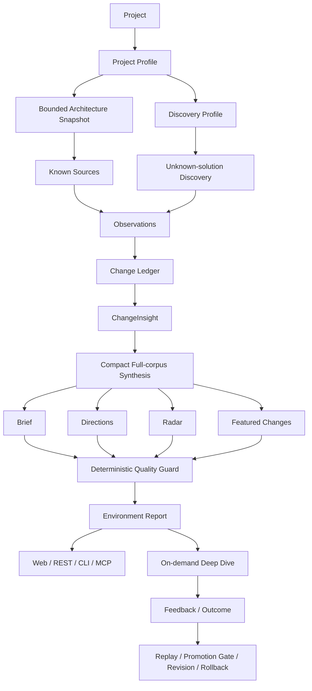

<div align="center">

# SignalHarness

**面向软件项目的 Project Environment Intelligence（项目环境情报）**

先理解你的项目，再持续观察依赖、协议、工具链和相邻方案的变化；把“外部发生了什么”压缩成“这对当前项目意味着什么”。

[English](README.en.md) · [架构](docs/ARCHITECTURE.md) · [数据流](docs/DATA_FLOW.md) · [面试演示](docs/INTERVIEW_DEMO_SCRIPT.md)

[](https://github.com/pocketvin/SignalHarness/actions/workflows/ci.yml)


</div>

---

## 它解决什么问题

依赖机器人、RSS、GitHub Watchlist 能告诉你“某个仓库发生了变化”，但一个真实项目更需要回答：

- 这个变化和**我的项目**有什么关系？
- 多条变化是否共同形成了一个值得关注的**方向**？
- 有没有以前没关注、但正在解决同类问题的**新方案**？
- 如果真的相关，具体会落到项目的哪些依赖、文件或静态结构上？
- 用户认为“太泛 / 不相关”以后，系统如何在不偷偷改规则的前提下变得更好？

SignalHarness 把这些问题放在同一条可追溯的数据链里：

> **Project → Observation → Change → ChangeInsight → Direction / Radar → Deep Dive → Feedback / Calibration**

它不是一个“让多个 Agent 自由讨论”的系统。当前主链是 **deterministic workflow + bounded model stages**：事实、身份、证据边界和质量门由 Python 掌握，模型只负责需要语义判断的部分。

---

## 当前产品主线



### 1. 先理解项目

项目接入后会形成可版本化的 Project Profile，并派生：

- 技术栈、runtime、协议、provider、依赖；
- problem spaces / solution categories；
- bounded `Architecture Snapshot`；
- `Discovery Profile`，决定应该主动寻找哪些相邻方案。

Project Understanding V2 会有限读取真实生产源码，提取：

- 主要子系统；
- 入口线索；
- dependency usage；
- 静态 import edges；
- 对应的文件路径 / 行号证据。

它**不会**把 bounded sample 冒充完整运行时调用图：静态 import 只是结构证据，不代表 runtime reachability。

### 2. 再观察环境

已知来源和主动发现进入同一 Observation 层：

- GitHub release / issue / PR / commit；
- package registry；
- OSV；
- RSS / official web change；
- local git；
- project-conditioned GitHub repository discovery。

Observation 经过时间窗口冻结、标准化、revision identity 和去重以后进入 `Change Ledger`。项目自己的活动与外部环境变化分开保存，**项目自身 commit/PR 不允许证明外部趋势**。

### 3. ChangeInsight：关系判断尽量便宜

每个 Change 都会得到持久化 ChangeInsight，但来源可以不同：

- validated cache；
- Python 确定性 FactCapsule / project relation；
- Qwen 等弱模型的 bounded semantic batch。

普通社区 GitHub Issue 在关系已经确定、又缺少高风险信号时，可以走保守的 deterministic projection：只说“社区报告 / 提议了什么”，不会把讨论升级成 confirmed defect。

### 4. 一次全局综合，而不是每条都 Deep Dive

强模型接收的是**完整 external Change corpus 的 compact representation**，不是 Featured / Top-K。

当前 synthesis 输出四类一等对象：

| 对象 | 回答的问题 |
| --- | --- |
| **Brief** | 最近整体发生了什么？ |
| **Direction** | 多个独立变化共同指向什么方向？ |
| **Radar** | 有没有此前未跟踪、但处于同一问题空间的新方案？ |
| **Featured** | 这期最值得先看的具体变化是什么？ |

Direction / Radar 之后还要经过确定性 Quality Guard：证据 ID、独立性、时间边界、项目活动污染、adoption overclaim、trend velocity、产品文案等都由代码检查。

### 5. Repair 是有界的

模型结果不合格不会直接展示，也不会无限循环。

- 局部措辞 / 时间语义问题 → localized repair，只发送失败结果和相关 Change；
- 全局证据结构 / 引用问题 → bounded full-context retry；
- repair 仍失败 → 明确 degraded / unavailable，不伪造成功。

因此宽扫描仍是可预测的 workflow，不是 autonomous agent loop。

### 6. Deep Dive 只在用户明确要求时发生

正常 Scan 不自动做 evidence-heavy Deep Dive。用户点击某条外部 Change 后，才会结合：

- 原始 Evidence；
- 当前 Project Profile；
- Architecture Snapshot；
- dependency usage / saved code references；
- 必要的外部核实。

这样把成本集中在真正需要深入判断的少数问题上。

### 7. Review-first 自进化

用户可以对 frozen Change 标记：

- 有用；
- 不太有用；
- 与项目无关；
- 太泛。

也可以记录实际 outcome。它们不会立刻改当前报告或偷偷改 Prompt，而是进入：

```text
Feedback / Outcome
        ↓
Frozen Episodes
        ↓
Replay
        ↓
Candidate Policy
        ↓
Promotion Gate
        ↓
Human Review
        ↓
Apply → Revision → Rollback
```

Web 的「学习与校准」页面直接展示这条真实链路；没有足够样本时就显示“样本不足”，不会伪造学习成功。

---

## Web 产品

启动本地服务：

```bash
uv run signal-harness serve --host 127.0.0.1 --port 8001
```

打开：

```text
http://127.0.0.1:8001/demo
```

当前 Web 主要包含：

- 环境总览：Brief / Direction / Radar / Featured；
- 全部变化：按当前报告读取 frozen Change；
- 项目活动：单独展示 project-owned activity；
- 项目与关注：Project Profile / Watchlist / Architecture Snapshot；
- 学习与校准：Feedback / Outcome / Replay / Candidate / Revision；
- 真实执行 Trace：模型、token、latency、cache、fallback、repair 状态。

Trace 只公开产品需要的安全字段；raw prompt、错误正文、source task 内部 payload 不通过产品 API 暴露。

---

## REST / CLI / MCP 使用同一业务事实

当前 Direction-first 产品统一通过 `EnvironmentApplication` 读取和执行：

```text
                     REST / React
                    ↗
EnvironmentApplication → CLI
                    ↘
                      MCP
```

这避免 REST、CLI、MCP 各自重新定义“最新报告”“当前 Profile”“Change 属于哪个 Scan”。

### CLI

```bash
# 运行当前 Project Environment Intelligence 流程
uv run signal-harness environment --project signalharness --window since_last

# 只读，不调用模型
uv run signal-harness environment-context --project signalharness
uv run signal-harness environment-architecture --project signalharness
uv run signal-harness environment-report --project signalharness
uv run signal-harness environment-changes --project signalharness
uv run signal-harness environment-calibration --project signalharness
```

旧 `scan / report / changes / change` 仍保留为 legacy compatibility surface，不再是当前 Web 产品的事实源。

### MCP

```bash
# stdio MCP
uv run signal-harness mcp

# REST + SSE + Streamable HTTP MCP (/mcp)
uv run signal-harness serve --host 127.0.0.1 --port 8001
```

当前 MCP 同时包含 current-product tools 和少量 legacy compatibility tools。写动作（启动 Scan、记录 feedback / outcome）有明确权限边界，不把整个 MCP 伪装成 read-only。

---

## 快速开始

### 1. 安装

```bash
git clone https://github.com/pocketvin/SignalHarness.git
cd SignalHarness

uv sync --extra dev --locked
npm --prefix frontend ci --ignore-scripts
npm --prefix frontend run build
```

要求：

- Python 3.10+
- Node.js / npm（仅前端开发与构建需要）
- `uv`

### 2. 配置真实模型（可选）

```bash
cp .env.example .env
```

`.env.example` 使用当前 Provider Catalog 的真实变量约定：

```text
QWEN_API_KEY / QWEN_BASE_URL
KIMI_API_KEY / KIMI_BASE_URL
DEEPSEEK_API_KEY / DEEPSEEK_BASE_URL
OPENAI_API_KEY / OPENAI_BASE_URL
```

模型名默认来自 `configs/model_profiles/*.yaml`；只有你明确需要覆盖时才设置 `*_MODEL` / `*_MODEL_PROFILE`。

不要提交 `.env`、API Key、runtime outputs 或本地 state。

### 3. 启动

```bash
uv run signal-harness serve --host 127.0.0.1 --port 8001
```

### 4. 离线验证

```bash
npm --prefix frontend run typecheck
npm --prefix frontend run build
uv run --extra dev python -m pytest tests/signal_harness -q
uv run --extra dev ruff check src/signal_harness tests/signal_harness
uv run --extra dev mypy src/signal_harness
uv build
```

Public CI 只跑离线、确定性的质量门禁，不要求真实模型凭据，也不会产生 provider 费用。

---

## 代码结构

```text
src/signal_harness/
├── environment_application.py   # 当前产品 application truth
├── intelligence/                # ChangeInsight / synthesis / guard / deep dive
├── projects/                    # onboarding / discovery / architecture snapshot
├── persistence/                 # Change Ledger / intelligence revisions
├── providers/                   # model profiles / provider routing
├── runtime/                     # workflow / streaming / permissions / trace
├── service*.py                  # REST / SSE adapters
├── mcp_server.py                # MCP adapter
├── agent_team/                  # legacy five-Agent compatibility baseline
└── agent_integration/           # legacy/eval model integration infrastructure

frontend/src/environment/        # 当前 React + TypeScript 产品 UI
configs/                         # policies / built-in project config / watchlist
tests/signal_harness/            # offline regression and product contracts
docs/                            # architecture / data flow / decision records
```

---

## 设计原则

1. **项目优先，而不是新闻优先。** 先理解项目，再决定什么变化值得看。
2. **完整 evidence ledger，紧凑模型 wire。** 不靠 Top-K 删除事实来省 token。
3. **Python 掌握确定性边界。** ID、归属、时间、独立性、权限和 guard 不交给模型拍脑袋。
4. **宽扫描便宜，深分析按需。** Broad Scan 不跑 autonomous agent loop。
5. **历史冻结。** 新 Profile / 新 Policy 不重写旧 Report。
6. **学习可回放、可批准、可回滚。** 不允许 Scan-time self-modification。
7. **旧能力兼容，但不让 legacy 成为第二份 current truth。**

---

## 当前能力边界

SignalHarness 目前是：

> **Project Environment Intelligence + bounded static codebase understanding**

它还不是完整程序分析平台。当前明确不声称：

- 已经理解整个代码仓库；
- 已经建立完整 symbol graph / call graph；
- 静态 import 等于运行时可达；
- GitHub 搜索可以证明市场采用率；
- 一条新 repo 就能证明行业趋势；
- 模型输出未经 guard 就是真实事实。

如果继续向 Repository Index / symbol graph / impact propagation 演进，那会是独立的更重阶段，而不是把当前 Architecture Snapshot 描述得比实际更强。

---

## Legacy Harness / Eval 基线

仓库仍保留早期 deterministic / mock-agent / five-Agent Harness、regression eval、capability eval 和相关 CLI。它们用于：

- 回归；
- 架构实验；
- compatibility；
- 历史对照。

它们**不是当前 Direction-first Web 产品路径**。新的 REST / CLI / MCP 产品语义应通过 `EnvironmentApplication`，而不是继续向 `ProductIntelligenceService` 或旧 assessment/impact-score 模型扩展。

---

## 进一步阅读

### 当前产品

- [Architecture](docs/ARCHITECTURE.md)
- [Data Flow](docs/DATA_FLOW.md)
- [Environment Intelligence V1](docs/ENVIRONMENT_INTELLIGENCE_V1.md)
- [Target State](docs/SIGNALHARNESS_TARGET_STATE.md)
- [Working Plan](docs/SIGNALHARNESS_WORKING_PLAN.md)
- [Interview Demo Script](docs/INTERVIEW_DEMO_SCRIPT.md)

### 历史验证 / 工程记录

- [Repair Pass](docs/REPAIR_PASS.md)
- [Model Eval Results](docs/MODEL_EVAL_RESULTS.md)
- [Real Source Smoke](docs/REAL_SOURCE_SMOKE.md)
- [Notices](NOTICE.md)

---

## 项目状态

当前主干已经具备完整的离线测试、Ruff、mypy、TypeScript typecheck、Vite production build 与 Python package build 门禁。真实 provider smoke 和 live-source scan 属于显式、可能产生费用的人工验证，不在 Public CI 中自动运行。

如果你把 SignalHarness 用在面试或架构讨论里，最准确的一句话是：

> **先用确定性分析理解项目和证据，再用弱模型解释局部变化、强模型做一次全局综合；只有用户明确需要时才 Deep Dive，并用可回放、可批准、可回滚的反馈闭环持续校准系统。**
