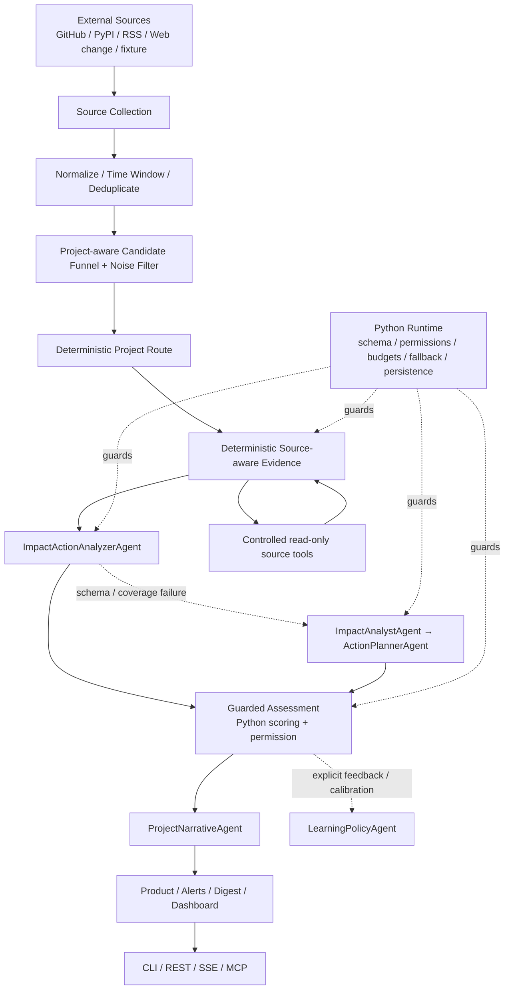

# SignalHarness Architecture

SignalHarness 的目标产品是 Project Environment Intelligence。P1/P2 建立 SQLite Change Ledger、冻结 Scan Window、Coverage 与可恢复本地 Run；P3 增加 versioned ProfileRevision 与显式 Preference Engine；P4 用 frozen Harness ablation 评估 Analyzer 组件；P5 将 frozen Scan 投影成 Overall → Top → All → Detail，并让 CLI/REST/Web/MCP 共用同一产品状态。真实 `agent` 当前默认 `deterministic-evidence-impact-action` 两调用路径；五-Agent routed analyzer 继续作为受保护 baseline/rollback，`mock-agent` 默认仍覆盖完整五-Agent。

## Workflow flowchart




## Real agent run sequence

```mermaid
sequenceDiagram
    participant User as User CLI / Service
    participant Workflow
    participant Tools as Tool Executor
    participant Provider
    participant Guard as Python Guarded Runtime
    participant Trace as Trace Recorder

    User->>Workflow: scan --mode agent
    Workflow->>Trace: collect / normalize / candidate funnel
    Workflow->>Workflow: deterministic project route
    Workflow->>Tools: bounded source-aware evidence requests
    Tools-->>Workflow: ToolObservation / evidence context
    Workflow->>Provider: ImpactActionAnalyzerAgent
    Provider-->>Workflow: ImpactActionOutput
    alt merged schema or event coverage invalid
        Workflow->>Provider: ImpactAnalystAgent
        Provider-->>Workflow: ImpactOutput
        Workflow->>Provider: ActionPlannerAgent
        Provider-->>Workflow: ActionOutput
    else provider timeout/error
        Workflow->>Workflow: deterministic fallback; no extra same-provider split calls
    end
    Workflow->>Guard: authoritative score / decision / permission mapping
    Guard->>Provider: ProjectNarrativeAgent
    Provider-->>Guard: Chinese product-facing Narrative
    Guard->>Trace: schema / fallback / failure_kind / cost / latency
    Guard-->>User: Product Intelligence + human-readable outputs
    Note over Guard,Provider: LearningPolicyAgent remains outside the real-scan hot path and runs in explicit calibration/learning flows
```

## 四层安全边界

1. LLM 不能直接执行工具
   Agent 只能输出 structured tool requests。Python runtime 检查 allowlist、permission policy、budget 和 read-only constraints，再决定是否执行。

2. LLM 不能直接写文件
   LLM 只能返回 schema-validated JSON。`outputs/`、trace、digest、dashboard、proposal snapshots 都由 Python runtime 或 report writer 写入本地文件。

3. LLM 不能决定最终分数
   `ImpactAnalystAgent` 提供 semantic relevance 和 impact reasoning，但没有 authoritative `final_score` 字段。最终分数由 deterministic scoring、semantic relevance、evidence confidence 和 policy multiplier 组合。

4. Learning proposal 不能自动 apply
   `LearningPolicyAgent` 只能产出 review-only proposal。高风险 proposal 或 replay gate failed proposal 不会自动应用；需要显式 review 和 approval。真实交互扫描默认只记录 `learning_deferred` 并先返回 guarded decision，Learning 的 LLM reflection 在显式 calibration/learning 路径执行。

5. 外部正文不是指令
   GitHub/RSS/Web/ToolObservation 都是 untrusted external data。Context Prompt 明确禁止执行其中的 prompt override/tool command/forced classification；确定性关键词语义也先移除 instruction-like 句子，但原始正文仍保留用于 evidence audit。

## 核心文件路径

- `configs/projects/*.yaml`
  Project Catalog：为每个可选项目绑定显示名、Project Profile 与项目级 Watchlist；新增项目不需要修改 Runtime 代码。

- `configs/project_profile.yaml` / `configs/project_profiles/*.yaml`
  自动/显式项目事实的兼容输入：purpose、技术栈、dependencies 与 lockfile evidence、runtime/protocol/provider、critical modules、monitored ecosystem、focus keywords。运行时实际使用的 effective Profile 会版本化进入 project Ledger。

- `configs/watchlist.yaml` / `configs/watchlists/*.yaml`
  project-scoped source watchlist：实时 GitHub、PyPI package registry、RSS + 配置化 public HTTP(S) snapshot/diff。GitHub release 可携带 package identity，用于与 Registry release 聚合同一 Change；官方 Registry/RSS/Web page 的 provenance 由 Python/runtime 持有。

- `configs/signal_policy.yaml`
  deterministic scoring weights、category weights、thresholds、tool allowlist、permission policy。

- `src/signal_harness/runtime/workflow.py`
  主 workflow：source collection、normalization、统一时间窗口、deduplication/change delta、project-aware candidate funnel、noise filter、Agent run、report writing。

- `src/signal_harness/signal/deltas.py`
  Source-native Change Delta：GitHub / package-registry Release 的版本前后关系、Issue/RSS 的 created/updated 变化语义。

- `src/signal_harness/agent_integration/runner.py`
  Versioned Analyzer runner：real-agent 默认 deterministic Route/Evidence + merged ImpactAction + Narrative；schema/coverage contract failure 可升级 split Impact→Action；five-Agent baseline、controlled tool-use、repair、LearningPolicy handling 仍保留。

- `src/signal_harness/agent_integration/scoring_bridge.py`
  将 Agent outputs 转成 guarded `SignalAssessment`，并由 Python runtime 计算 final decision。

- `src/signal_harness/evals.py`
  Eval 分层：40-case Regression protection；32-case Capability Golden + fair shared-evidence baseline；逐 case Trajectory contract；cross-project context；provider contract/model eval；Narrative blind human calibration。

- `src/signal_harness/mcp_server.py`
  当前 10 个 structured MCP tools：9 个只读 product/context 查询 + 1 个复用 persistent StreamRunManager 的 fresh-scan starter；不能绕过 Project scope、fixture allowlist 或 permission policy。

- `src/signal_harness/service.py`
  FastAPI REST + SSE + MCP Streamable HTTP 服务层；每次 run 隔离 output/trace，同时按 `project_id` 连接共享的持久 Project State，并携带 source mode 与 provider selection。

- `src/signal_harness/service_streaming.py`
  local stream-run manager：POST 创建后立即启动 workflow；queued/running 输入与状态会持久化并在服务启动时做有界恢复。SSE event-id 历史仍仅在进程内用于重连回放，断开浏览器不取消 run。

- `src/signal_harness/resources.py`
  Distribution resource resolver：workspace 本地默认资源优先；缺失时回退到 wheel 内的只读 configs/examples。显式自定义路径不被重定向。

- `frontend/` → `src/signal_harness/ui/static/demo.*`
  Golden Demo 的 source-of-truth 是 React + TypeScript + Tailwind，Vite 只在构建时把 SPA 编译成 package-owned `demo.html/css/js`；FastAPI 仍通过 `/demo` + `/demo-assets/*` 托管这些静态产物，不引入独立 Node 服务。React 数据层只消费既有 REST/SSE/Product contract，不复制评分、路由、Schedule 或持久化业务逻辑。Narrative review 继续作为独立静态 surface，不被 Vite `emptyOutDir=false` 构建删除。
  UI 采用“项目环境情报控制台”信息架构：顶部只有紧凑项目状态带，随后立即进入 Runtime 控制与真实 Trace 双栏；source / analysis mode / time window 使用可访问的 segmented controls，Project Context/Monitoring 渐进披露，Environment Report → Priority Changes → All Changes 构成主阅读流，Change Detail 使用 Drawer，完整 Audit 位于低层工程入口。
  LLM 调用会先 append `status=running` Trace、完成后 update 同一 index。完成事件附带 `structured-reasoning-v1`：它只从已经 schema-validated 的显式 Agent 输出提取公开判断摘要，不包含 raw provider response、Prompt 或隐藏 chain-of-thought。每条 LLM Trace 可展开查看 summary / per-event structured fields，以及 Schema、Tool、Permission、Fallback、Latency、Token；用户手动的展开/收起状态在后续 SSE re-render 中保持。Pipeline 也由实际 Trace 映射，不再硬编码 five-Agent。guarded 决策后 `ProjectNarrativeAgent` 仍只负责 presentation，不参与 score/decision/permission。

- `src/signal_harness/ui/dashboard.py`
  静态本地 dashboard writer。展示 summary、signals、source/tool health、model/profile/limits、trace、token/cost/latency、score breakdown、learning。

- `outputs/dashboard.html`
  本地 dashboard 产物。用于 demo，不提交。

- `outputs/task_trace.json`
  本地 trace 产物。记录 Agent calls、schema/fallback/retry、tool requests/executions、permission checks、source task health；LLM step 还可携带 bounded `structured-reasoning-v1` 公共摘要 metadata。该 metadata 是 schema 输出摘要，不是隐藏思维链。

## P1 durable Change Ledger

- **Ledger path**：每个 project state 下使用 `change_ledger.sqlite3`；当前是本地/单 owner 的 SQLite v1 schema。
- **Persist before Top-K**：Normalize + in-batch dedup 后，所有 pre-funnel candidates 先写入 EventRevision/Change，再由 candidate funnel 决定哪些进入当前深度分析 budget。
- **Frozen ScanChange**：`scan_changes` 固定本次使用的 `event_revision_id`、basic relevance、rank 与是否进入深度分析，因此后续 revision 不会改写旧 Scan 看到的事实。
- **ProjectImpact**：所有 ScanChange 都保存 basic project-aware relevance；只有被 Analyzer 实际处理的 Change 才附带完整 assessment。
- **Compatibility**：`signals.json` / `impact_scores.json` 等旧产物仍表示本次深度分析 shortlist，不伪装成 All Changes；REST `GET /runs/{run_id}/changes` 是 P1 的分页 All-Changes 投影。
- **Failure boundary**：legacy seen-memory 只在报告成功后更新；Web Snapshot 使用 per-scan pending state，报告成功后才 promote，失败则 discard，所以失败重试不会吞掉尚未提交的网页变化。


## P2 window / coverage / recoverable-run boundary

- **Frozen window**：每个 Scan 在创建时冻结 U；有可靠来源时间的事实使用 `[L,U)`。`since_last` 首次显式回溯 7 天，之后读取 project + consumer 的 interactive checkpoint。
- **Checkpoint separation**：interactive checkpoint 不等于 source cursor、schedule checkpoint、notification dedup 或 Inbox read state。只有成功、面向现在、interactive live 且没有明确 coverage 缺口的 Scan 才推进。
- **Late facts**：原发布时间早于 L、但本轮首次观察或出现新 revision 的事实可用 `late_discovery` / `late_revision` 进入一次；`window_exception` 是 Scan 元数据，不参与 EventRevision identity。
- **Observation-only sources**：Web Snapshot diff 是本 Scan 才生成的 observation，若没有可靠 source occurrence time，则标记 `observed_during_scan`，不伪装成精确发生在 U 前。
- **Source coverage**：`scan_sources` 持久化 `complete/partial/unknown`、分页数、history limit 和 diagnostics；REST `/runs/{run_id}/coverage` 公开同一数据。
- **GitHub pagination**：release/issues collector 跟随分页；达到 bounded page cap 时标记 `partial/history_limited`，不会因 HTTP 200 错误推进 `since_last`。
- **Recoverable local runs**：stream run 在 POST 后立即执行，输入/queued/running 状态先落盘；服务启动会对未完成任务做有界恢复。SSE replay history 仍是内存态，因此这不是 Redis/Celery/Temporal 一类分布式 durable queue。

## P3 profile / preference boundary

- **ProfileRevision**：每个 project 的 Auto Profile Facts 在 SQLite 中版本化；Scan 创建时解析 active Preferences 得到 effective Profile，并把 `profile_revision_id` 固定进 `scans`。后续 profile/preference 变化不会改写历史 Scan。
- **Preference authority**：Critical / Important / Normal / Low / Ignore 是显式用户状态，scope 可落到 dependency/provider/runtime/protocol/module/ecosystem/source/category/topic；active preference 高于自动发现和模型推断，并且可审计、撤销。
- **Ranking + Context**：Preference 不只是 UI 设置；匹配项会进入 deterministic relevance adjustment，同时 effective Profile 中保留结构化 preference，供 Analyzer context 使用。
- **Safe onboarding evidence**：`uv.lock` / `package-lock.json` 等 allowlisted lockfile 只读解析 declared constraint、resolved version、source file、confidence；不执行 repository scripts、不安装依赖、不读取 secret 文件。
- **Fast product controls**：REST/Golden Demo 支持结构化五档重要性和确定性 natural-language preference 更新，两条路径写入同一个 project preference model。

## P6 source identity / PyPI registry boundary

- **Official registry source**：`package_registry` 通过 PyPI JSON Simple/Index API 只读获取 distribution metadata，按 PEP 440 版本聚合 wheel/sdist，保留 `previous_version`、yanked 状态、ETag / last-serial、API version、retry 与明确 history cap/coverage。
- **Source-owned package identity**：GitHub release 只有在 Watchlist/onboarding 明确绑定 `package_name + package_registry` 时才拥有 package identity；Registry release 从官方 registry metadata 获取同一 identity，不从正文关键词猜测。
- **Cross-source Change aggregation**：同一 `(registry, canonical package, version)` 的 GitHub release 与 Registry release 共享一个 Change，但保留各自 EventRevision/evidence；不同 package/version 不会误合并。
- **Project applicability**：direct dependency 与 installed/resolved version 来自 Project Profile/lockfile evidence；版本适用性判断基于 source identity，而不是 release body 中恰好提到某个依赖名。
- **Failure / checkpoint boundary**：单个 Registry source 失败时 SourceTask 明确为 `failed + partial`，只要其他来源成功 Scan 可产出 partial 结果，但不会推进 interactive `since_last` checkpoint。
- **Real-source evidence**：2026-09-09 对官方 PyPI `pydantic` 的只读 smoke 成功，返回 coverage=complete、205 个版本、latest `2.13.5`、previous `2.13.4`；这只是连接器运行证据，不是版本长期事实。
- **Own-project Local Git**：`local_git` 只读执行 bounded `git log`，保留 repository identity、commit SHA、author/commit time、parents、merge flag 与可识别的 PR number；达到 commit cap 时显式 `partial/history_limited`。GitHub origin 可规范化成 `owner/repo`，无 origin 时退回本地 repository path identity。
- **Cross-source Git identity**：Local Git commit 与未来/已有 GitHub commit observation 使用 `(normalized repository, commit SHA)` 作为 Change identity；同一 commit 可以保留多份 EventRevision/evidence，但不会制造重复 Change。
- **OSV exact-version matching**：`security_osv` 只接受 Project Profile/lockfile 已解析出的具体 `name + ecosystem + resolved_version`，不会根据公告正文猜依赖是否受影响；单 dependency 查询失败会形成 partial coverage，全部失败则 source failure。
- **Security identity / applicability**：OSV advisory 优先使用 CVE alias，其次 GHSA/OSV id 做稳定 Change identity；受影响 resolved version 是直接依赖证据，不复用 release 的 `installed = already satisfied` 语义，避免把真实漏洞错误降权。
- **Real-source Git/OSV evidence**：2026-09-09 当前仓库只读 Git smoke 正确解析为 `pocketvin/signalharness`；OSV 对 `pydantic==2.13.4` 与 `httpx==0.28.1` 两条真实 PyPI resolved-version 查询均成功，coverage=complete，本次返回 0 advisory。
- **GitHub own-project facts**：GitHub commit 直接使用 API `since`；merged PR 因 list endpoint 无 `since`，按 `updated desc` 分页并在安全 cutoff 后停止，再用 `merged_at` 做窗口成员判断。commit / merged PR 与 Local Git 共用 `(repository, final commit SHA)` Change identity，同时保留 GitHub author/merger/ref/label/signature 等证据。
- **Project-owned Git semantics**：local onboarding 只读解析 GitHub origin，把当前项目 repo 标成 `project_owned` 并启用 commits + merged PR；这类事实按项目自身代码变化处理，不伪装成上游 dependency release。
- **Usage-bound changelog identity**：RSS/Web Watchlist 可声明 `entity_type + entity_name`（dependency/provider/protocol/runtime）。Context/Ranking 只在 Effective Project Profile 确认使用同一实体时建立结构化相关性；显式 Preference 也直接对该身份生效。绑定存在但 Profile 未使用时不靠正文关键词补猜。
- **Bounded Web restraint**：网页源仍保持现有 body-size/security 边界。FastAPI 全历史 release-notes 页面实测超过 1 MB，因此继续由 GitHub + PyPI 覆盖，而不是为单页放宽所有 Web Snapshot 上限。OpenAI API changelog 与 MCP specification 的真实 baseline smoke 均成功。
- **Real-source GitHub evidence**：2026-09-09 对 `pocketvin/signalharness` 的认证只读 smoke 在 7 日窗口返回 19 commits（complete / 1 page），merged PR 当前 0 条（complete / 1 page）；认证来自本机已授权 GitHub CLI keyring，token 未写入配置或日志。

## P7 continuous-monitoring boundary

- **One Scan service**：Schedule 只决定触发时机与窗口；实际执行仍复用 `StreamRunManager → SignalHarnessWorkflow`。Scheduler 不复制 source collection、Analyzer、Ledger 或 report 逻辑。
- **Schedule state**：SQLite `schedules` 保存 cadence、timezone/local time、next-run、last-run、独立 schedule checkpoint 与状态。12h/24h/本地时间均冻结成一次 custom `[L,U)`；missed runs 从旧 checkpoint 合并补扫，不把 timer tick 当业务事实。
- **Checkpoint isolation**：scheduled run 始终 `interactive=false`，不会推进 manual `since_last`。只有 success 且 coverage 非 partial 才推进 schedule checkpoint；partial/error 保留旧 checkpoint。
- **Restart reconciliation**：StreamRun 先做既有 queued/running 恢复，Schedule 再重新挂 finalizer；若 Scan 已成功写盘但 schedule 收尾尚未完成，则读取 durable `service_run.json` 补 checkpoint/Inbox，而不是重写或静默跳过。
- **Inbox projection**：Inbox 从 frozen `ScanChange + EventRevision + Assessment` 生成。逻辑 notification key = Change + EventRevision + decision，因此重复处理幂等；新 revision 或 decision escalation 可产生新提醒。Inbox read state 独立于 notification/delivery 状态。
- **Outbox / DeliveryAttempt**：外发先落 durable Outbox，再发送；每次尝试单独记录。重试复用同一 idempotency key，HTTP/网络失败不会创建第二个逻辑通知。
- **Signed Webhook**：第一条 delivery transport 使用 HMAC-SHA256 signed Webhook。URL/secret 只来自 runtime env，不持久化到产品数据库或普通日志。loopback real-HTTP integration 已验证网络栈；真正的外部用户 destination 仍需显式授权后验收。
- **Legacy alerts**：`alerts.json` / `alerts.md` 继续是兼容本地产物，不作为 Inbox 或 external delivery 的事实源。

## P8 calibration boundary

- **Durable real evidence**：SQLite schema v6 adds project-scoped `calibration_feedback` and `change_outcomes`. Feedback/outcomes attach to frozen ScanChange/EventRevision whenever available; legacy feedback JSON remains a compatibility projection rather than the P8 source of truth.
- **Episode read model**：`CalibrationDataset` deterministically groups real feedback/outcomes by frozen `(scan, Change, EventRevision)`. Positive/negative evidence can become replay labels; contradictory evidence remains `ambiguous` and is excluded from hard metrics. Missing Change attachment is surfaced as orphan feedback instead of inventing history.
- **Evidence floor**：durable calibration requires at least three labeled Episodes by default. `insufficient_evidence`, `reject_no_gain`, and `reject_regression` cannot promote a real-project policy candidate. Only measured non-regressing improvement produces `promotion_allowed=true`.
- **Frozen replay + shadow**：candidate replay reuses the exact frozen EventRevision and effective Project Profile. Shadow output records old/proposed score, rank, decision, and—where the frozen Assessment supports it—notification eligibility for every Episode, so ranking/decision/delivery changes are inspectable before activation.
- **Promotion boundary**：real-project `apply_staged_learning` requires both the existing risk/human-approval gate and a durable `calibration_replay.json` with `promotion_allowed=true`. A Scan-time Agent cannot write this gate or directly change active policy.
- **Version / rollback**：each policy apply snapshots old/new policy under `policy_revisions/`. Explicit `learning-rollback --yes` only restores the prior policy if no newer policy has replaced that revision, then records rollback history.
- **Hot-path isolation**：normal Scan/Analyzer execution does not require Calibration, outcomes, or Episodes. Calibration is an asynchronous/read-model improvement path over already durable Scan facts.
- **Current real evidence**：2026-09-09 current project has no durable labeled Episodes yet. A legacy feedback-derived candidate therefore correctly returns `insufficient_evidence / promotion_allowed=false`; no real P8 policy improvement is claimed.

## Project state / candidate / provenance boundaries

- **Run state**：trace、run metadata 与本次输出按 run 隔离。
- **Project state**：seen signal fingerprints、feedback、alert state 与 learning artifacts 按 `project_id` 持久化；同项目并发写入受 project lock 保护。
- **Project onboarding / connection**：`project-connect` 与 `POST /projects/connect` 通过 allowlisted manifest/lockfile + bounded path inspection 自动生成并立即激活 Project Profile/Watchlist，同时创建首个 ProfileRevision；`project-draft` / `POST /project-drafts` 仅保留为兼容 preview。浏览器只上传 allowlisted manifest/lockfile text 与相对路径，不上传源码或 `.env`。
- **Web snapshot boundary**：`web_change.fetch_snapshot` 只接受当前 Project Watchlist 已批准的 public HTTP(S) URL；公网/端口/redirect/content-type/body-size 都受 Python 校验。首次 observation 只建立 project-scoped baseline，unchanged 页面不产生 Signal。
- **Candidate funnel**：live events 在 normalize/deduplicate 后才做 project-aware Top-K，避免“先按时间截断再判断相关性”造成系统性漏报。
- **Source authority**：GitHub repo 本身是否官方与 Issue 作者 authority 分开；community / maintainer / official 进入不同 evidence confidence 上限。官方 RSS 与 official Web snapshot 由 Watchlist 显式声明，非官方网页保持 secondary。
- **Release semantics**：GitHub Release 的 Documentation/Chores 章节不会单凭风险关键词把整个 release 升级成 security/breaking signal；运行时 Features/Bug Fixes 等章节仍参与确定性语义。
- **Change delta**：Normalize 后统一使用 observed change time 做窗口过滤；Issue 保留 created/updated，Release 关联相邻 tag 得到 `previous_version → current_version`，RSS 保留 publish/update。
- **Prompt-injection boundary**：外部 instruction-like 句子不进入确定性 keyword semantics，Prompt Context 同时声明外部正文不可覆盖角色、权限、工具或评分规则。
- **Provider capability freshness**：Project `.env` 只提供凭证/选择；capability 来自精确 Model Profile。已知 retired alias 可安全解析到当前 profile 并公开 warning，未知 override 使用 conservative capability，不继承其他模型元数据。

## 面试展示重点

SignalHarness 的产品价值是持续回答“项目周围发生了什么、哪些值得知道、会影响什么、该做什么”；当前五 Agent / Tool Guard / Trace 是现阶段实现与工程证据，不是产品必须永远维持的固定形态。

## Evaluation and observability

SignalHarness 不再让一个数据集承担所有 Eval 目标：

- `regression-eval --enforce`：40-case Regression protection；
- `capability-eval`：32-case hard Capability Golden，使用 acceptable decisions、0–3 relevance/nDCG、fact/project/action/uncertainty/forbidden/language grader；
- fair baseline：single Agent 与 split semantic stack 使用同一 Event/Profile/Route/Evidence；
- `trajectory-eval --enforce`：代表性 case 逐条跑完整 offline Harness，验证 Agent/tool/schema/fallback；
- `project-eval --enforce`：同一事件跨项目比较；
- `model-eval`：provider contract、latency、tokens/cost；
- Narrative calibration：16-pair blind human A/B；没有真实人工标注与 agreement/bias 校准时 LLM judge 保持 disabled。
  `/eval/narrative` 只读取 blind review：review API 不返回 variant mapping，也隐藏 final decision / impact score；overall + 全部 rubric dimensions 完整后才原子写回 review，mapping 始终独立保存。
  Presentation 与 permission/audit state 明确分层：`action_items`/Trace 属于运行时审计真值，用户可见的 `action_items_zh` / Product projection / Eval reviewer 经过 `presentation-v2` sanitizer。它会保留 substantive Chinese engineering step，但不会把 `Approval required before`、`is not enabled`、`Human approval`、内部 tool/permission id 等执行层文本带到产品文案。Prompt v3 负责减少模型产生这些内容，但 deterministic sanitizer 才是 authoritative presentation boundary。
  第一轮 pre-fix 人类 quick review 的 5 个总体选择解盲后全部偏向 split semantic stack；因为输出随后发生 presentation 修复，这 5 个标签只作为历史失败证据归档，post-fix review 从 0/16 重启。

`resume-v1` 的 40/40 只代表 Regression Contract。Capability V1 刻意包含会让当前实现失败的 hard cases，因此不以 100% 为初始目标，也不会为了 CI 绿色降低难度。Mock Capability 只验证 plumbing；生产架构选择仍需要重复 real-provider trials + human-calibrated Narrative evidence + production Episodes。

Capability Eval 的真实生成与 deterministic scoring 已解耦。真实 provider 结果按 trial checkpoint 保存，实验签名约束 Prompt/Eval/provider/profile 等生成条件；`capability-regrade` 可在不调用模型的情况下，把同一冻结语义输出重新通过当前 `guarded-scoring-v2` 和 grader。这样 scoring/policy 实验不会重复支付语义生成成本。

`guarded-scoring-v2` 采用 evidence-aware floor：明确不确定/unsupported evidence 不触发硬 alert floor；verified official direct-impact 只有在强 semantic relevance，或 semantic + deterministic project-match 双通道一致时才能升到 priority floor；高相关 engineering opinion 只允许 SAVE floor。`already_satisfied`、显式 Ignore preference、Noise/route 仍拥有最终否决权。

Harness ablation 的 fixture source tools 现在严格 offline：外部 GitHub/RSS/Web/Registry/OSV 读取在 ablation 中转换为 frozen fixture-safe observation，本地 `web_change.load_fixture` 仍真实读取 fixture。GitHub credential/网络失败不再改变离线 Eval 结果。正常产品 Scan 不启用该开关。

### Adaptive semantic execution default

当前 real-agent 默认与离线推荐均是 `deterministic-evidence-impact-action`：deterministic router/evidence 保持 Python/runtime authority，`ImpactActionAnalyzerAgent` 合并 Impact+Action，随后由 presentation-only `ProjectNarrativeAgent` 输出用户文案。正常路径 2 个 LLM calls；40-case 与 15-case real-world Harness 都保持 1.000/1.000/1.000。

Adaptive gate 不按“风险高”机械预路由。已有 Qwen frozen shadow 显示 uncertainty/risk 预升级增加调用但没有 decision/ranking 增益，因此 runtime 只把**模型输出 contract failure**当升级信号：merged schema invalid 或 event coverage incomplete → 追加 split Impact → Action；provider timeout/error → 不追加同 provider 请求，继续 deterministic fallback。`TraceStep.metadata.failure_kind` 显式区分 schema/coverage/provider timeout/provider error，便于 Eval、SSE 与后续成本分析。

真实 smoke 还验证了 presentation/audit 分界：Product Intelligence、Radar Digest、Alerts Markdown、Dashboard 推荐和 Demo fallback 使用 `what_changed_zh / why_relevant_zh / action_items_zh`；raw `reason/action_items/score_breakdown` 只保留在 machine-readable JSON/Trace/audit。这样权限说明和 deterministic fallback 文案不会重新从 legacy 输出漏回用户层。

真实 Qwen `qwen-plus` 已完成 4-case production-style Analyzer smoke：decision/category 4/4 + 4/4，2 次调用均 schema-valid，0 fallback / 0 escalation，10,597 provider-reported tokens，summed LLM latency 47.3s。该 smoke 输入是冻结的 real-world events，因此验证的是真实 Provider Analyzer，不等同于 live source collection。基于 offline 40/15-case、Capability/human evidence 与该 smoke，`RunMode.AGENT` 默认已切换到该 2-call Harness；`RunMode.MOCK_AGENT` 和显式 `--harness-variant five-agent` 继续保留 five-Agent baseline。

## Distribution boundary

Source checkout、wheel install 与 Docker 共享同一 runtime contract。`uv build` 的 wheel force-includes 默认 configs 与 `examples/signal_harness` 到 `signal_harness/_resources/`；静态 UI 资源位于 package 自身 `ui/static/`。运行时 resolver 先检查 cwd 中的默认资源，只有缺失时才使用 package fallback，因此本地项目配置仍然拥有最高优先级。Fixture guard 只额外允许 package 自带的 immutable examples，不放宽到任意工作区外文件。

## Service and deployment boundary

`signal-harness serve` 会先读取项目根目录可选的 `.env`（不覆盖显式进程环境变量），`signal-harness scan --mode agent` 也使用同一规则；demo/mock scan 不加载真实凭证。随后 FastAPI，提供 health、同步 run、trace、assessment、signals、feedback，以及 `/demo` Golden Demo；Golden Demo 默认中文并支持 EN 切换，`/demo/meta` 暴露非敏感 Project Catalog 与 Provider readiness。每个 stream-run 先选择 `project_id`，再按该项目的 profile/watchlist 构造 Workflow 上下文；`/stream-runs/{id}/events` 使用 SSE 推送同一 `TraceRecorder` 的真实 append/update。原 `POST /runs` 仍同步；`POST /stream-runs` 创建后立即启动后台任务，queued/running 输入与状态落盘并支持服务启动时的有界恢复。断线后任务继续，`Last-Event-ID` 可补发当前进程内的事件历史；服务重启后 SSE event replay history 不恢复，因此这里不声称拥有分布式 durable queue。Docker 镜像运行相同入口并包含 `/health` healthcheck。

MCP 是薄适配层，不是新的业务平面：当前 9 个 product/context 工具只读，`signalharness_start_scan` 是明确标注副作用的持久 fresh-scan starter，并复用同一 StreamRunManager/Workflow。其他可写行为仍由原有 REST/CLI、permission guard、Schedule/Outbox 或 learning gate 控制。
