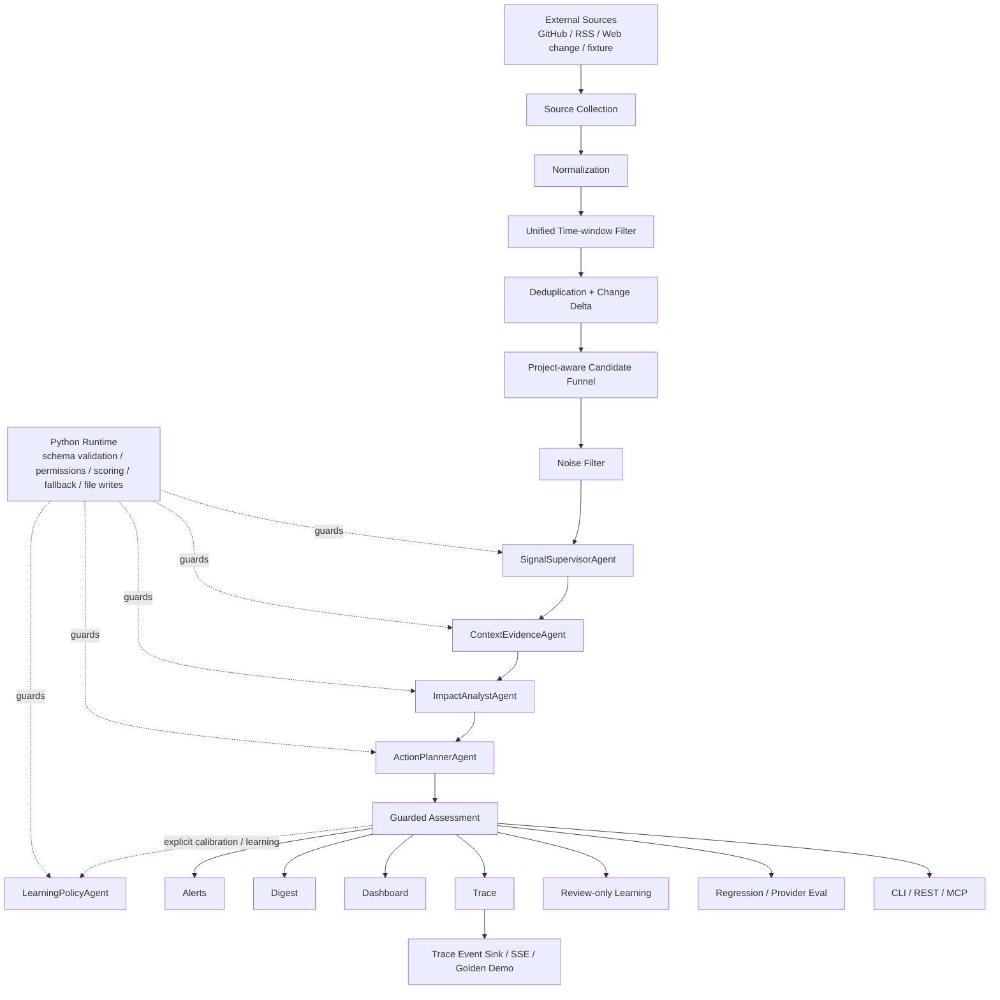
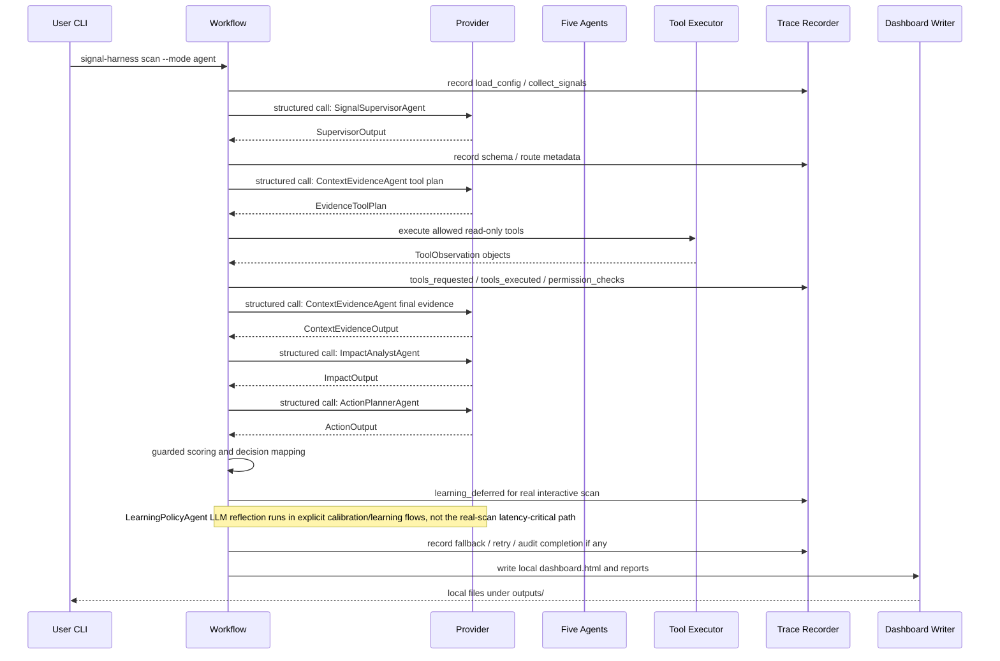

# SignalHarness Architecture

SignalHarness 的目标产品是 Project Environment Intelligence；当前仍保留五-Agent routed analyzer 作为可验证 baseline。P1/P2 已建立 SQLite Change Ledger、冻结 Scan Window、Coverage 与可恢复本地 Run；P3 在同一 Ledger 上增加 versioned ProfileRevision 与显式 Preference Engine，使每个 Scan 固定引用实际使用的 effective project context。CLI/REST/SSE Golden Demo 与当前只读 MCP 仍复用同一 runtime；未来 Analyzer 数量不再是产品约束。

## Workflow flowchart

## Real agent run sequence

## 四层安全边界

1. LLM 不能直接执行工具
   Agent 只能输出 structured tool requests。Python runtime 检查 allowlist、permission policy、budget 和 read-only constraints，再决定是否执行。

2. LLM 不能直接写文件
   LLM 只能返回 schema-validated JSON。`outputs/`、trace、digest、dashboard、proposal snapshots 都由 Python runtime 或 report writer 写入本地文件。

3. LLM 不能决定最终分数
   `ImpactAnalystAgent` 提供 semantic relevance 和 impact reasoning，但没有 authoritative `final_score` 字段。最终分数由 deterministic scoring、semantic relevance、evidence confidence 和 policy multiplier 组合。

4. Learning proposal 不能自动 apply
   `LearningPolicyAgent` 只能产出 review-only proposal。高风险 proposal 或 replay gate failed proposal 不会自动应用；需要显式 review 和 approval。真实交互扫描默认只记录 `learning_deferred` 并先返回 guarded decision，Learning 的 LLM reflection 在显式 calibration/learning 路径执行。

5. 外部正文不是指令
   GitHub/RSS/Web/ToolObservation 都是 untrusted external data。Context Prompt 明确禁止执行其中的 prompt override/tool command/forced classification；确定性关键词语义也先移除 instruction-like 句子，但原始正文仍保留用于 evidence audit。

## 核心文件路径

- `configs/projects/*.yaml`
  Project Catalog：为每个可选项目绑定显示名、Project Profile 与项目级 Watchlist；新增项目不需要修改 Runtime 代码。

- `configs/project_profile.yaml` / `configs/project_profiles/*.yaml`
  自动/显式项目事实的兼容输入：purpose、技术栈、dependencies 与 lockfile evidence、runtime/protocol/provider、critical modules、monitored ecosystem、focus keywords。运行时实际使用的 effective Profile 会版本化进入 project Ledger。

- `configs/watchlist.yaml` / `configs/watchlists/*.yaml`
  project-scoped source watchlist：实时 GitHub/RSS + 配置化 public HTTP(S) snapshot/diff。官方 RSS / Web page 可显式声明 provenance authority。

- `configs/signal_policy.yaml`
  deterministic scoring weights、category weights、thresholds、tool allowlist、permission policy。

- `src/signal_harness/runtime/workflow.py`
  主 workflow：source collection、normalization、统一时间窗口、deduplication/change delta、project-aware candidate funnel、noise filter、Agent run、report writing。

- `src/signal_harness/signal/deltas.py`
  Source-native Change Delta：GitHub Release 的版本前后关系、Issue/RSS 的 created/updated 变化语义。

- `src/signal_harness/agent_integration/runner.py`
  五 Agent runner：controlled tool-use loop、schema retry、repair boundary、audit completion、LearningPolicy handling。

- `src/signal_harness/agent_integration/scoring_bridge.py`
  将 Agent outputs 转成 guarded `SignalAssessment`，并由 Python runtime 计算 final decision。

- `src/signal_harness/evals.py`
  三类 eval：40-case 产品 regression gate、cross-project context gate 与 provider contract/model eval。

- `src/signal_harness/mcp_server.py`
  五个结构化只读 MCP tools；读取 project context、signal history、assessment、trace 和 feedback，且不能绕过 permission policy。

- `src/signal_harness/service.py`
  FastAPI REST + SSE + MCP Streamable HTTP 服务层；每次 run 隔离 output/trace，同时按 `project_id` 连接共享的持久 Project State，并携带 source mode 与 provider selection。

- `src/signal_harness/service_streaming.py`
  local stream-run manager：POST 创建后立即启动 workflow；queued/running 输入与状态会持久化并在服务启动时做有界恢复。SSE event-id 历史仍仅在进程内用于重连回放，断开浏览器不取消 run。

- `src/signal_harness/resources.py`
  Distribution resource resolver：workspace 本地默认资源优先；缺失时回退到 wheel 内的只读 configs/examples。显式自定义路径不被重定向。

- `src/signal_harness/ui/demo.py` / `src/signal_harness/ui/static/`
  Golden Demo loader + 独立 HTML/CSS/JS 静态资源。UI 只消费真实 trace append/update 事件，不维护假的 Agent 执行状态；FastAPI 通过 `/demo-assets/*` 提供静态资源。

- `src/signal_harness/ui/dashboard.py`
  静态本地 dashboard writer。展示 summary、signals、source/tool health、model/profile/limits、trace、token/cost/latency、score breakdown、learning。

- `outputs/dashboard.html`
  本地 dashboard 产物。用于 demo，不提交。

- `outputs/task_trace.json`
  本地 trace 产物。记录 Agent calls、schema/fallback/retry、tool requests/executions、permission checks、source task health。

## P1 durable Change Ledger

- **Ledger path**：每个 project state 下使用 `change_ledger.sqlite3`；当前是本地/单 owner 的 SQLite v1 schema。
- **Persist before Top-K**：Normalize + in-batch dedup 后，所有 pre-funnel candidates 先写入 EventRevision/Change，再由 candidate funnel 决定哪些进入当前深度分析 budget。
- **Frozen ScanChange**：`scan_changes` 固定本次使用的 `event_revision_id`、basic relevance、rank 与是否进入深度分析，因此后续 revision 不会改写旧 Scan 看到的事实。
- **ProjectImpact**：所有 ScanChange 都保存 basic project-aware relevance；只有被 Analyzer 实际处理的 Change 才附带完整 assessment。
- **Compatibility**：`signals.json` / `impact_scores.json` 等旧产物仍表示本次深度分析 shortlist，不伪装成 All Changes；REST `GET /runs/{run_id}/changes` 是 P1 的分页 All-Changes 投影。
- **Failure boundary**：legacy seen-memory 只在报告成功后更新；Web Snapshot 使用 per-scan pending state，报告成功后才 promote，失败则 discard，所以失败重试不会吞掉尚未提交的网页变化。

## P2 window / coverage / recoverable-run boundary

- **Frozen window**：每个 Scan 在创建时冻结 U；有可靠来源时间的事实使用 `[L,U)`。`since_last` 首次显式回溯 7 天，之后读取 project + consumer 的 interactive checkpoint。
- **Checkpoint separation**：interactive checkpoint 不等于 source cursor、schedule checkpoint、notification dedup 或 Inbox read state。只有成功、面向现在、interactive live 且没有明确 coverage 缺口的 Scan 才推进。
- **Late facts**：原发布时间早于 L、但本轮首次观察或出现新 revision 的事实可用 `late_discovery` / `late_revision` 进入一次；`window_exception` 是 Scan 元数据，不参与 EventRevision identity。
- **Observation-only sources**：Web Snapshot diff 是本 Scan 才生成的 observation，若没有可靠 source occurrence time，则标记 `observed_during_scan`，不伪装成精确发生在 U 前。
- **Source coverage**：`scan_sources` 持久化 `complete/partial/unknown`、分页数、history limit 和 diagnostics；REST `/runs/{run_id}/coverage` 公开同一数据。
- **GitHub pagination**：release/issues collector 跟随分页；达到 bounded page cap 时标记 `partial/history_limited`，不会因 HTTP 200 错误推进 `since_last`。
- **Recoverable local runs**：stream run 在 POST 后立即执行，输入/queued/running 状态先落盘；服务启动会对未完成任务做有界恢复。SSE replay history 仍是内存态，因此这不是 Redis/Celery/Temporal 一类分布式 durable queue。

## P3 profile / preference boundary

- **ProfileRevision**：每个 project 的 Auto Profile Facts 在 SQLite 中版本化；Scan 创建时解析 active Preferences 得到 effective Profile，并把 `profile_revision_id` 固定进 `scans`。后续 profile/preference 变化不会改写历史 Scan。
- **Preference authority**：Critical / Important / Normal / Low / Ignore 是显式用户状态，scope 可落到 dependency/provider/runtime/protocol/module/ecosystem/source/category/topic；active preference 高于自动发现和模型推断，并且可审计、撤销。
- **Ranking + Context**：Preference 不只是 UI 设置；匹配项会进入 deterministic relevance adjustment，同时 effective Profile 中保留结构化 preference，供 Analyzer context 使用。
- **Safe onboarding evidence**：`uv.lock` / `package-lock.json` 等 allowlisted lockfile 只读解析 declared constraint、resolved version、source file、confidence；不执行 repository scripts、不安装依赖、不读取 secret 文件。
- **Fast product controls**：REST/Golden Demo 支持结构化五档重要性和确定性 natural-language preference 更新，两条路径写入同一个 project preference model。

## Project state / candidate / provenance boundaries

- **Run state**：trace、run metadata 与本次输出按 run 隔离。
- **Project state**：seen signal fingerprints、feedback、alert state 与 learning artifacts 按 `project_id` 持久化；同项目并发写入受 project lock 保护。
- **Project onboarding / connection**：`project-connect` 与 `POST /projects/connect` 通过 allowlisted manifest/lockfile + bounded path inspection 自动生成并立即激活 Project Profile/Watchlist，同时创建首个 ProfileRevision；`project-draft` / `POST /project-drafts` 仅保留为兼容 preview。浏览器只上传 allowlisted manifest/lockfile text 与相对路径，不上传源码或 `.env`。
- **Web snapshot boundary**：`web_change.fetch_snapshot` 只接受当前 Project Watchlist 已批准的 public HTTP(S) URL；公网/端口/redirect/content-type/body-size 都受 Python 校验。首次 observation 只建立 project-scoped baseline，unchanged 页面不产生 Signal。
- **Candidate funnel**：live events 在 normalize/deduplicate 后才做 project-aware Top-K，避免“先按时间截断再判断相关性”造成系统性漏报。
- **Source authority**：GitHub repo 本身是否官方与 Issue 作者 authority 分开；community / maintainer / official 进入不同 evidence confidence 上限。官方 RSS 与 official Web snapshot 由 Watchlist 显式声明，非官方网页保持 secondary。
- **Release semantics**：GitHub Release 的 Documentation/Chores 章节不会单凭风险关键词把整个 release 升级成 security/breaking signal；运行时 Features/Bug Fixes 等章节仍参与确定性语义。
- **Change delta**：Normalize 后统一使用 observed change time 做窗口过滤；Issue 保留 created/updated，Release 关联相邻 tag 得到 `previous_version → current_version`，RSS 保留 publish/update。
- **Prompt-injection boundary**：外部 instruction-like 句子不进入确定性 keyword semantics，Prompt Context 同时声明外部正文不可覆盖角色、权限、工具或评分规则。
- **Provider capability freshness**：Project `.env` 只提供凭证/选择；capability 来自精确 Model Profile。已知 retired alias 可安全解析到当前 profile 并公开 warning，未知 override 使用 conservative capability，不继承其他模型元数据。

## 面试展示重点

SignalHarness 的产品价值是持续回答“项目周围发生了什么、哪些值得知道、会影响什么、该做什么”；当前五 Agent / Tool Guard / Trace 是现阶段实现与工程证据，不是产品必须永远维持的固定形态。

## Evaluation and observability

SignalHarness 把验证拆成三层：`regression-eval --enforce` 验证 40 个项目 contract case；`project-eval --enforce` 用同一事件跨项目比较，证明 Project Context 会改变判断；`model-eval` 验证 provider schema、retry/fallback、tool errors、repair、latency、provider-reported token usage 和 estimated cost。三者都不是通用 LLM leaderboard。

当前 `resume-v1` offline regression suite 的 committed acceptance 是 40/40 exact decision、40/40 exact category、priority precision/recall 100%、FPR/FNR 0%。这些数字来自项目特定 contract corpus。

## Distribution boundary

Source checkout、wheel install 与 Docker 共享同一 runtime contract。`uv build` 的 wheel force-includes 默认 configs 与 `examples/signal_harness` 到 `signal_harness/_resources/`；静态 UI 资源位于 package 自身 `ui/static/`。运行时 resolver 先检查 cwd 中的默认资源，只有缺失时才使用 package fallback，因此本地项目配置仍然拥有最高优先级。Fixture guard 只额外允许 package 自带的 immutable examples，不放宽到任意工作区外文件。

## Service and deployment boundary

`signal-harness serve` 会先读取项目根目录可选的 `.env`（不覆盖显式进程环境变量），再启动 FastAPI，提供 health、同步 run、trace、assessment、signals、feedback，以及 `/demo` Golden Demo；Golden Demo 默认中文并支持 EN 切换，`/demo/meta` 暴露非敏感 Project Catalog 与 Provider readiness。每个 stream-run 先选择 `project_id`，再按该项目的 profile/watchlist 构造 Workflow 上下文；`/stream-runs/{id}/events` 使用 SSE 推送同一 `TraceRecorder` 的真实 append/update。原 `POST /runs` 仍同步；`POST /stream-runs` 创建后立即启动后台任务，queued/running 输入与状态落盘并支持服务启动时的有界恢复。断线后任务继续，`Last-Event-ID` 可补发当前进程内的事件历史；服务重启后 SSE event replay history 不恢复，因此这里不声称拥有分布式 durable queue。Docker 镜像运行相同入口并包含 `/health` healthcheck。

MCP 是只读第二入口，不是新的副作用平面。所有可写行为仍由原有 Workflow、permission guard 和 learning gate 控制。
