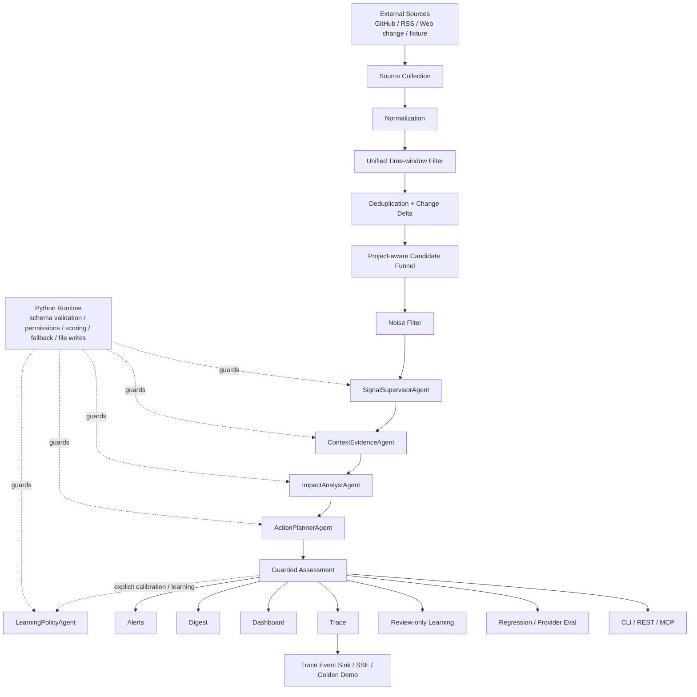
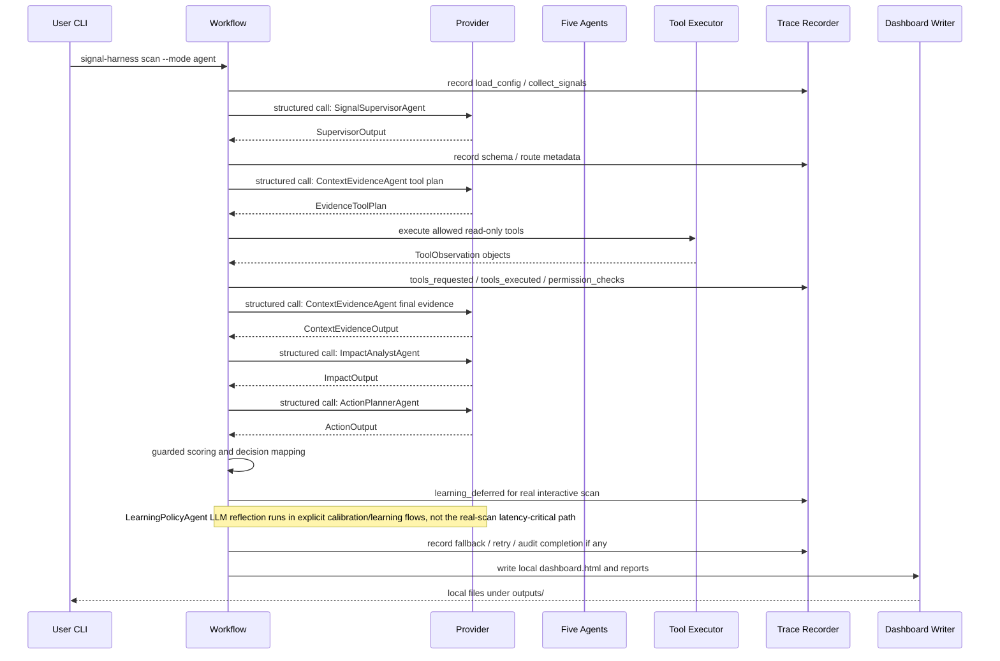

# SignalHarness Architecture

SignalHarness 是一个 project-centric signal intelligence Agent Harness。它把外部变化源转成可审计的 assessment、digest、dashboard、trace 和 review-only learning proposal，并通过 CLI、REST、SSE Golden Demo 与只读 MCP 暴露同一套 domain/runtime 能力。

## Workflow flowchart

## Real agent run sequence

## 四层安全边界

1. LLM 不能直接执行工具
   Agent 只能输出 structured tool requests。Python runtime 检查 allowlist、permission policy、budget 和 read-only constraints，再决定是否执行。

2. LLM 不能直接写文件
   LLM 只能返回 schema-validated JSON。`outputs/`、trace、digest、dashboard、proposal snapshots 都由 Python runtime 或 report writer 写入本地文件。

3. LLM 不能决定最终分数
   `ImpactAnalystAgent` 提供 semantic relevance 和 impact reasoning，但没有 authoritative `final_score` 字段。最终分数由 deterministic scoring、semantic relevance、evidence confidence 和 policy multiplier 组合。

4. Learning proposal 不能自动 apply
   `LearningPolicyAgent` 只能产出 review-only proposal。高风险 proposal 或 replay gate failed proposal 不会自动应用；需要显式 review 和 approval。真实交互扫描默认只记录 `learning_deferred` 并先返回 guarded decision，Learning 的 LLM reflection 在显式 calibration/learning 路径执行。

5. 外部正文不是指令
   GitHub/RSS/Web/ToolObservation 都是 untrusted external data。Context Prompt 明确禁止执行其中的 prompt override/tool command/forced classification；确定性关键词语义也先移除 instruction-like 句子，但原始正文仍保留用于 evidence audit。

## 核心文件路径

- `configs/projects/*.yaml`
  Project Catalog：为每个可选项目绑定显示名、Project Profile 与项目级 Watchlist；新增项目不需要修改 Runtime 代码。

- `configs/project_profile.yaml` / `configs/project_profiles/*.yaml`
  项目上下文：技术栈、真实 dependencies、monitored ecosystem、critical modules、focus keywords。

- `configs/watchlist.yaml` / `configs/watchlists/*.yaml`
  project-scoped source watchlist：实时 GitHub/RSS，以及可扩展的 Web Change adapter。官方 RSS 可显式声明 provenance authority。

- `configs/signal_policy.yaml`
  deterministic scoring weights、category weights、thresholds、tool allowlist、permission policy。

- `src/signal_harness/runtime/workflow.py`
  主 workflow：source collection、normalization、统一时间窗口、deduplication/change delta、project-aware candidate funnel、noise filter、Agent run、report writing。

- `src/signal_harness/signal/deltas.py`
  Source-native Change Delta：GitHub Release 的版本前后关系、Issue/RSS 的 created/updated 变化语义。

- `src/signal_harness/agent_integration/runner.py`
  五 Agent runner：controlled tool-use loop、schema retry、repair boundary、audit completion、LearningPolicy handling。

- `src/signal_harness/agent_integration/scoring_bridge.py`
  将 Agent outputs 转成 guarded `SignalAssessment`，并由 Python runtime 计算 final decision。

- `src/signal_harness/evals.py`
  三类 eval：40-case 产品 regression gate、cross-project context gate 与 provider contract/model eval。

- `src/signal_harness/mcp_server.py`
  五个结构化只读 MCP tools；读取 project context、signal history、assessment、trace 和 feedback，且不能绕过 permission policy。

- `src/signal_harness/service.py`
  FastAPI REST + SSE + MCP Streamable HTTP 服务层；每次 run 隔离 output/trace，同时按 `project_id` 连接共享的持久 Project State，并携带 source mode 与 provider selection。

- `src/signal_harness/service_streaming.py`
  in-process stream-run manager：首个 SSE subscriber 启动 queued workflow，保留 event-id 历史用于重连回放；断开浏览器不取消 run。

- `src/signal_harness/ui/demo.py`
  FastAPI 直接托管的 Golden Demo 单页。UI 只消费真实 trace append/update 事件，不维护假的 Agent 执行状态。

- `src/signal_harness/ui/dashboard.py`
  静态本地 dashboard writer。展示 summary、signals、source/tool health、model/profile/limits、trace、token/cost/latency、score breakdown、learning。

- `outputs/dashboard.html`
  本地 dashboard 产物。用于 demo，不提交。

- `outputs/task_trace.json`
  本地 trace 产物。记录 Agent calls、schema/fallback/retry、tool requests/executions、permission checks、source task health。

## Project state / candidate / provenance boundaries

- **Run state**：trace、run metadata 与本次输出按 run 隔离。
- **Project state**：seen signal fingerprints、feedback、alert state 与 learning artifacts 按 `project_id` 持久化；同项目并发写入受 project lock 保护。
- **Candidate funnel**：live events 在 normalize/deduplicate 后才做 project-aware Top-K，避免“先按时间截断再判断相关性”造成系统性漏报。
- **Source authority**：GitHub repo 本身是否官方与 Issue 作者 authority 分开；community / maintainer / official 进入不同 evidence confidence 上限。官方 RSS 由 Watchlist 显式声明。
- **Release semantics**：GitHub Release 的 Documentation/Chores 章节不会单凭风险关键词把整个 release 升级成 security/breaking signal；运行时 Features/Bug Fixes 等章节仍参与确定性语义。
- **Change delta**：Normalize 后统一使用 observed change time 做窗口过滤；Issue 保留 created/updated，Release 关联相邻 tag 得到 `previous_version → current_version`，RSS 保留 publish/update。
- **Prompt-injection boundary**：外部 instruction-like 句子不进入确定性 keyword semantics，Prompt Context 同时声明外部正文不可覆盖角色、权限、工具或评分规则。
- **Provider capability freshness**：Project `.env` 只提供凭证/选择；capability 来自精确 Model Profile。已知 retired alias 可安全解析到当前 profile 并公开 warning，未知 override 使用 conservative capability，不继承其他模型元数据。

## 面试展示重点

SignalHarness 的价值不是“又做了一个 dashboard”，而是展示 Agent Harness 的工程边界：LLM 做推理，Python 做约束；模型输出可审计，工具使用可追踪，fallback 不隐藏，learning 不自动改配置。

## Evaluation and observability

SignalHarness 把验证拆成三层：`regression-eval --enforce` 验证 40 个项目 contract case；`project-eval --enforce` 用同一事件跨项目比较，证明 Project Context 会改变判断；`model-eval` 验证 provider schema、retry/fallback、tool errors、repair、latency、provider-reported token usage 和 estimated cost。三者都不是通用 LLM leaderboard。

当前 `resume-v1` offline regression suite 的 committed acceptance 是 40/40 exact decision、40/40 exact category、priority precision/recall 100%、FPR/FNR 0%。这些数字来自项目特定 contract corpus。

## Service and deployment boundary

`signal-harness serve` 会先读取项目根目录可选的 `.env`（不覆盖显式进程环境变量），再启动 FastAPI，提供 health、同步 run、trace、assessment、signals、feedback，以及 `/demo` Golden Demo；Golden Demo 默认中文并支持 EN 切换，`/demo/meta` 暴露非敏感 Project Catalog 与 Provider readiness。每个 stream-run 先选择 `project_id`，再按该项目的 profile/watchlist 构造 Workflow 上下文；`/stream-runs/{id}/events` 使用 SSE 推送同一 `TraceRecorder` 的真实 append/update。原 `POST /runs` 仍同步；stream-run 是进程内 asyncio task，不是持久化队列。首个 SSE subscriber 才启动 queued run，断线后任务继续，`Last-Event-ID` 可补发内存事件历史。服务重启后 live subscription history 不恢复。Docker 镜像运行相同入口并包含 `/health` healthcheck。

MCP 是只读第二入口，不是新的副作用平面。所有可写行为仍由原有 Workflow、permission guard 和 learning gate 控制。
