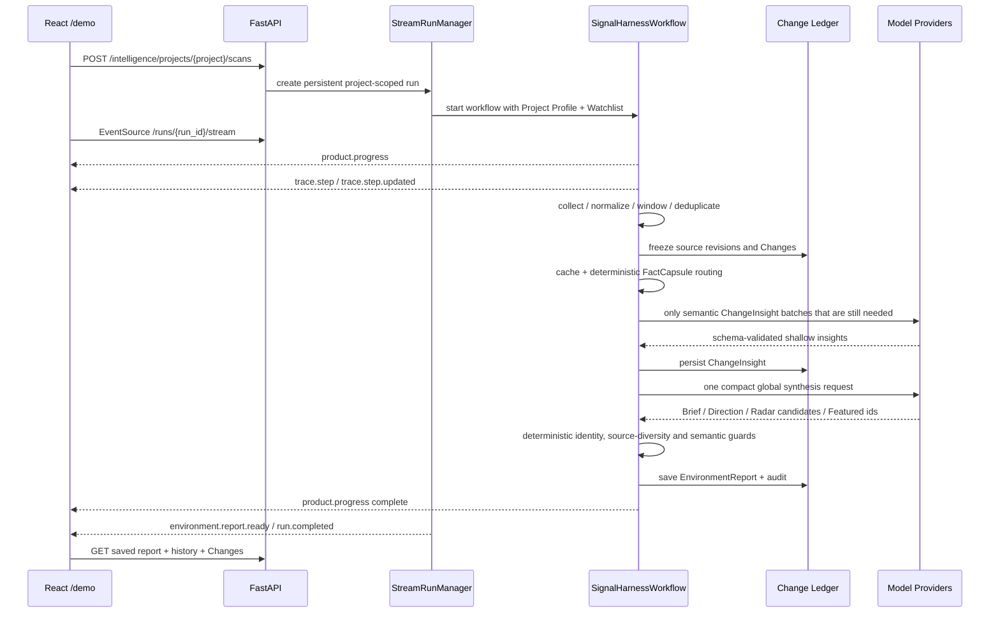

# SignalHarness Data Flow

SignalHarness 当前主产品链路是 **Project Environment Intelligence**。旧 `scan` / Agent Harness 仍保留用于回归、兼容与工程能力证明，但网页 `/demo`、`environment` CLI 与 `/intelligence/*` 使用下面这条 Direction-first 数据流。

## 主数据流

```mermaid
flowchart LR
    Catalog[Project Catalog] --> Profile[Effective Project Profile]
    Catalog --> Watchlist[Project Watchlist]
    Catalog --> Architecture[Bounded Architecture Snapshot]
    Architecture --> Profile
    Profile --> DiscoveryProfile[Project-conditioned DiscoveryProfile]
    Watchlist --> Sources[Known sources: GitHub / PyPI / OSV / RSS / Web / Local Git]
    DiscoveryProfile --> DiscoverySource[Bounded GitHub repository search]
    Sources --> Collect[Collect]
    DiscoverySource --> Collect
    Collect --> Normalize[Normalize + Frozen Window + Revision Dedup]
    Normalize --> Ledger[(Project-scoped Change Ledger)]
    Ledger --> Changes[Change Revisions]

    Profile --> Capsule[Project-aware FactCapsule]
    Changes --> Capsule
    Capsule --> Route{ChangeInsight 路由}
    Route -->|cache hit| Insights[ChangeInsight]
    Route -->|deterministic| Insights
    Route -->|semantic gap| Shallow[Bounded shallow model batches]
    Shallow --> Insights

    Insights --> External[External environment corpus]
    Insights --> Activity[Canonical project activity]
    External --> Digest[Full compact external DirectionDigest]
    Activity --> ActivityIndex[Full activity counts + kind index]
    Activity --> ActivitySummary[Deterministic UI work-area summary]
    Activity --> ActivityContext[Max 24 balanced recent context rows]
    ActivityIndex --> Synthesis[Strong-model synthesis context]
    ActivityContext --> Synthesis
    Profile --> Synthesis
    Architecture --> Synthesis
    Digest --> Synthesis[Strong-model synthesis]
    Synthesis --> Guards[Python semantic / source-independence guards]
    Guards --> Report[Brief + Directions + Radar + Featured]
    Insights --> Report
    Report --> Persistence[(SQLite + saved report)]

    Persistence --> App[EnvironmentApplication]
    App --> CLI[environment-* CLI]
    App --> MCP[current MCP tools]
    App --> API[REST]
    API --> Web[React Web]

    Trace[TraceRecorder] --> SSE[trace.step / trace.step.updated]
    SSE --> Web
    User[Explicit user click] --> DeepDive[Deep Dive]
    Architecture --> DeepDive
    DeepDive --> Persistence
```



## 一次网页扫描的时序



## 数据所有权边界

| 数据 | authoritative owner | 说明 |
| --- | --- | --- |
| Project / Watchlist | Project Catalog + config | 每个项目绑定自己的 Profile 与来源范围 |
| Effective Profile | SQLite ProfileRevision | 显式 Preference 会进入后续项目关系判断与模型上下文 |
| Architecture Snapshot | Project Profile / Python static analyzer | 最多有界读取生产源码样本，保存子系统、入口、依赖 import 证据与静态 import 边；不执行代码、不声称运行时 call graph |
| Source observation / revision | Python collectors + Change Ledger | 模型不能修改来源事实 |
| Change identity / frozen window | Python runtime | Git commit / merged PR 使用 `(repository, final commit SHA)` canonical identity；历史 Scan 不会被后续 revision 偷偷改写 |
| ChangeInsight semantic note | shallow model 或 deterministic path | schema 校验后持久化；缓存按 profile/version/policy 隔离 |
| Project relation basis | Python FactCapsule / projection | 模型只补真正需要语义理解的短 note |
| Discovery scope / queries | Python Project DiscoveryProfile | 从 Project Profile 确定性派生；没有全局 AI 默认主题；当前最多 3 条 query，每条最多 5 个 repo |
| Radar prose | same strong synthesis call | `new_solution` / `emerging_direction` 与 Brief/Direction 同一次生成；Python 负责 discovered evidence 与趋势门槛校验 |
| Direction candidate prose | strong synthesis model | 不是最终 authority |
| Direction source independence | Python guard | 同 vendor / 同 repo 的伪独立来源不能靠模型自证成立 |
| Report / History | SQLite + saved artifacts | Web 与 CLI 读取同一份持久化结果 |
| Execution Trace | TraceRecorder | SSE 只是实时投影，不是前端模拟进度 |
| Project activity summary | Python deterministic projection | 按 canonical project activity + Conventional Commit scope 聚合施工面；不调用模型、不参与 Direction 证据 |
| Deep Dive | explicit user action | 仅外部环境 Change 可启动；project activity 已是一手项目事实，只展示保存证据，不重复调用模型 |

## 失败与降级

- 单条 ChangeInsight 失败时保留原始 Change，不把“没解释成功”当成“不相关”。
- Architecture enrichment 是补充项目上下文：某个源码 blob 不可读时跳过该样本；浏览器 manifest-only 连接不会为了补架构自动上传源码。静态 import 只能证明文本结构，不能证明运行可达。
- Discovery 是补充来源：GitHub repository search 失败只记录 source diagnostics，不降低核心 Scan coverage，也不阻塞安全 checkpoint。
- 新发现 repo 的“首次出现”是 project-scoped observation 语义；同一项目已经见过后不会因元数据 revision 重复制造 new-solution。
- 全局 synthesis 失败时保存完整 Change 集并产出 degraded report，不用少量候选冒充完整环境报告。
- Source coverage 为 partial/unknown 时公开提示，不推进不安全的 `since_last` checkpoint。
- 模型调用有 provider fallback、schema validation、bounded retry 与 Trace；可确定性处理的错误优先局部修复，不整份重跑。
- 浏览器断开不会取消正在执行的 Run；同进程内 EventSource 可根据 event id 回放 Trace。

## CLI / REST / Web 一致性

current Web REST、`environment-*` CLI 与 current MCP tools 都委托同一个 `EnvironmentApplication`。Scan 动作统一进入 `EnvironmentApplication → StreamRunManager → SignalHarnessWorkflow(..., intelligence_pipeline=True)`；读取动作统一从相同 ProfileRevision / IntelligenceRepository / EnvironmentReport projection 返回。`environment-report/context/architecture/changes/change/calibration` 与对应 MCP/REST read 都不会为了读取而调用模型。网页「学习与校准」只是 calibration read-model 的产品投影：Feedback/Outcome → frozen Episode → replay → candidate → promotion gate → revision/rollback，真实 apply/rollback 仍留在显式受控 learning flow 中。旧 `scan/report/changes` 与 compatibility MCP tools 仍是受保护的 Harness baseline。

```bash
uv run signal-harness environment --project signalharness --window since_last
uv run signal-harness environment-report --project signalharness
uv run signal-harness serve --host 127.0.0.1 --port 8001
```

因此当前面试主线不是“CLI 算一套、网页再算一套”，而是 **同一业务状态的不同接口投影**。
